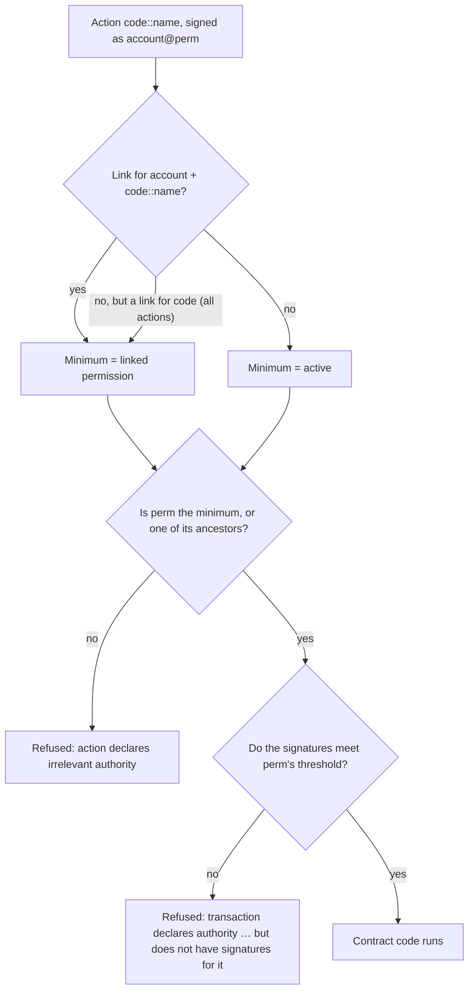

# Permissions cookbook

Every PulseVM account carries its own permission tree, and any permission can be bound to one contract action. These recipes cover what institutions and app builders set up most often. Each one gives the purpose, the command, the JSON and the error you get when it's misused.

The commands use [`pulse-ts`](/build/cli) on the [1:1 demo network](/network/one-to-one-demo), where the system account is `eosio` and the token contract is `eosio.token`. On a Pulse-native chain such as Alpine, use `pulse` and `pulse.token`. The account in the examples is `yourname1`.

## How the chain decides

For every action in a transaction, and every authorization it declares, PulseVM runs the same three checks before any contract code runs:



- **Minimum permission lookup.** The chain looks for a link from `account` for `code::action`, then for a link covering every action of `code`, and otherwise uses `active`.
- **Parents satisfy children.** `owner` satisfies anything, `active` satisfies everything below it, and a child never satisfies its parent. So `active` can still call an action linked to `bot`, but `bot` can't call anything that needs `active`.
- **Links are checked before contract code.** A refused permission never reaches your contract, so a bug in your code can't widen what a linked key can do.
- **Thresholds are weighted.** A permission's authority is a threshold plus weighted keys and weighted `account@permission` entries. Account entries are resolved recursively.

The native account actions (`updateauth`, `deleteauth`, `linkauth`, `unlinkauth`) can't be linked. Each has its own rule, noted in the recipes below.

## Give a bot one action

**Purpose:** a key that can call `yourname1::trade` and nothing else.

```bash
pulse-ts update-auth yourname1 bot active PUB_K1_…botkey --sign-permission active
pulse-ts push-action eosio linkauth \
  '{"account":"yourname1","code":"yourname1","type":"trade","requirement":"bot"}' \
  -a yourname1@active
```

**Use it:** `pulse-ts push-action yourname1 trade '{"amount":"5.0000 XPR"}' -a yourname1@bot`

**Misuse:** the bot key signing anything else, such as a token transfer:

```
action declares irrelevant authority 'yourname1@bot'; minimum authority is yourname1@active
```

The full walk-through, with a contract that enforces limits, is the [bot key tutorial](/build/tutorial-bot-key).

## A payments key for token transfers

**Purpose:** a processor's key that can send `eosio.token` transfers from the account and do nothing else.

```bash
pulse-ts update-auth yourname1 payments active PUB_K1_…payskey --sign-permission active
pulse-ts push-action eosio linkauth \
  '{"account":"yourname1","code":"eosio.token","type":"transfer","requirement":"payments"}' \
  -a yourname1@active
```

**Use it:** `pulse-ts transfer yourname1 supplier1 "25.0000 XPR" "inv 1042" --contract eosio.token -p payments`

**Misuse:** the payments key calling any other action, for example one of your own contract's:

```
action declares irrelevant authority 'yourname1@payments'; minimum authority is yourname1@active
```

A link restricts *which* action, not its arguments. This key can send any amount of that token to anyone. For caps, payee lists or daily budgets, link the key to an action of your own contract that checks them and then transfers, as in the [tutorial](/build/tutorial-bot-key#what-a-real-system-adds).

## A compliance key for freeze

**Purpose:** a compliance officer's key that can freeze accounts in your token and do nothing else.

Freeze is policy you write. The reference token contracts don't include it. Your token contract adds a `freeze(account)` action that writes to a table, and its `transfer` refuses frozen accounts. The chain's part is making sure only the compliance key, or the issuer's `active`, can call it:

```bash
pulse-ts update-auth mytoken compliance active PUB_K1_…compkey --sign-permission active
pulse-ts push-action eosio linkauth \
  '{"account":"mytoken","code":"mytoken","type":"freeze","requirement":"compliance"}' \
  -a mytoken@active
```

**Use it:** `pulse-ts push-action mytoken freeze '{"account":"someone"}' -a mytoken@compliance`

**Misuse:** the compliance key trying to mint, upgrade the contract or move the issuer's tokens:

```
action declares irrelevant authority 'mytoken@compliance'; minimum authority is mytoken@active
```

Inside `freeze`, check `require_auth(get_self())` as usual. For dual control, make `compliance` itself 2-of-3 (next recipe).

## A 2-of-3 treasury

**Purpose:** spending from `treasury1` needs any two of three people.

`pulse-ts update-auth` sets a single key or a single account. For a threshold, push the native `updateauth` action with the full authority. Here `active` becomes 2-of-3 over three named accounts:

```bash
pulse-ts push-action eosio updateauth '{
  "account": "treasury1",
  "permission": "active",
  "parent": "owner",
  "auth": {
    "threshold": 2,
    "keys": [],
    "accounts": [
      { "permission": { "actor": "cfo1",  "permission": "active" }, "weight": 1 },
      { "permission": { "actor": "ops1",  "permission": "active" }, "weight": 1 },
      { "permission": { "actor": "risk1", "permission": "active" }, "weight": 1 }
    ],
    "waits": []
  }
}' -a treasury1@active
```

The same shape works with three keys in `keys` instead. Rules the chain enforces:

- `accounts` sorted by actor, then permission. `keys` sorted in ascending binary order, which usually matches the order of the `PUB_K1_…` strings but is not guaranteed to; if the chain returns `invalid authority`, reorder them.
- No duplicates, a threshold above zero, and weights that can reach the threshold.

**Use it:** one signer proposes the transfer through the multisig contract and a second approves. See [Native multisig](/guide/multisig).

**Misuse:** one signer alone:

```
transaction declares authority 'treasury1@active' but does not have signatures for it
```

An unreachable threshold or unsorted list:

```
invalid authority: …
```

Put `owner` under the same or a stricter authority, or anyone who holds the old owner key can rewrite `active`.

## Rotate a key

**Purpose:** replace a compromised or retiring key without moving any assets. The account name, balances, contracts and links all stay.

```bash
# new active key, signed by the current active key
pulse-ts update-auth yourname1 active owner PUB_K1_…newkey

# new owner key, signed by the current owner key
pulse-ts update-auth yourname1 owner root PUB_K1_…newownerkey
```

`root` stands for the owner permission's empty parent. `updateauth` needs the permission being changed (or an ancestor), so `owner` can also rotate `active`: add `--sign-permission owner`.

`update-auth` replaces the whole authority. If `active` had several keys, account entries or a code grant, write them all again, or push `updateauth` with the full JSON as in the treasury recipe.

**Misuse:** signing with the retired key afterwards:

```
transaction declares authority 'yourname1@active' but does not have signatures for it
```

## Recover through a parent account

**Purpose:** if the owner key is lost, another account the institution controls can restore it. This is how a parent company recovers a subsidiary's account, or a custodian recovers a customer's.

Set `owner` to 1-of-2: the customer's own key, or `recovery1@active`:

```bash
pulse-ts push-action eosio updateauth '{
  "account": "yourname1",
  "permission": "owner",
  "parent": "",
  "auth": {
    "threshold": 1,
    "keys": [ { "key": "PUB_K1_…customerkey", "weight": 1 } ],
    "accounts": [ { "permission": { "actor": "recovery1", "permission": "active" }, "weight": 1 } ],
    "waits": []
  }
}' -a yourname1@owner
```

To hand owner entirely to the parent, `pulse-ts update-auth yourname1 owner root recovery1@active --sign-permission owner` does it in one line.

**Recover:** with `recovery1`'s key in the keystore, sign as `yourname1@owner` and set a new active key:

```bash
pulse-ts push-action eosio updateauth '{
  "account": "yourname1", "permission": "active", "parent": "owner",
  "auth": { "threshold": 1, "keys": [ { "key": "PUB_K1_…freshkey", "weight": 1 } ], "accounts": [], "waits": [] }
}' -a yourname1@owner
```

The chain accepts `recovery1`'s signature for `yourname1@owner` because `owner` names `recovery1@active`. For stronger control, make `recovery1@active` itself a 2-of-3.

**Misuse:** changing `owner` while signing with `active`:

```
updateauth action declares irrelevant authority 'yourname1@active'; minimum authority is yourname1@owner
```

## Time-delayed owner change

**Not available on PulseVM.** Antelope's wait weights (`"waits": [{ "wait_sec": 604800, "weight": 1 }]`) only count in a delayed transaction, and PulseVM rejects every transaction with a delay (`delay larger than 0 not supported`). An authority that needs a wait weight to reach its threshold can never be satisfied. Use a 2-of-3 owner, or the multisig contract, for changes that should never be instant.

## Let a contract act as itself

**Purpose:** a contract that sends inline actions under its own account, for example to pay out, place an order or call another contract.

Add the code grant to `active` next to its key:

```bash
# demo network and other chains migrated from Antelope
pulse-ts update-auth yourname1 active owner PUB_K1_…yourkey --code yourname1@eosio.code

# Pulse-native chains (Alpine)
pulse-ts update-auth yourname1 active owner PUB_K1_…yourkey --code yourname1@pulse.code
```

The resulting authority is threshold 1 with your key and `yourname1@eosio.code`, so either your signature or the contract's own code satisfies `active`.

**Misuse:** the contract sends an inline action as `yourname1@active` without the grant:

```
transaction declares authority 'yourname1@active' but does not have signatures for it
```

An inline action authorized by the *caller's* permission goes through the same minimum-permission check. A contract can't use a linked key's authority on an action that key isn't linked to.

## Unlink a key from an action

**Purpose:** return an action to its default minimum (`active`), for example when retiring a bot.

```bash
pulse-ts push-action eosio unlinkauth \
  '{"account":"yourname1","code":"yourname1","type":"trade"}' \
  -a yourname1@active
```

After this, `yourname1@bot` signing `trade` gets `action declares irrelevant authority 'yourname1@bot'; minimum authority is yourname1@active`.

`unlinkauth` needs the permission currently linked, or an ancestor, so the linked key can unlink itself, which only removes its own access. Unlinking a pair that has no link is refused: `cannot unlink non-existent permission link`.

**Misuse:** trying to link one of the native account actions:

```
cannot link eosio::updateauth to a minimum permission
```

## Delete a permission

**Purpose:** remove a permission and its keys entirely.

```bash
pulse-ts push-action eosio deleteauth '{"account":"yourname1","permission":"bot"}' -a yourname1@active
```

The chain refuses to delete a permission that's still in use:

| Case | Refused with |
|:---|:---|
| Still linked | `cannot delete a linked authority; unlink it first. 'yourname1@bot' is linked to yourname1::trade` |
| Has children | `cannot delete permission 'yourname1@bot' because it has child permissions` |
| `owner` or `active` | `cannot delete owner authority` / `cannot delete active authority` |
| Signed by the permission's child | `deleteauth action declares irrelevant authority …; minimum authority is …` |

So retiring a bot is two transactions, or two actions in one: `unlinkauth` for each linked action, then `deleteauth`.

## Next

- Build the full pattern: [Tutorial: a bot key that can only trade](/build/tutorial-bot-key).
- See it in production: [Delegated authority with hard limits](/guide/delegated-authority), where a stolen bot key failed 31 of 31 attempts to move money or take the account over.
- Design a permission model for your institution: [contact Metallicus](https://metallicus.com/contact-us?utm_source=pulsevm.dev&utm_medium=docs).
