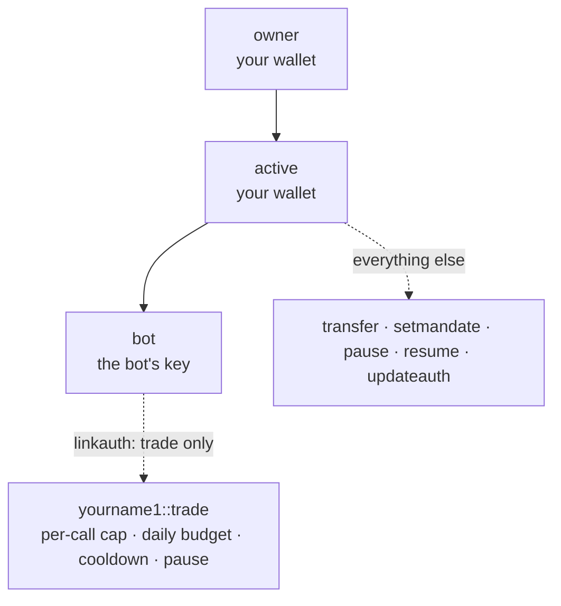

# Tutorial: a bot key that can only trade

By the end of this tutorial your account holds a bot key that can call exactly one action, `trade`, inside limits you set: a per-call cap, a daily budget and a cooldown. The same key cannot move your tokens, change your keys or touch its own limits, and you can stop it with one signature.

Two layers do the work:

1. **The protocol.** A `bot` permission linked to `yourname1::trade` is refused for every other action before any contract code runs.
2. **Your contract.** `trade` reads a mandate stored in your account and rejects anything outside it.



This is the pattern behind trading vaults running on XPR Network mainnet today. See [Delegated authority with hard limits](/guide/delegated-authority) for the production version.

## What you need

- `pulse-ts` installed and pointed at a network ([Get started](/build/get-started), steps 2 to 4).
- An account you control, called `yourname1` below. On the [1:1 demo network](/network/one-to-one-demo) that is your XPR Network testnet account.
- About 120 KB of free RAM on that account. The chain bills ten times the WebAssembly size for code, and this contract is about 11 KB.
- Rust with the `wasm32-unknown-unknown` target, and a clone of [pulse-cdt-rust](https://github.com/MetalBlockchain/pulse-cdt-rust).

The commands use the demo network, where the system account is `eosio` and the token contract is `eosio.token` with the `XPR` symbol. On a Pulse-native chain such as Alpine, use `pulse`, `pulse.token` and `SYS`.

## 1. Create the contract

Inside your pulse-cdt-rust clone:

```bash
mkdir -p contracts/mandate/src
cp contracts/pulse_token/build.rs contracts/mandate/
```

Add `"contracts/mandate"` to `members` in the root `Cargo.toml`, then create `contracts/mandate/Cargo.toml`:

```toml
[package]
name = "mandate"
version = "0.1.0"
edition = "2024"

[dependencies]
pulse_cdt = { workspace = true }

[build-dependencies]
syn = { version = "1", features = ["full"] }
quote = "1.0"
serde_json = "1.0"

[lib]
crate-type = ["cdylib"]

[features]
default = ["contract-entry"]
contract-entry = []
```

## 2. Write the mandate

Save this as `contracts/mandate/src/lib.rs`. It stores two single-row tables in your account, `mandate` (the limits) and `usage` (what the bot has spent), and reads the block time with `current_time_point()`.

```rust
#![no_std]
#![no_main]
extern crate alloc;

use pulse_cdt::{
    NumBytes, Read, Write, action, contract,
    contracts::{current_time_point, require_auth},
    core::{Asset, Name, SingletonDefinition, Table, check},
    name, table,
};

/// The owner's limits for the bot. One row, stored in the account itself.
#[derive(Read, Write, NumBytes, Clone, PartialEq)]
#[table(primary_key = name!("mandate").raw())]
pub struct Mandate {
    pub per_call_cap: Asset,
    pub daily_budget: Asset,
    pub cooldown_sec: u32,
    pub paused: bool,
}

/// What the bot has used. Reset at the first trade of each UTC day.
#[derive(Read, Write, NumBytes, Clone, PartialEq)]
#[table(primary_key = name!("usage").raw())]
pub struct Usage {
    pub day: u32,
    pub spent_today: Asset,
    pub last_trade_sec: u32,
    pub trades: u64,
}

const MANDATE: SingletonDefinition<Mandate> = SingletonDefinition::new(name!("mandate"));
const USAGE: SingletonDefinition<Usage> = SingletonDefinition::new(name!("usage"));

#[derive(Default)]
struct MandateContract;

#[contract]
impl MandateContract {
    /// Owner only: set or replace the limits. Resumes a paused mandate.
    #[action]
    fn setmandate(per_call_cap: Asset, daily_budget: Asset, cooldown_sec: u32) {
        require_auth(get_self());
        check(per_call_cap.is_valid() && per_call_cap.amount > 0, "per-call cap must be positive");
        check(daily_budget.symbol == per_call_cap.symbol, "cap and budget must use one symbol");
        check(daily_budget.amount >= per_call_cap.amount, "daily budget is below the per-call cap");
        let mandate = MANDATE.get_instance(get_self(), get_self().raw());
        mandate.set(
            Mandate { per_call_cap, daily_budget, cooldown_sec, paused: false },
            get_self(),
        );
    }

    /// Owner only: stop the bot. One signature, effective in the next block.
    #[action]
    fn pause() {
        set_paused(true);
    }

    /// Owner only: let the bot trade again under the same limits.
    #[action]
    fn resume() {
        set_paused(false);
    }

    /// The bot's one action. A real system would route `amount` through an
    /// exchange and back into this account; here we enforce the limits and
    /// record the usage.
    #[action]
    fn trade(amount: Asset) {
        require_auth(get_self());

        let mandate = MANDATE.get_instance(get_self(), get_self().raw());
        check(mandate.exists(), "no mandate set");
        let m = mandate.get();
        check(!m.paused, "mandate is paused");
        check(amount.symbol == m.per_call_cap.symbol, "wrong symbol for this mandate");
        check(amount.amount > 0, "amount must be positive");
        check(amount.amount <= m.per_call_cap.amount, "above per-call cap");

        let now = current_time_point().sec_since_epoch();
        let today = now / 86_400;
        let usage = USAGE.get_instance(get_self(), get_self().raw());
        let mut u = usage.get_or_default(Usage {
            day: today,
            spent_today: Asset::zero(m.per_call_cap.symbol),
            last_trade_sec: 0,
            trades: 0,
        });
        if u.day != today {
            u.day = today;
            u.spent_today = Asset::zero(m.per_call_cap.symbol);
        }
        check(
            u.trades == 0 || now >= u.last_trade_sec + m.cooldown_sec,
            "cooldown: too soon after the last trade",
        );
        check(
            u.spent_today.amount + amount.amount <= m.daily_budget.amount,
            "daily budget exceeded",
        );

        u.spent_today += amount;
        u.last_trade_sec = now;
        u.trades += 1;
        usage.set(u, get_self());
    }
}

fn set_paused(paused: bool) {
    require_auth(get_self());
    let mandate = MANDATE.get_instance(get_self(), get_self().raw());
    check(mandate.exists(), "no mandate set");
    let mut m = mandate.get();
    m.paused = paused;
    mandate.set(m, get_self());
}
```

Every action calls `require_auth(get_self())`, which checks that the transaction carries *some* authority of `yourname1`. It does not say which permission. Keeping the bot away from `setmandate`, `pause` and `resume` is the protocol's job, and step 5 sets that up.

## 3. Build

```bash
cargo build --target wasm32-unknown-unknown --release -p mandate
```

```
    Finished `release` profile [optimized] target(s) in 1.39s
```

The WebAssembly is `target/wasm32-unknown-unknown/release/mandate.wasm` (about 11 KB). `build.rs` writes `contracts/mandate/abi.json`, which lists four actions, `setmandate`, `pause`, `resume` and `trade`, and two tables, `mandate` and `usage`.

## 4. Deploy to your account and set the mandate

The contract runs on your own account, so its tables live there too.

```bash
pulse-ts set-code yourname1 ./target/wasm32-unknown-unknown/release/mandate.wasm
pulse-ts set-abi  yourname1 ./contracts/mandate/abi.json

pulse-ts push-action yourname1 setmandate \
  '{"per_call_cap":"10.0000 XPR","daily_budget":"25.0000 XPR","cooldown_sec":30}' \
  -a yourname1@active

pulse-ts table yourname1 mandate
```

The table read returns one row:

```json
{
  "rows": [
    { "per_call_cap": "10.0000 XPR", "daily_budget": "25.0000 XPR", "cooldown_sec": 30, "paused": false }
  ],
  "more": false
}
```

## 5. Give the bot a permission and bind it to `trade`

Create the bot's key and import its private key (in production, it lives only on the bot's server):

```bash
pulse-ts create-key          # the bot's PUB_K1_… / PVT_K1_… pair
pulse-ts key:add             # import the bot's private key, on the bot's machine
```

::: warning Keep the bot's key in its own keystore
Import the bot key where the bot runs, not into the keystore that holds your owner key. Current `pulse-ts` releases sign with every matching key they hold, and the chain refuses the extra signature (`transaction bears irrelevant signatures`). A fix that signs with only the required keys is in review for `pulse-ts`.
:::

Create a `bot` permission under `active`. A new permission needs its parent's authority, so `active` signs:

```bash
pulse-ts update-auth yourname1 bot active PUB_K1_…botkey --sign-permission active
```

Bind `bot` to one action with the native `linkauth` action on the system account:

```bash
pulse-ts push-action eosio linkauth \
  '{"account":"yourname1","code":"yourname1","type":"trade","requirement":"bot"}' \
  -a yourname1@active
```

`pulse-ts account yourname1` now shows `bot` under `active`. From here on the chain treats `yourname1@bot` as the minimum permission for `yourname1::trade`, and `active` (the default) for every other action.

## 6. The bot trades

```bash
pulse-ts push-action yourname1 trade '{"amount":"5.0000 XPR"}' -a yourname1@bot
```

```
tx_id: 3f1c…
```

```bash
pulse-ts table yourname1 usage
```

```json
{ "rows": [ { "day": 20720, "spent_today": "5.0000 XPR", "last_trade_sec": 1790251200, "trades": 1 } ], "more": false }
```

Your numbers for `day` and `last_trade_sec` will differ; they come from the block time.

## 7. The bot tries to take money out

```bash
pulse-ts transfer yourname1 someoneelse "1.0000 XPR" --contract eosio.token -p bot
```

The chain refuses it before `eosio.token` runs:

```
action declares irrelevant authority 'yourname1@bot'; minimum authority is yourname1@active
```

No link exists for `eosio.token::transfer`, so its minimum is `active`, and `bot` sits below `active` in the tree. A permission satisfies its descendants, never its ancestors.

## 8. The bot tries to change its limits or your keys

```bash
pulse-ts push-action yourname1 setmandate \
  '{"per_call_cap":"1000.0000 XPR","daily_budget":"1000.0000 XPR","cooldown_sec":0}' \
  -a yourname1@bot
```

```
action declares irrelevant authority 'yourname1@bot'; minimum authority is yourname1@active
```

The same happens for `resume` after you pause. The native account actions are guarded the same way:

| The bot tries | Refused with |
|:---|:---|
| `update-auth yourname1 active owner PUB_K1_…botkey --sign-permission bot` | `updateauth action declares irrelevant authority 'yourname1@bot'; minimum authority is yourname1@active` |
| `push-action eosio linkauth '{"account":"yourname1","code":"eosio.token","type":"transfer","requirement":"bot"}' -a yourname1@bot` | `link action declares irrelevant authority 'yourname1@bot'; minimum authority is yourname1@active` |

A permission can edit its own authority and create children under itself. It can never reach an action it is not linked to, and it cannot link itself to new ones.

## 9. The bot hits the mandate

The protocol let these through, because the bot is calling `trade`. Your contract refuses them:

```bash
pulse-ts push-action yourname1 trade '{"amount":"50.0000 XPR"}' -a yourname1@bot
```

| Attempt | Refused with |
|:---|:---|
| `50.0000 XPR`, above the per-call cap | `pulse assert failed: above per-call cap` |
| `5.0000 XPR` again within 30 seconds | `pulse assert failed: cooldown: too soon after the last trade` |
| A fourth trade after 5 + 10 + 10 XPR in one day | `pulse assert failed: daily budget exceeded` |
| `5.0000 FOO` | `pulse assert failed: wrong symbol for this mandate` |

A failed check rejects the whole transaction, so `usage` never records a refused trade. Contracts built with the Rust kit report `pulse assert failed: …`. C++ contracts using `check()` report `eosio assert failed: …`.

## 10. Stop the bot with one signature

```bash
pulse-ts push-action yourname1 pause '{}' -a yourname1@active
pulse-ts push-action yourname1 trade '{"amount":"5.0000 XPR"}' -a yourname1@bot
```

```
pulse assert failed: mandate is paused
```

Only `active` can undo it, with `resume` or a new `setmandate`. To remove the bot entirely, unlink and delete the permission (see [Permissions cookbook](/build/permissions-cookbook#unlink-a-key-from-an-action)).

## What a real system adds

This contract records trades instead of making them. A production router, like the vaults on XPR Network, adds:

- **An exchange round trip inside `trade`.** The contract sends inline actions that place the order and bring the proceeds back into the same account. To send inline actions as itself, the account's `active` needs the code grant: `--code yourname1@eosio.code` (`pulse.code` on Pulse-native chains). See the [cookbook](/build/permissions-cookbook#let-a-contract-act-as-itself).
- **A price band** against an oracle and the exchange's last price, and **keep floors** the account always holds.
- **A published build.** Anyone can compare the account's code hash with the source you publish.

One thing the chain already guarantees: your contract cannot launder the bot's authority. If `trade` sent an inline `eosio.token::transfer` authorized by `yourname1@bot`, the chain would run the same minimum-permission check and refuse it. What the bot can trigger is exactly what `trade`'s code does, and nothing else.

## What you built

- A key with one job, enforced by the protocol before your code runs.
- Limits enforced by a contract you wrote, stored in your own account.
- An owner who can pause, change limits or revoke the key at any time, without asking the operator.

That is the whole pattern behind [Delegated authority with hard limits](/guide/delegated-authority), where a stolen bot key failed 31 of 31 attempts to move money out or take the account over. Next, the [Permissions cookbook](/build/permissions-cookbook) has the recipes for treasury multisig, payments keys, rotation and recovery. To run this pattern for your institution, [contact Metallicus](https://metallicus.com/contact-us?utm_source=pulsevm.dev&utm_medium=docs).
