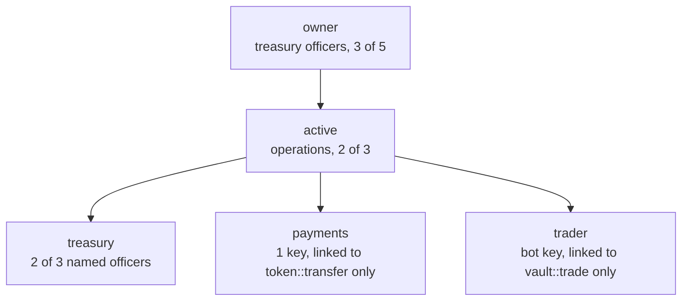

# Accounts and permissions

On PulseVM an account is a name, not a key. Each account holds a tree of permissions. Each permission is a threshold over keys and other accounts, and any permission can be bound to exactly one contract action. Multisig, scoped bot keys, key rotation and recovery are things you configure with two system actions. You do not deploy or audit a contract to get them.

This is the part of PulseVM that people who build on it talk about first.

## Named accounts

Accounts are readable names of up to 12 characters (`a-z`, `1-5`, `.`): `acme.treas`, `branch.14`, `payroll`. Operations, audit and reconciliation already think in names, and so does the chain. Tokens, contracts and history are all addressed by name.

## A tree of permissions

Every account starts with two permissions: `owner`, the root used for recovery, and `active`, for day-to-day use. You add any structure beneath them, each with its own threshold and its own keys or accounts.



A permission is satisfied by a weighted set of factors that must reach its threshold:

- **Keys**: K1 (secp256k1), R1 (secp256r1, for HSMs and secure enclaves) and WebAuthn (passkeys). R1 and WebAuthn are verified by the chain itself, so a passkey can sign for an account directly.
- **Other accounts**: `subsidiary@owner` can be satisfied by `parent@active`, which is how institutional recovery and delegation work.

## Give a key one job

`linkauth` binds a permission to a single contract action. After this call, `acme.treas@payments` is the permission required for `token::transfer`:

```json
{ "account": "acme.treas", "code": "token", "type": "transfer", "requirement": "payments" }
```

For every action in a transaction, the chain looks up the minimum permission for that contract and action. That is the linked permission if one exists, and `active` if not. A signature from a permission that does not reach that minimum is refused **before the contract runs**. So a key on `trader`, linked only to `vault::trade`, cannot transfer tokens, cannot touch `active` or `owner`, and cannot link itself to any other action. It can still manage its own permission (rotate its own key, or remove its own link), which never widens its reach. PulseVM refuses it with the same message as XPR Network and every Antelope chain:

```
action declares irrelevant authority 'vault@keeper'; minimum authority is vault@active
```

That one mechanism is what lets you hand a trading bot, a payments processor, an auditor or an AI agent a key with a mandate the protocol enforces. For a system that does exactly this in production, see [Delegated authority with hard limits](/guide/delegated-authority).

## Recipes

These use [`pulse-ts`](https://github.com/paulgnz/pulse-cli-ts). The system account is `pulse` on Pulse-native chains such as Alpine and `eosio` on chains migrated from Antelope, such as the [1:1 demo network](/network/one-to-one-demo); substitute accordingly.

**Add a permission with its own key.** `trader` sits under `active`, so `active` signs its creation:

```bash
pulse-ts update-auth myacct trader active PUB_K1_6...botkey --sign-permission active
```

**Bind it to one action:**

```bash
pulse-ts push-action pulse linkauth \
  '{"account":"myacct","code":"vault","type":"trade","requirement":"trader"}' \
  -a myacct@active
```

**Use it.** The bot signs with `trader`, and only `vault::trade` accepts it:

```bash
pulse-ts push-action vault trade '{"owner":"myacct","market":3,"amount":"25.0000 XMD"}' -a myacct@trader
```

**Rotate a key.** One action, signed by the parent. The account, its assets and its history stay where they are:

```bash
pulse-ts update-auth myacct active owner PUB_K1_6...newkey --sign-permission owner
```

**Revoke.** `unlinkauth` removes the binding and `deleteauth` removes the permission:

```bash
pulse-ts push-action pulse unlinkauth '{"account":"myacct","code":"vault","type":"trade"}' -a myacct@active
pulse-ts push-action pulse deleteauth '{"account":"myacct","permission":"trader"}' -a myacct@active
```

For dual control on any permission, see [Multisig](/guide/multisig).

## What this replaces

On EVM chains one key is one account. Everything beyond that is a smart-contract wallet you deploy, audit and maintain.

| You need | On PulseVM | On an EVM chain |
|:---|:---|:---|
| Readable identity | The account name | A name service mapped onto a hex address |
| Dual control | A threshold on the permission | A multisig contract wallet |
| A key limited to one action | `linkauth` | A session-key module or guard contract |
| Key rotation | One `updateauth`; the account stays | A smart wallet, or moving every asset to a new address |
| Recovery | `owner`, or a parent account, rewrites `active` | A recovery module |
| Passkeys and HSM keys | WebAuthn and R1 keys, verified by the chain | A contract-wallet verifier or the P-256 precompile |
| Users who never pay gas | The institution stakes resources | A paymaster service |

Every row in the right-hand column is code someone has to write, audit and keep safe. Every row in the middle column is protocol.

## For contract developers

Contracts check authority with `require_auth(account)` or `require_auth2(account, permission)`, and the chain has already enforced the whole tree, including links, before your code runs. A contract acts under its own authority through a `pulse.code` grant on its permission (`eosio.code` on migrated chains), which is how contracts send inline actions safely. See [Authorization](/concepts/authorization) for the developer view and [System contracts](/build/system-contracts) for the native actions.
