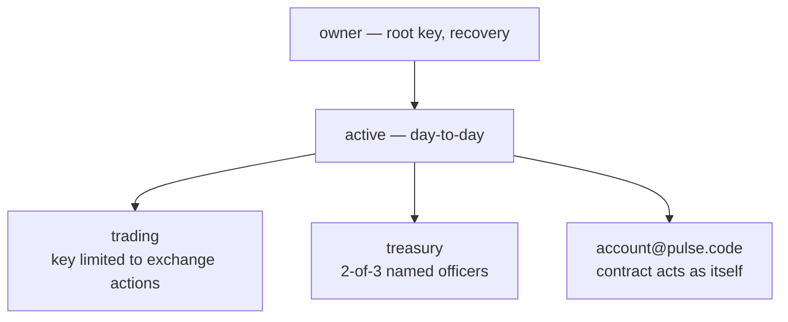

# Accounts & Permissions

The account model is PulseVM's clearest advantage over EVM-style chains — and the part that maps directly onto how institutions already operate.

## Named accounts

Accounts are human-readable names (up to 12 characters, `a-z`, `1-5`): `acme.treas`, `branch.04`, `fdxtoken`. Reconciliation, audit, and operations think in names; so does the chain.

## Permission hierarchies

Every account has a tree of permissions. By default: `owner` (root, recovery) and `active` (day-to-day). You can add any structure beneath them:

- A `trading` permission whose key can only call exchange actions
- A `payroll` permission delegated to an operations account
- An `active` requiring 2-of-3 named officers (see [Multisig](/guide/multisig))

Each permission is a **threshold over weighted factors** — keys, other accounts' permissions, and time waits. Authority can be *delegated across accounts*: `subsidiary@owner` can be satisfied by `parent@active`.

## The permission tree

## What this replaces

On EVM chains, one key equals one account; everything beyond that — multisig, spending limits, session keys, recovery — is a smart-contract wallet platform you deploy, audit, and maintain (multisig contracts, ERC-4337 account-abstraction stacks). Here it is protocol configuration:

- **Key rotation**: one `updateauth` action. Assets never move; the account persists.
- **Recovery**: `owner` rotates a lost `active` key. Delegated owner = institutional recovery.
- **Dual control**: a threshold on the permission, not a contract deployment.
- **HSM custody**: secp256r1 (R1) keys are first-class — hardware modules and secure enclaves sign natively.

## For contract developers

Contracts check authority with `require_auth(account)` — the chain enforces the full permission tree. A contract can also act under its own authority via a `pulse.code` permission grant, enabling safe inline actions.
