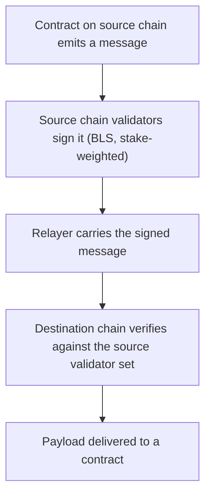

# Cross-Chain Messaging & Interoperability

PulseVM's premise is that an institution or consortium runs **its own network** — its own validators, its own rules, its own state. The obvious next question is the one this page answers: *then how does my network transact with the others?*

The answer is not a bridge in the usual sense. It is **verified message passing between chains that already share validator infrastructure.**

::: warning Status: landing, not shipped
Interchain messaging exists today at the **Metal / Avalanche ecosystem layer** and in EVM subnets. **Native support inside PulseVM is in review upstream** — [PR #64](https://github.com/MetalBlockchain/pulsevm/pull/64): real BLS12-381 signing (min-pk, via `blst`), stake-weighted signature aggregation, proof-of-possession, and a wire codec byte-compatible with AvalancheGo. The Metallicus team has publicly demonstrated asset transfer between a Subnet-EVM chain and PulseVM over Avalanche ICM as work in progress. Until it merges and ships in a release, treat this as a capability that is landing — not one to build production systems against.
:::

## The model, plainly

Chains in the Metal ecosystem are secured by validators drawn from a common network. That shared foundation is what makes interoperability structurally different from bridging:

1. A contract on the **source chain** emits a message.
2. That chain's **own validators sign it** — the same validators who already secure it, using BLS signatures that aggregate into one compact proof weighted by stake.
3. A **relayer** carries the signed message. Relayers are untrusted couriers: they can delay or drop a message, but they cannot forge one.
4. The **destination chain verifies** the aggregate signature against the source chain's validator set, then delivers the payload to a contract.

The contrast with the classic bridge model is the trust assumption. A conventional bridge inserts an external party — a custodian, a multisig federation, an off-chain committee — whose honesty you must trust *in addition to* the two chains. Here, there is no new party: **if you already trust the source chain's validator set, you already trust its messages.**

## Mixed-VM ecosystems: EVM ↔ PulseVM

Interchain messaging is a **network-level standard, not a VM-specific one** — participants do not need to run the same virtual machine.

EVM chains built on [subnet-evm](https://github.com/MetalBlockchain/subnet-evm) already support Warp messaging today through the EVM Warp precompile. Because PulseVM's implementation is wire-compatible with AvalancheGo, the two speak the same protocol: a **Solidity contract on an EVM network and an Antelope-model contract on a PulseVM network can exchange verifiable messages**, carried by the same relayer infrastructure that already exists.

That matters for a common institutional situation: an organization with existing EVM systems that wants Antelope-style named accounts, permissions, and resource economics for a new deployment does not have to choose. The two networks can be separate, each suited to its purpose, and still transact.

## Connect by choice

For regulated deployments, *whether* networks connect is as important as *how*.

**Isolation is the default posture.** A network interoperates only where a business relationship requires it, and that connection is a deliberate configuration — not an inherited exposure that arrives with the technology. An operator decides:

- **which counterparty networks** it will accept messages from,
- **which contracts** may act on those messages,
- **under what conditions** — amount limits, allow-lists, dual control, or any other policy expressible in a system contract.

The practical consequence is a bounded blast radius. Connecting to one counterparty does not implicitly connect you to everything that counterparty connects to, and every connection is a configuration change an auditor can inspect. See [Privacy & Confidentiality](/guide/privacy) for the broader isolation model.

## What it enables

- **Institution-to-institution settlement** across separate networks — each party keeps its own ledger and its own rules, while value and instructions move between them under verification rather than under trust.
- **A common settlement asset.** Metal Dollar can act as the shared unit across the ecosystem, so participants transact in one asset without sharing one chain — see [For Banks & Fintechs](/institutions/banks).
- **Consortium networks that stay sovereign.** Members exchange verified state — attestations, positions, claims, settlement instructions — without merging into a single shared chain and the governance compromise that implies. See [Enterprises & Consortia](/institutions/enterprises).
- **Mixed-VM architectures**, as above: EVM where EVM fits, PulseVM where the account and permission model fits.
- **Continuity after migration.** A chain that [migrates its state onto PulseVM](/guide/migrate-antelope-chain) lands inside this ecosystem rather than isolated from it.

## How a contract uses it

Conceptually, from the contract author's side:

- **Sending** — a contract emits a message with a payload and a destination chain. The chain's validators sign it as part of normal operation; the contract does not manage keys or signatures itself.
- **Receiving** — the destination chain verifies the aggregate signature before any contract code runs, so a contract that receives a message can rely on its origin. What it *does* with that message — accept, reject, apply policy — is ordinary contract logic.

The host-function surface that exposes this to WASM contracts is part of the work in review; this page will document the concrete API once it ships. Follow [PR #64](https://github.com/MetalBlockchain/pulsevm/pull/64) for the implementation, and [Updates](/network/updates) for release status.

## Related

- [Privacy & Confidentiality](/guide/privacy) — the isolation model this builds on
- [Launch Your Own Network](/network/launch) — standing up the network that would connect
- [Enterprises & Consortia](/institutions/enterprises) — the multi-party case
- [For Banks & Fintechs](/institutions/banks) — settlement and Metal Dollar
