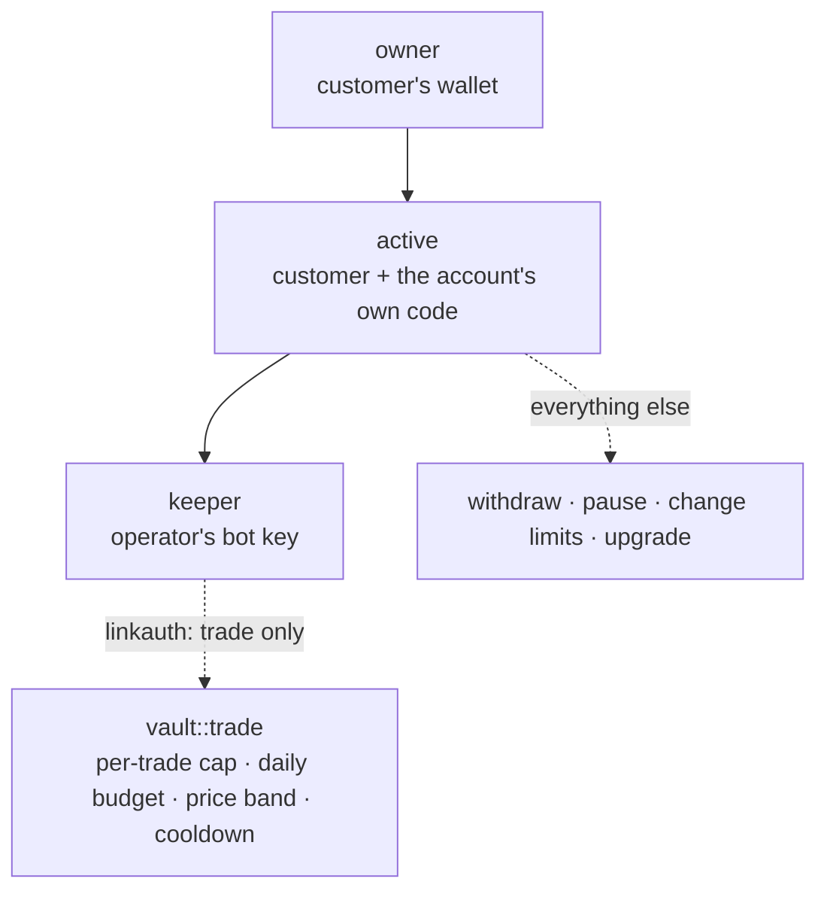

# Delegated authority with hard limits

Give someone, or something, the power to act for you, and let the chain enforce exactly how far that power goes. On PulseVM this is not a product you buy or a contract wallet you audit. It is how accounts work.

## The pattern

1. **The customer owns the account.** Their wallet holds `owner`. Nobody else can change who controls it.
2. **The operator gets one permission, bound to one action.** A named permission holds the operator's key and is linked with [`linkauth`](/guide/accounts-permissions#give-a-key-one-job) to a single contract action. Every other contract action refuses it before any contract code runs. The permission can still manage itself (change its own key, or remove its own link), but none of that reaches another action.
3. **The contract holds the limits.** That one action checks a mandate stored in the account: how much per call, how much per day, at what prices, how often.
4. **The owner can stop it with one signature.** Pause, change the limits or take everything out, at any time, without asking the operator.

## Case study: a service key that can only do its job

**The result first.** A live service holds a key on accounts its customers own. That key is permitted exactly one action. When the operator handed the real key to an attacker in a test exercise, 31 of 31 attempts to move funds out or take the account over were refused by the ledger itself. The customer can stop the service, or take everything back, with one signature.

For a bank, the same shape is a payments processor that can only pay approved payees, a treasury sweep that can only move money between your own accounts, or an AI agent acting under a customer's mandate.

### The service

This runs in production today on XPR Network mainnet, which uses the same account model PulseVM runs unchanged: PulseVM has replayed all 401,005,383 XPR Network mainnet blocks.

[Vaults](https://vaults.protonnz.com), built by the XPR Network block producer protonnz, is a trading bot you hire without handing over your money. A customer picks a strategy and pays a setup fee. The system creates a vault: an account of their own, running a small router contract.

- **The customer's wallet is the vault's owner.** Money never leaves an account they control.
- **The operator's bot may call exactly one action, `trade`,** and only inside limits written into the account when it was built: a per-trade cap, a daily budget, a price band checked against an oracle and against the exchange's last price, a cooldown, and floors the vault always keeps.
- **Tokens only move through an exchange round trip back into the vault.** There is no action that pays an address the operator chooses.
- **The customer can pause, or take everything out, with one signature.**
- **Every claim can be checked on chain.** The vault page reads the account's permissions and code hash straight from the chain and compares them with the published build.

The first outside customer paid and had a built, verified, trading vault **146 seconds** later, with no person involved.

### What a stolen key can do

The operator ran the real bot key, from its real keychain, against a delivered vault on testnet: exactly what someone who copied the key off the server would hold. The goal was to get money out or take the account over.

**31 attempts. 31 refused by the chain. Nothing left the vault.** A sample of what the chain said:

| Attempt, signed with the bot's permission | Refused with |
|:---|:---|
| Transfer the vault's tokens to another account | `action declares irrelevant authority 'vault@keeper'; minimum authority is vault@active` |
| Push the tokens onto the exchange, then withdraw them | irrelevant authority; minimum is `active` |
| Rewrite the vault's `active` permission to the bot key | irrelevant authority; minimum is `active` |
| Link token transfers to the bot's permission | irrelevant authority; minimum is `active` |
| Trade above the per-call cap, or below the oracle floor | `above per-call cap`, `limit below oracle sell floor` |

The token transfer is refused by the protocol before the token contract is even consulted. That is the load-bearing result: a stolen key cannot move tokens directly, whatever it signs. What the permitted `trade` action does with the vault's funds is up to the router contract, which is why its code is published, pinned by hash and checked. One attempt, widening the bot's own permission, failed because the vault holds no bandwidth of its own rather than on authority. Even had it landed, it would not reach token transfers, which need `active`.

## Where else this applies

| Who acts | The one action | Limits the contract enforces |
|:---|:---|:---|
| A trading bot or market maker | `trade` | Size, daily budget, price band, cooldown |
| A payments processor | `pay` to approved payees | Per-payment and daily caps, allow-list |
| A treasury desk | `sweep` between the institution's own accounts | Amount bands, time windows, dual control above a threshold |
| An AI agent acting for a customer | One task-specific action | A mandate the customer set and can revoke |
| Payroll | `disburse` against an approved run | Total equals the approved batch |

## The same thing on an EVM chain

You would deploy a smart-contract wallet, add a module that grants the operator a session key, add a guard contract for the limits, and have each one audited, because the account itself cannot say "this key may only call that function". On PulseVM the account can, so the only contract you write is the one that holds your business limits.

## Build it

- [Accounts and permissions](/guide/accounts-permissions): the tree, `linkauth` and the exact commands.
- [Multisig](/guide/multisig): put the owner, or large withdrawals, under dual control.
- [Get started](/build/get-started): deploy a contract and bind a key to one of its actions.
