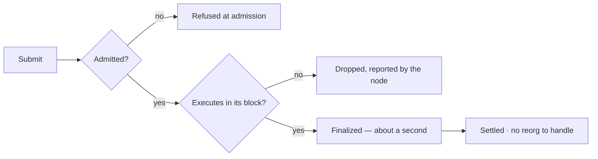

# Finality and settlement

On PulseVM **the head block is the last irreversible block.** A payment is settled the moment its block is accepted.

- A transaction is final in about a second, as soon as its block is accepted.
- **Finalized blocks do not reorganize** — there is no probabilistic-finality window. A transaction is either refused at the door, fails when its block is built, or lands in a block and is settled with no reorg to design around.
- No confirmation-count policies, no "wait N blocks" memos for your risk committee, no probabilistic language in your SLA.

"When is this transfer settled?" has a one-word answer: *now*. (And if the validator set ever can't reach quorum, the network pauses and resumes rather than forking — see below.)

## One payment, two kinds of chain

<FinalityTimeline />

## The lifecycle

## Reads are free, for anyone

Every read is free. An auditor or regulator can be handed a node or an indexer and get complete, real-time visibility into the chain's state — no per-query cost, no privileged access tier. Verifiability is a property of the network, not a paid feature.

## What happens under network partition

Finality is a **safety guarantee**: the network never produces two conflicting "final" states. If the validator set were ever unable to reach quorum, the protocol favors safety over liveness — it waits for quorum and resumes, rather than forking into divergent histories. For a settlement system this is exactly the right trade: there is never a reconciliation problem, only resumption.

## Why this matters more than TPS

Payment and settlement systems are defined by their failure semantics, not their peak throughput. Deterministic, instant finality removes an entire class of operational policy (reorg handling, finality monitoring, double-spend windows) from every integration that touches the chain.

## How it works

Metal Blockchain's Snowman consensus finalizes each block through repeated randomized sampling of the validator set — fast metastable agreement that suits small, accountable validator sets (a consortium's named institutions) as well as larger public sets.
