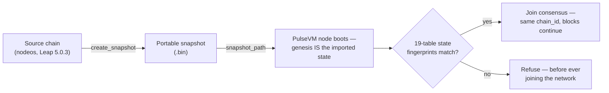

# Migrating an Antelope Chain to PulseVM

Any Antelope chain on the **Leap 5.0.3 lineage** — a public network or a private enterprise deployment — can move its entire state onto PulseVM and **keep its identity**. Not a token bridge, not a contract-by-contract port, not a "genesis snapshot" airdrop: the chain itself continues, executing on a new VM.

This page describes the capability and the evidence behind it. It is a technical demonstration of what PulseVM can do — not an announcement about any production network's plans.

## The thesis

Four properties make this a migration rather than a relaunch:

- **State moves byte-exactly.** Every account, permission tree, contract (verified code hashes), table row, balance, and resource position imports from an Antelope portable chainstate snapshot — the same `.bin` files nodeos produces.
- **Identity is continuous.** The migrated chain presents the **source chain_id**, so every existing key signs, every existing signature verifies, and every dapp's signing config is already correct. Block numbering continues from the cut — there is no "new chain" from a client's point of view.
- **History federates.** Pre-cut history stays on the source chain's Hyperion archive; post-cut history is indexed by [hyperion-rs](https://github.com/MetalBlockchain/hyperion-rs). One continuous account timeline, no history-migration project.
- **The switchover is measured.** In rehearsal, the write pause was **15.0 seconds wall-clock** with **zero read downtime** — and every step before the traffic flip is abortable, with the source chain resuming automatically.

## How it works



**Snapshot in, chain out.** PulseVM boots a chain directly from an Antelope portable chainstate snapshot: point the node's config at the file (`snapshot_path`) and genesis *is* the imported state. The snapshot reader is upstream PulseVM code ([`pulsevm_snapshot`, PR #53](https://github.com/MetalBlockchain/pulsevm/pull/53) — merged).

**Every node verifies; nobody is trusted.** Each validator computes **19-table state fingerprints** over its imported state and compares them against published goldens before joining consensus. There is no trusted snapshot publisher anywhere in the flow: a node whose import disagrees with the network **fails its own verification first**, before it can ever contribute a block. In a multi-validator ceremony, each operator takes the snapshot from their *own* source node — the fingerprints prove that everyone starts from identical state, byte for byte.

**History before the cut federates.** The new chain doesn't carry old blocks; it doesn't need to. Explorers and history APIs query the source chain's Hyperion for everything up to the snapshot block and the new chain's hyperion-rs for everything after, stitched into one timeline.

## The living proof

The **[XPR 1:1 demo network](/network/one-to-one-demo)** runs the full state of XPR Network testnet on PulseVM, live and public: **32,000+ accounts, ~600 deployed contracts, over two million table rows**, imported byte-exact from a production-scale Antelope chain.

The part that matters most: the blocks after the import are **transactions signed with real, pre-existing XPR Network keys** — login, transfers, contract calls, with the same key material users held before the import, because the chain_id never changed. Browse it at [testnet.explorer.pulsevm.dev](https://testnet.explorer.pulsevm.dev), where pre-import XPR history and post-import PulseVM blocks appear on one seamless account timeline.

## The cutover ceremony, rehearsed

Booting from a snapshot proves the *destination*. A live migration also needs the *transition*: freezing writes, cutting the snapshot at an exact block, verifying it, igniting the new chain, and flipping traffic — with a way back at every step. That sequence is run by a cutover agent: a single binary, driven by a journaled state machine:

```
ARMED → FROZEN → SNAPSHOTTED → VERIFIED → IGNITED → LIVE
```

- **ARMED** — preflight checks pass (freeze height declared, paths staged, producer API reachable); the ceremony is scheduled.
- **FROZEN** — at height H, writes are rejected at the API edge with a clear error (nothing is silently dropped); reads keep serving throughout.
- **SNAPSHOTTED** — the snapshot is cut and pinned to an exact **height and block id**, so a stray late block or microfork cannot smuggle in a different cut.
- **VERIFIED** — sha256 plus a **dual independent import**: the snapshot is imported into two fresh state arenas which must produce identical 19-table fingerprints before they're compared against the goldens.
- **IGNITED** — the PulseVM node starts and must present the **source chain_id at exactly the cut block**.
- **LIVE** — the gate that matters: the new chain's head must advance *past* the cut (consensus provably producing). Only then do traffic hooks run. The endpoint flip is the **only user-visible commitment in the entire ceremony**, and it happens strictly after this gate.

Every transition is an fsync'd journal entry with evidence — heights, block ids, hashes, per-table fingerprints, durations. Measured results from the rehearsal (a live Leap 5.0.3 source chain with real traffic flowing, cut over to PulseVM unattended):

| Ceremony step | Measured |
|---|---|
| Write freeze → snapshot cut & pinned | **2.9 s** |
| Verify (sha256 + dual import + 19 fingerprints) | **9 ms** |
| Ignite (PulseVM serves source chain_id at the cut) | **11.0 s** |
| First post-cutover block | **1.1 s** |
| **Total write gap (wall-clock)** | **15.0 s** |
| Read downtime | **zero** |

The same keys that signed transactions on the source chain before the freeze signed PulseVM transactions after it; balances carried to the digit; block numbering continued through the cut.

**The failed runs are part of the proof.** In two earlier rehearsal runs, a deliberately reachable misconfiguration meant the ignited chain presented the cut but could not produce. The LIVE gate refused, the ceremony **aborted and rolled back automatically** — the source chain's producer resumed, and because traffic flips only after LIVE, no client was ever pointed at a dead chain. The rollback doctrine is simple: the source chain remains authoritative until the new chain is provably producing, and un-pausing it is the entire rollback.

::: warning Scale, honestly
The rehearsal ran on a dev-scale chain. Snapshot creation scales with state size — at production scale it takes minutes, not seconds. The ceremony is designed for that: the source chain keeps producing (and serving reads) while the snapshot is written, so state size mostly extends the preparation phase rather than the write gap. A shadow-mirror design that pre-syncs state continuously and collapses the gap to a final drain is specified as the next iteration.
:::

## Where each piece stands

| Component | Status |
|---|---|
| Snapshot reader (`pulsevm_snapshot`) | **Merged upstream** — [PR #53](https://github.com/MetalBlockchain/pulsevm/pull/53) |
| Bulk state writer + snapshot boot | PRs in flight — [PR #58](https://github.com/MetalBlockchain/pulsevm/pull/58) |
| 1:1 demo network (full testnet state, live) | **Running** — [see it](/network/one-to-one-demo) |
| Cutover agent (freeze → verify → ignite → flip) | Rehearsed end-to-end; being open-sourced |
| R1 / WebAuthn key verification | Tracked upstream — [#54](https://github.com/MetalBlockchain/pulsevm/issues/54) |
| Multi-validator cutover ceremony | Next milestone — each validator snapshots and verifies independently |

## FAQ

**Do users need new keys?**
No. The chain_id is preserved, so every existing key and signature works unchanged — demonstrated with real pre-existing keys on the demo network. K1 keys are fully supported today; R1/WebAuthn passkey verification is tracked in [#54](https://github.com/MetalBlockchain/pulsevm/issues/54).

**Do dapps need code changes?**
The endpoint URL. That's the list. chain_id, keys, contracts, ABIs, and table shapes are unchanged; `/v1/chain` REST is served through a compatibility gateway so eosjs/WharfKit clients work as-is; hyperion-rs serves drop-in Hyperion v2 history shapes.

**What happens to history?**
State migrates, history federates: pre-cut actions stay on the source chain's Hyperion, post-cut actions index into hyperion-rs, and explorers stitch them into one account timeline at the snapshot block.

**How long is the pause?**
15.0 seconds of write pause in rehearsal, zero read downtime. Larger chains extend the preparation phase (snapshot creation), not materially the write gap.

**Is this production-ready today?**
The capability is demonstrated, not yet productized. The reader is merged, the demo network is live, and the ceremony is rehearsed with automatic rollback — while the state-writer/boot PRs, R1/WebAuthn keys, and a multi-validator rehearsal are open, tracked work. This page will keep pace as each lands.

## Related

- [The 1:1 Demo Network](/network/one-to-one-demo) — the migration capability, running live
- [Antelope Compatibility](/compare/antelope) — the execution-layer surface that makes byte-exact import meaningful
- [Updates](/network/updates) — the development timeline
- [MetalBlockchain/pulsevm](https://github.com/MetalBlockchain/pulsevm) — the VM, and the PRs/issues linked above
