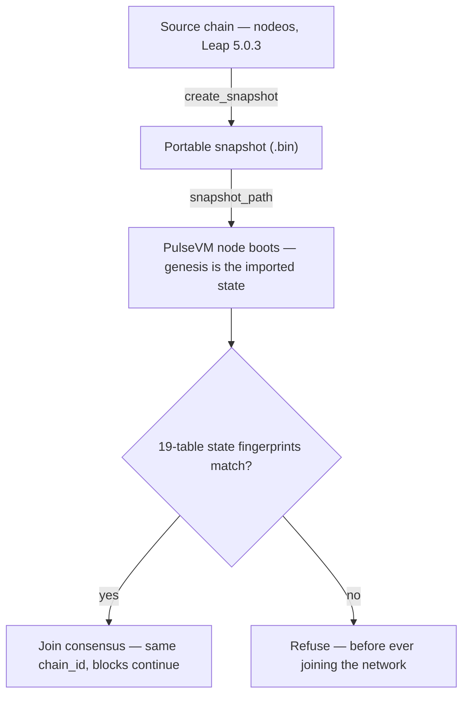

# Migrating an Antelope Chain to PulseVM

Any Antelope chain on the **Leap 5.0.3 lineage** — a public network or a private enterprise deployment — can move its entire state onto PulseVM and **keep its identity**. Not a token bridge, not a contract-by-contract port, not a "genesis snapshot" airdrop: the chain itself continues, executing on a new VM.

This page describes the capability and the evidence behind it. It is a technical demonstration of what PulseVM can do — not an announcement about any production network's plans.

## The thesis

Four properties make this a migration rather than a relaunch:

- **State moves byte-exactly.** Every account, permission tree, contract (verified code hashes), table row, balance, and resource position imports from an Antelope portable chainstate snapshot — the same `.bin` files nodeos produces.
- **Identity is continuous.** The migrated chain presents the **source chain_id**, so every existing key signs, every existing signature verifies, and every dapp's signing config is already correct. Block numbering continues from the cut — there is no "new chain" from a client's point of view.
- **History federates.** Pre-cut history stays on the source chain's Hyperion archive; post-cut history is indexed by [hyperion-rs](https://github.com/MetalBlockchain/hyperion-rs). One continuous account timeline, no history-migration project.
- **The switchover is measured.** In the dev-chain rehearsal the write pause was **15.0 seconds wall-clock** with **zero read downtime**. Against a real chain's full state (32,513 accounts, live XPR Network testnet), the API-provider ceremony has now been run **22 consecutive times without a failure**, with an externally measured **99.8% read availability** through the ceremony and a traffic flip smaller than ordinary internet jitter — and every step before the flip is abortable, with automatic rollback.

## How it works

<video controls muted playsinline preload="none" poster="/media/cutover-explainer.png" src="/media/cutover-explainer.mp4" style="width:100%;border-radius:12px;margin:8px 0 20px;"></video>

*106 seconds: the whole cutover — the one-file idea, the nobody-trusted verification, the ceremony, the rollback, and the URL that keeps its memory.*




**Snapshot in, chain out.** PulseVM boots a chain directly from an Antelope portable chainstate snapshot: point the node's config at the file (`snapshot_path`) and genesis *is* the imported state. The snapshot reader is upstream PulseVM code ([`pulsevm_snapshot`, PR #53](https://github.com/MetalBlockchain/pulsevm/pull/53) — merged).

**Every node verifies; nobody is trusted.** Each validator computes **19-table state fingerprints** over its imported state and compares them against published goldens before joining consensus. There is no trusted snapshot publisher anywhere in the flow: a node whose import disagrees with the network **fails its own verification first**, before it can ever contribute a block. In a multi-validator ceremony, each operator takes the snapshot from their *own* source node — the fingerprints prove that everyone starts from identical state, byte for byte.

**History before the cut federates.** The new chain doesn't carry old blocks; it doesn't need to. Explorers and history APIs query the source chain's Hyperion for everything up to the snapshot block and the new chain's hyperion-rs for everything after, stitched into one timeline.

## The living proof

The **[XPR 1:1 demo network](/network/one-to-one-demo)** runs the full state of XPR Network testnet on PulseVM, live and public: **32,000+ accounts, ~600 deployed contracts, over two million table rows**, imported byte-exact from a production-scale Antelope chain.

The part that matters most: the blocks after the import are **transactions signed with real, pre-existing XPR Network keys** — login, transfers, contract calls, with the same key material users held before the import, because the chain_id never changed. Browse it at [testnet.explorer.pulsevm.dev](https://testnet.explorer.pulsevm.dev), where pre-import XPR history and post-import PulseVM blocks appear on one seamless account timeline.

## The cutover ceremony, rehearsed

Booting from a snapshot proves the *destination*. A live migration also needs the *transition*: freezing writes, cutting the snapshot at an exact block, verifying it, igniting the new chain, and flipping traffic — with a way back at every step. That sequence is run by a cutover agent: a single binary, driven by a journaled state machine:

```
ARMED → FROZEN → SNAPSHOTTED → VERIFIED → IGNITED → LIVE
```

- **ARMED** — preflight checks pass (freeze height declared, paths staged, producer API reachable); the ceremony is scheduled.
- **FROZEN** — at height H, writes are rejected at the API edge with a clear error (nothing is silently dropped); reads keep serving throughout.
- **SNAPSHOTTED** — the snapshot is cut and pinned to an exact **height and block id**, so a stray late block or microfork cannot smuggle in a different cut.
- **VERIFIED** — sha256 plus a **dual independent import**: the snapshot is imported into two fresh state arenas which must produce identical 19-table fingerprints before they're compared against the goldens.
- **IGNITED** — the PulseVM node starts and must present the **source chain_id at exactly the cut block**.
- **LIVE** — the gate that matters: the new chain's head must advance *past* the cut (consensus provably producing). Only then do traffic hooks run. The endpoint flip is the **only user-visible commitment in the entire ceremony**, and it happens strictly after this gate.

Every transition is an fsync'd journal entry with evidence — heights, block ids, hashes, per-table fingerprints, durations. Measured results from the rehearsal (a live Leap 5.0.3 source chain with real traffic flowing, cut over to PulseVM unattended):

| Ceremony step | Measured |
|---|---|
| Write freeze → snapshot cut & pinned | **2.9 s** |
| Verify (sha256 + dual import + 19 fingerprints) | **9 ms** |
| Ignite (PulseVM serves source chain_id at the cut) | **11.0 s** |
| First post-cutover block | **1.1 s** |
| **Total write gap (wall-clock)** | **15.0 s** |
| Read downtime | **zero** |

The same keys that signed transactions on the source chain before the freeze signed PulseVM transactions after it; balances carried to the digit; block numbering continued through the cut.

**The failed runs are part of the proof.** In two earlier rehearsal runs, a deliberately reachable misconfiguration meant the ignited chain presented the cut but could not produce. The LIVE gate refused, the ceremony **aborted and rolled back automatically** — the source chain's producer resumed, and because traffic flips only after LIVE, no client was ever pointed at a dead chain. The rollback doctrine is simple: the source chain remains authoritative until the new chain is provably producing, and un-pausing it is the entire rollback.

## Rehearsed again — on a real chain's state, from the operator's side

The dev-chain rehearsal proved the mechanics. The next question was the one an
infrastructure operator actually asks: *what do my users see?* So the ceremony was
re-run in **API-provider mode** — the flavor an RPC provider runs on switch day —
against the **full live state of XPR Network testnet** (32,513 accounts, 636
contracts, a 180 MB production-shape snapshot), with an external probe hammering
the public endpoint every 250 ms from another network, through the entire ceremony:

| Measured (live-testnet state, API-provider ceremony) | Result |
|---|---|
| Read availability through the whole ceremony (3,229 external probes) | **99.81%** |
| The traffic flip itself (nodeos → PulseVM behind one URL) | **0.75 s** (2 probes) — smaller than the **1.26 s** worst internet-jitter gap in the *same trace before the ceremony began* |
| State verification (sha256 + dual independent import + 19 fingerprints) | **4.1 s** |
| Write proof | a transfer signed with a pre-existing key, pushed through the *same public URL*, minted the first post-cut block |

**Repeatability, with numbers.** The same ceremony has now run **22 times in a
row against the live testnet — 22/22 reached LIVE**, zero aborts (two batches,
statistically identical):

| Ceremony phase (N=22) | mean | median | p95 |
|---|---|---|---|
| Snapshot at finality (source chain's own irreversibility wait) | 176.6 s | 174.0 s | 180.0 s |
| Verify (sha256 + dual import + fingerprints) | 3.1 s | 2.9 s | 4.0 s |
| Ignite (PulseVM serves the source chain_id at the cut) | 8.5 s | 8.6 s | 8.6 s |
| Flip + health + source retirement | 2.0 s | 2.0 s | 2.1 s |
| **Ceremony gap (freeze → LIVE)** | **190.2 s** | **188.0 s** | **194.7 s** |

The anatomy matters: **~93% of that gap is the source chain finalizing its own
cut block** — the unavoidable wait for irreversibility that any snapshot-based
migration pays, on any stack. The tooling itself (verify + ignite + flip +
retire) costs about **13.6 seconds**. Reads never gap either way; the shadow-mirror
design that pre-syncs state continuously targets the finality wait, not the tooling.

## Your history endpoint keeps its memory

"History federates" was proven client-side by the explorer; it is now a
**server-side capability**: a federating history router serves the Hyperion `/v2`
API through one public URL, answering pre-cut queries from the source chain's
existing Hyperion archive and post-cut queries from the new chain's
[hyperion-rs](https://github.com/MetalBlockchain/hyperion-rs) — one continuous,
correctly ordered account timeline across the migration seam. The cutover agent
runs it as part of the same ceremony: hyperion-rs is stood up against the new
chain and health-gated for hydration *before* anything flips, and `/v1` and `/v2`
swap in the same instant.

Recorded live (same testnet-state ceremony): minutes after the cut, one call to
the public `/v2/history/get_actions` returned the **post-cut transfer indexed by
hyperion-rs directly above thousands of pre-cut actions from the old archive** —
same URL, same account, one timeline; `get_transaction` resolves post-cut ids
locally and pre-cut ids from the archive. Providers who kept their own full
history point the router at their local archive instead of a public one — same
configuration, one knob. And an operational bonus from the recorded run: post-cut
`/v2` availability measured *higher* than the pre-cut public archive it fronted
(99.8–100% vs 93.3%), because post-cut answers are local.

The ceremony now covers all three operator roles — **block producer** (freeze,
snapshot at exactly the declared height, become a producer of the new chain),
**API provider** (`/v1` continuity, zero read gap), and **history provider**
(`/v2` continuity) — each with a recorded, journaled run on real chain state.

::: warning Scale, honestly
These numbers are testnet-scale (180 MB snapshot, ~32k accounts; verification
alone at this size is ~3–4 s). A larger chain extends snapshot creation and the
finality wait — the phases where the source chain is still fully serving — more
than the tooling phases. The 22-run distribution above is one chain at one size;
the honest claim is repeatability and anatomy, not a universal constant.
:::

## Where each piece stands

| Component | Status |
|---|---|
| Snapshot reader (`pulsevm_snapshot`) | **Merged upstream** — [PR #53](https://github.com/MetalBlockchain/pulsevm/pull/53) |
| Bulk state writer + snapshot boot | PRs in flight — [PR #58](https://github.com/MetalBlockchain/pulsevm/pull/58) |
| 1:1 demo network (full testnet state, live) | **Running** — [see it](/network/one-to-one-demo) |
| Cutover agent (freeze → verify → ignite → flip) | **Open source: [pulse-cutover](https://github.com/paulgnz/pulse-cutover)** — three modes recorded (producer / API / history) on live-testnet state; 22/22 repeat runs; reproduce it yourself against a public snapshot |
| Federated /v2 history router | **Recorded live** — one URL, pre-cut archive + post-cut hyperion-rs |
| R1 / WebAuthn key verification | Tracked upstream — [#54](https://github.com/MetalBlockchain/pulsevm/issues/54) |
| Multi-validator cutover ceremony | Next milestone — each validator snapshots and verifies independently |

## FAQ

**Do users need new keys?**
No. The chain_id is preserved, so every existing key and signature works unchanged — demonstrated with real pre-existing keys on the demo network. K1 keys are fully supported today; R1/WebAuthn passkey verification is tracked in [#54](https://github.com/MetalBlockchain/pulsevm/issues/54).

**Do dapps need code changes?**
The endpoint URL. That's the list. chain_id, keys, contracts, ABIs, and table shapes are unchanged; `/v1/chain` REST is served through a compatibility gateway so eosjs/WharfKit clients work as-is; hyperion-rs serves drop-in Hyperion v2 history shapes.

**What happens to history?**
State migrates, history federates: pre-cut actions stay on the source chain's Hyperion, post-cut actions index into hyperion-rs, and a federating router serves both through the same public /v2 URL as one account timeline — recorded live, with a post-cut transaction answering directly above thousands of pre-cut rows minutes after the cut.

**How long is the pause?**
Reads: zero downtime, measured externally at 99.8% availability through 22 live-testnet ceremonies with a 0.75 s flip. Writes: 15.0 s on the dev-chain rehearsal; on real testnet state the freeze-to-LIVE gap averaged 190 s — of which ~93% is the source chain finalizing its own cut block (a wait any snapshot migration pays) and ~13.6 s is the tooling.

**Is this production-ready today?**
The capability is demonstrated, not yet productized. The reader is merged, the demo network is live, and the ceremony is rehearsed with automatic rollback — while the state-writer/boot PRs, R1/WebAuthn keys, and a multi-validator rehearsal are open, tracked work. This page will keep pace as each lands.

## Related

- [The 1:1 Demo Network](/network/one-to-one-demo) — the migration capability, running live
- [Antelope Compatibility](/compare/antelope) — the execution-layer surface that makes byte-exact import meaningful
- [Updates](/network/updates) — the development timeline
- [MetalBlockchain/pulsevm](https://github.com/MetalBlockchain/pulsevm) — the VM, and the PRs/issues linked above
