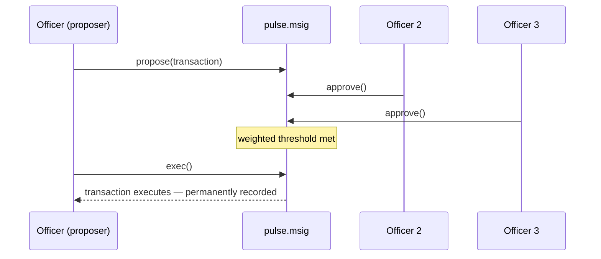

# Native multisig

On-chain multisig in PulseVM is not a smart-contract product — it is a protocol citizen, and arguably the most institution-shaped feature in the stack.

## How it works

1. **Configure**: any permission on any account can require weighted approvals — e.g. `treasury@active` = threshold 2 over three named officers' keys.
2. **Propose**: an officer proposes a transaction on-chain. The proposal is visible chain-wide, with the *decoded actions* — approvers review "transfer 1,000,000 XMD to settlement.a", not a calldata blob.
3. **Approve asynchronously**: each approver signs from their own device and key, on their own schedule. Approvals (and revocations) are on-chain actions.
4. **Execute at threshold**: the transaction runs only when the weighted threshold is met. Expiry is automatic.

Every proposal, approval, revocation, and execution lands permanently on the audit trail **with named identities attached**.

## The flow

## What institutions do with it

- Wire-release requiring 2-of-3 treasury officers
- System-contract upgrades requiring a majority of consortium members
- Risk committee or board approval before a sensitive change executes

All the same primitive. No separate smart-contract multisig platform to deploy, audit, and maintain — and no calldata-blob signing ceremonies.

## Combine it with a one-job key

Multisig and [`linkauth`](/guide/accounts-permissions#give-a-key-one-job) compose. A common institutional shape:

| Permission | Who holds it | What it can do |
|:---|:---|:---|
| `owner` | Board, 3 of 5 | Replace any other permission |
| `active` | Operations, 2 of 3 | Everything day to day |
| `payments` | One processor key | Only `token::transfer`, and only within limits your contract enforces |
| `release` | Treasury, 2 of 3 | Only the large-payment release action |

Small payments flow with one key that can do nothing else. Large ones need two officers. The chain enforces both. See [Delegated authority with hard limits](/guide/delegated-authority) for this pattern in production.

---

The on-chain mechanism is the open-source **`pulse.msig`** system contract — see [System Contracts](/build/system-contracts#pulse-msig). Chains migrated from Antelope keep their `eosio.msig`.
