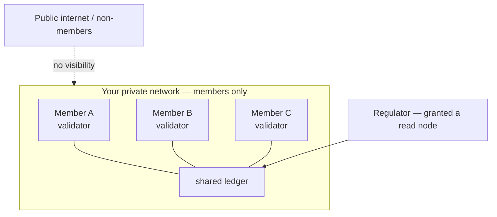

# Privacy & Confidentiality

Privacy on PulseVM is delivered through **architecture** — and the most powerful lever is one public chains don't have: the network boundary itself. How private a deployment is, is a deliberate design choice, not a fixed property.

## The network boundary

A PulseVM network is a subnet with its own validator set. When you run a **private, permissioned network** — validators restricted to the member institutions, and no public RPC or explorer exposed — transaction data lives only among those members. It is not on a public chain, not in a public mempool, not in a public explorer.

This is fundamentally different from a public L1, where every transaction is globally visible and confidentiality must be bolted on cryptographically. Here, confidentiality begins at the boundary: **only the people running the network see it.** (A public-facing network — like a testnet — simply chooses to expose RPC and an explorer; that exposure is a deployment decision you control.)

## The network boundary

## The trust boundary is the validator set

It's worth being precise about who "sees" the data. On-chain data is held in plaintext by the validators. So the confidentiality boundary is the **validator set**: in a closed consortium where the members are the validators, the data is private from the outside world, and shared among the members — which is usually the point of a shared ledger.

## Isolation by relationship

Because launching a network is provisioning rather than a research project, the topology can match the confidentiality requirement:

- **One network per consortium** — members share a ledger; non-members see nothing.
- **Separate networks per relationship** — bilateral or small-group settlement on its own subnet, isolated from other counterparties.
- **Connect by choice** — networks interoperate only where the business relationship requires; isolation is the default posture. See [Cross-Chain Messaging](/guide/cross-chain).

## Confidentiality between members on a shared network

Where two members of the same network must keep specific data confidential **from each other**, the established patterns are:

- **Application-layer encryption** — encrypt sensitive payloads to the intended parties before they go on-chain; the ledger stores and orders the ciphertext, and only the addressed parties can decrypt. (This is implemented in your application, the same way it would be on any ledger.)
- **Reference, don't store** — keep sensitive detail off-chain and commit only a hash or proof on-chain for integrity and audit.
- **A dedicated network** — when two parties need full mutual confidentiality, give the relationship its own subnet.

## Auditor & regulator access

Confidentiality and oversight aren't in tension. Free reads mean a supervisor can be handed a node or an indexer for complete, real-time visibility into the network they oversee — full transparency to the right party, while the data stays off the public internet.

## In short

The network-boundary model gives institutional deployments strong, practical confidentiality: your transactions live among named members on infrastructure you control, with the validator set as the trust boundary. Finer-grained confidentiality between members is a design choice — a dedicated network, application-layer encryption, or both.
