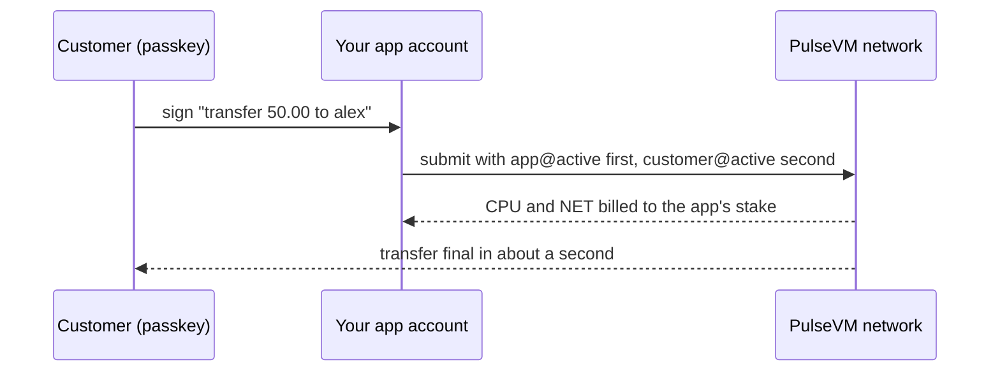

# Resources: CPU, NET and RAM

PulseVM has no gas market. Capacity is provisioned, not auctioned.

| Resource | What it meters | How you get it |
|---|---|---|
| **CPU** | execution time | staked (by the institution/app) |
| **NET** | bandwidth | staked |
| **RAM** | state storage | purchased/provisioned per account |

## Why institutions prefer this

- **Users never buy a token to press a button.** The application or institution stakes resources and sponsors its users — customer experience without crypto mechanics.
- **Costs are capacity planning**, not per-transaction tolls that spike with market activity.
- **Reads are free** — auditors, regulators, and analytics query the chain at no cost.

## How an app pays for its users

With the `ONLY_BILL_FIRST_AUTHORIZER` protocol feature active, as on XPR Network and chains migrated from it, a transaction's CPU and NET are billed to its **first authorizer**. Without it, every authorizing account is billed. An application that adds its own account as the first authorizer, alongside the customer's signature, pays for the transaction. The customer signs with a passkey and never holds a fee token.

Sizing is capacity planning: stake enough CPU and NET for your peak daily volume, and provision RAM for the accounts and table rows you create. Staking can also be delegated, so a treasury account can fund the capacity that an operations account uses.

## Practical notes

- RAM is sized per account. When a contract writes a table row it names the RAM payer explicitly: the contract, the caller or another authorized account. Sponsoring your users' storage is a choice your contract makes.
- Resource configuration (and pricing, where wanted) is system-contract policy — a deploying organization sets its own economics.
