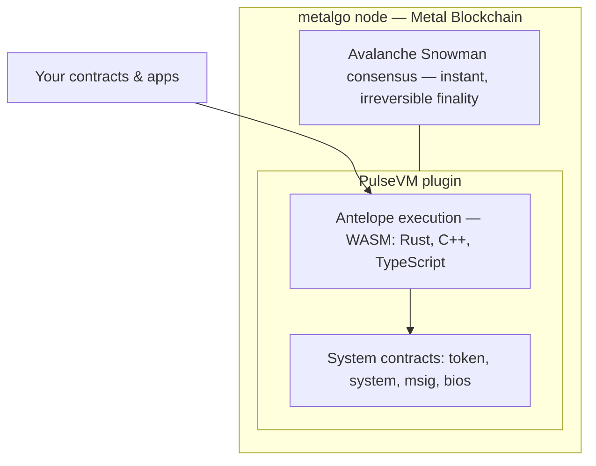

# What is PulseVM?

PulseVM gives an institution a blockchain that works the way the institution already does: accounts with names, authority that follows your org chart, keys that can be limited to one job, and settlement that is final in about a second. It runs on a network you own.

Under the hood, PulseVM is an execution environment for [Metal Blockchain](https://metalblockchain.org) delivered as a plugin for its node software (metalgo). It implements the **Antelope execution model** — the account, permission, and resource system proven over years of production on [XPR Network](https://xprnetwork.org) (Antelope 5.0.3) — and runs it as a subnet with modern consensus: sub-second blocks and instant, irreversible finality.

It is the base layer for **A-Chain**, the future of XPR Network — and equally a kit for any institution or consortium to deploy **its own network** with its own validators and its own rules.

## How it fits together

## The mental model

Think of PulseVM as an operating environment, not "a blockchain you join":

- **Accounts** are named (`acme.treasury`, not `0x7f3a…`) and carry hierarchical permission trees.
- **Permissions** express real authorization structures: role keys, weighted multisig thresholds, delegation between accounts, instant key rotation. Any permission can be bound to one contract action, so a bot, a processor or an agent gets a key that can do exactly one thing.
- **Contracts** are WebAssembly, written in TypeScript, Rust, or C++, with typed ABIs and human-readable actions.
- **Resources** (CPU, NET, RAM) are staked and provisioned by the operator or institution — end users never buy gas.
- **Finality is instant**: the head block is the last irreversible block. There is no reorg case.
- **The rules are yours**: account creation policy, fee models, asset-level controls — all live in system contracts the deploying organization owns.

## Where it comes from

PulseVM stands on two proven foundations, named plainly:

- **Execution: Antelope (formerly EOSIO).** The account, permission, contract, and resource semantics are a direct lineage from the Antelope protocol — the model behind XPR Network, WAX, Telos, and EOS. The VM is written in **Rust**: modern, memory-safe, and checked **byte-for-byte against the reference implementation**: PulseVM has replayed all 401,005,383 XPR Network mainnet blocks.
- **Consensus: Avalanche's Snowman protocol**, as implemented by Metal Blockchain (metalgo). Repeated randomized sampling of the validator set yields fast, metastable, instantly-final agreement — equally suited to small accountable consortium sets and larger public ones.

## A Rust node running WebAssembly contracts

A detail worth being precise about, because it answers a common question — *"Antelope contracts are C++; how do they run on a Rust node?"*

Contracts on Antelope chains are never executed as C++. Authors compile their contract — written in **C++, Rust, or TypeScript** — into a **WebAssembly (WASM)** binary once, and the chain stores and executes that binary. Any node that (a) runs a WASM engine and (b) serves the same host functions the contract imports will execute it identically. PulseVM does both: a production Rust WASM runtime, plus about 180 Antelope host functions, which covers every contract on XPR Network mainnet (all 401,005,383 blocks replay). The Spring-era crypto and BLS sets are still to come ([status](/build/intrinsics)). The result: **contract binaries from existing Antelope chains run unchanged, byte-identical code hashes and all.**

PulseVM's code is open to read and build on ([MetalBlockchain/pulsevm](https://github.com/MetalBlockchain/pulsevm)), created by Metallicus CTO **Glenn Mariën** ([@MlennGarien](https://github.com/MlennGarien)). Evaluation, testing and non-commercial use are free under the PulseVM Business License; commercial deployments are licensed by Metallicus.

## Where to go next

- [Accounts and permissions](/guide/accounts-permissions): the feature people who build on it talk about first
- [Delegated authority with hard limits](/guide/delegated-authority): a key that can only trade, in production
- [For banks and fintechs](/institutions/banks): the economic argument
- [Get started](/build/get-started): deploy a contract and give a second key one job
