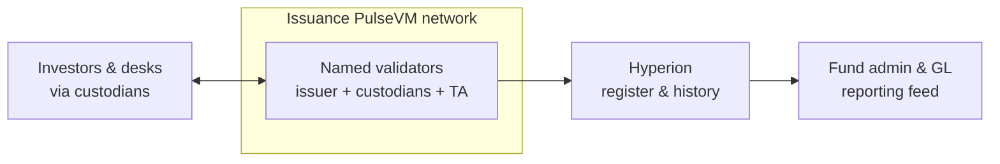

# Capital Markets

The tokenized-deposit logic extends directly to tokenized instruments: private securities, fund shares, money-market instruments, and the cap-table and fund-admin plumbing around them.

## Why the primitives fit

- **Asset issuance with controls you define** — transfer restrictions, allow-listing, lock-ups, and freeze/clawback under legal order as system-contract policy, not per-token bespoke code.
- **Named accounts** for issuers, transfer agents, custodians, and investors; **[multisig](/guide/multisig)** for corporate actions and treasury.
- **[Instant, irreversible finality](/guide/finality)** removes settlement-window risk; atomic delivery-versus-payment is native when cash and asset are on the same ledger.
- **[Private networks](/guide/privacy)** keep the cap table and holdings among the right parties, with auditor/regulator read-access on demand.

## What this looks like in practice

Picture a private-credit manager issuing a $250 million tokenized note program on a network it operates with its transfer agent and two custodian banks. Issuance could be a contract action: the instrument is created with its terms — lock-up, allow-list, holder cap — encoded as ledger-level policy, and the 80 institutional investors hold it at **named accounts** the transfer agent has verified, so the register and the cap table are the same live object rather than a spreadsheet reconciled against custodian records. Secondary transfers between eligible holders settle as atomic delivery-versus-payment — note and tokenized cash swap in one [instant, final](/guide/finality) transaction, so neither side ever holds principal risk in a settlement window, and an ineligible buyer simply cannot receive the instrument because the policy check is in the transfer itself. On coupon day, operations proposes the distribution, a second officer approves under [multisig](/guide/multisig), and one action pays every holder of record from state — no record-date snapshot, no payment-agent file, no breaks to chase, and the entire run is on the permanent audit trail. The fund administrator and the auditor read the same [Hyperion](/institutions/technical-evaluators) history for free; a regulator granted access sees every issuance, transfer, and corporate action by named account. If a court orders a position frozen, compliance executes it as policy in contracts the operator owns. This is the designed capability — the shape a pilot issuance is built to prove.

The ledger is the register and the settlement venue in one; fund administration, custody records, and the GL consume it as a free read instead of reconciling against it.

## Why not something else?

**Why not a public EVM chain?** Because a securities register on a public chain lives at anonymous hex addresses on infrastructure the issuer doesn't govern — eligibility and transfer restrictions become bespoke token code, settlement is probabilistic until enough blocks pass, and fees float with unrelated network congestion. A legal order against a holding has no native path, and confidentiality of the cap table is gone by default. See [PulseVM vs Ethereum](/compare/ethereum).

**Why not a generic permissioned or enterprise DLT?** Permissioned EVM stacks give the operator consensus control but keep the EVM's primitives — hex identities, contract-wallet multisig, per-token restriction frameworks — so the institutional layer is something your engineers assemble, audit, and own forever. Consortium DLT toolkits without production public lineage deliver a framework and a governance problem rather than a working register with native accounts, permissions, and system contracts hardened by real usage. See [PulseVM vs Permissioned EVM](/compare/permissioned-evm) and the [full comparison](/compare/).

**Why not stay with existing post-trade infrastructure?** For listed markets, existing infrastructure is deep and works; the case here starts where that infrastructure doesn't reach — private securities, fund shares, and bespoke instruments whose registers live in spreadsheets and whose settlement is emails, wires, and multi-day reconciliation between transfer agent, custodian, and administrator records. Tokenizing those instruments on a ledger the issuer operates makes the register authoritative, settlement atomic, and corporate actions one auditable step — without asking anyone else's market infrastructure for permission.

## Frequently asked questions

### How does atomic delivery-versus-payment settlement work?

The security and the cash leg live on the same ledger, so a trade settles as one transaction: the instrument moves to the buyer and the tokenized cash moves to the seller in a single atomic action that either fully executes or doesn't happen. There is no settlement window between the legs, so principal risk — delivering the asset and waiting for the payment — is removed by construction, and [finality is instant and irreversible](/guide/finality).

### How are transfer restrictions and investor eligibility enforced?

As system-contract policy the issuer or operator owns, not per-token bespoke code. Allow-lists, lock-ups, jurisdiction gates, and holder caps are rules checked on every transfer at the ledger level; because every holder is a named, [permissioned account](/guide/accounts-permissions) rather than an anonymous address, eligibility is a property of the account, and a non-compliant transfer simply cannot execute.

### How do corporate actions work — coupons, distributions, redemptions?

As contract actions against the authoritative register. A coupon run is one action that pays every holder of record instantly and finally, under [multisig](/guide/multisig) approval by named officers; a redemption retires the instrument and returns cash in the same atomic step. Because the ledger is the register, there is no record-date reconciliation across custodian chains — entitlement is read directly from state, and the full history of every action is permanently auditable.

### What happens under a court order or regulatory action?

Freeze, clawback, and account restriction are first-class policy in system contracts the operator owns, executed under [multisig](/guide/multisig) by named officers with every step on the audit trail. A legal order against a holding is an auditable ledger operation with a documented authorization chain — not an exception request to a protocol that cannot comply.

### Who can see the cap table and holdings?

Exactly the parties the network admits. A deployment is [private and permissioned](/guide/privacy) — issuer, transfer agent, custodians, and investors as named accounts — so holdings are visible inside that boundary and to whomever the operator grants read access, such as auditors or regulators, not to the public internet. Reads are free, so oversight and reporting impose no cost or rate pressure.

### Is PulseVM running in production today?

PulseVM itself is at the test-network stage, in active development by Metallicus. The execution model it implements — Antelope, formerly EOSIO — has run public production chains such as [XPR Network](https://xprnetwork.org), WAX, and Telos for years, so the account, permission, and contract semantics are proven; correctness is measured by [differential testing against that production reference](/institutions/technical-evaluators). Pilot deployments are run with Metallicus engineering.

**[Talk to us — Contact Metallicus →](https://metallicus.com/contact-us?utm_source=pulsevm.dev&utm_medium=docs)**

## For your engineering team

- **[For Technical Evaluators](/institutions/technical-evaluators)** — architecture, integration surface, operations, and the failure model, CTO-to-CTO.
- **[Get Started](/build/get-started)** — stand up against the public test network and deploy a first contract.
- **[Finality & Settlement](/guide/finality)** — why "when is it settled?" has a one-word answer.
