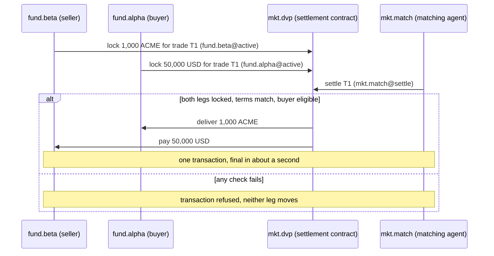

# Capital markets: both legs settle, or neither does

Settlement cycles exist because delivery and payment live on different ledgers, and someone has to carry the risk in between. When the security and the cash are on the same PulseVM network, delivery-versus-payment is one transaction: both legs settle together in about a second, or the whole thing is refused and nothing moves.

## How it works on PulseVM

| Account | Role | Permission that matters |
| --- | --- | --- |
| `acme` | Issuer | `issue`: 2 of 3 officers, linked to `acme.shr::issue` |
| `acme.shr` | Security token contract | Transfer rules the issuer writes: holder allow-list, lock-ups, holder caps |
| `acme.ta` | Transfer agent | `register`, linked to `acme.shr::allow` (adds verified holders) |
| `usd.cash` | Cash token on the same network (for example a tokenized deposit) | Standard transfers |
| `mkt.dvp` | Settlement contract | Holds locked legs per trade; `pulse.code` grant lets it deliver both legs itself |
| `mkt.match` | Matching agent | `settle`, linked to `mkt.dvp::settle` only |
| `fund.alpha`, `fund.beta` | Buyer and seller | Their own `owner` and `active`; they lock legs and can reclaim unsettled ones |

The network operator [stakes resources](/guide/resources) for issuers and investors, so no fund needs a fee token to hold a security. The register is the contract's state: the cap table and the settlement venue are the same object.

## Atomic delivery-versus-payment

What makes it hold:

- **One transaction, two legs.** The security transfer and the cash transfer are inline actions of the same transaction. If either fails, the chain rolls back both. There is no state in which the seller has delivered and not been paid.
- **The issuer's rules run inside the leg.** `acme.shr` checks the buyer against the allow-list during the transfer. An ineligible buyer fails the security leg, which fails the cash leg.
- **Final means final.** Accepted blocks are final in about a second, with no reorganization that could unwind a leg after the fact ([finality](/guide/finality)).
- **Bilateral option.** Two counterparties can also put both transfers in one transaction and both sign it, proposed through `pulse.msig`, with no settlement contract at all.

## Corporate actions under multisig

A coupon or dividend is one action on `acme.shr` that pays every holder of record from state. Operations proposes it, a second officer approves under [weighted multisig](/guide/multisig), and the run is on the permanent record with both names on it. No record-date extract, no paying-agent file.

## Delegated authority: the matching agent

The matching agent runs unattended, so its key gets exactly one job. `mkt.match@settle` can call `mkt.dvp::settle` and nothing else, and `settle` only pairs legs whose terms both sides locked. A compromised agent key cannot transfer, withdraw or change a permission. This is the pattern live on XPR Network for trading bots; see the [delegated authority case study](/guide/delegated-authority).

Evaluating a permissioned EVM network for tokenization? See [PulseVM vs permissioned EVM](/compare/permissioned-evm).

## Frequently asked questions

### What makes delivery-versus-payment atomic on PulseVM?

Both legs execute inside one transaction. If any action in it fails, including an eligibility check on the security or a short cash balance, the whole transaction is rolled back and nothing moves. Once accepted it is final in about a second, with no reorganization that could unwind one leg later.

### Can the issuer enforce transfer restrictions such as allow-lists and lock-ups?

Yes, as policy the issuer writes into the token contract it owns. Because the check runs inside the transfer, an ineligible buyer does not just fail compliance review afterwards: the security leg fails, and with it the cash leg. Freeze or clawback under legal order is also policy the issuer writes; it is not built into the reference contracts.

### What can the matching agent's key do?

Only call `settle` on the settlement contract. Its permission is linked to that one action, so the chain refuses the key on transfers, withdrawals or permission changes before contract code runs, and the contract only pairs legs whose terms match what both sides locked.

### Is this in production?

No. PulseVM is at the test-network stage, and pilot issuances are run with Metallicus. The account, permission and multisig model it runs is the one XPR Network runs in production today.

## Next step

Pick one instrument and one cash leg. A pilot issues it, settles DvP trades between named holders and runs a corporate action under multisig. **[Talk to Metallicus →](https://metallicus.com/contact-us?utm_source=pulsevm.dev&utm_medium=docs)**
