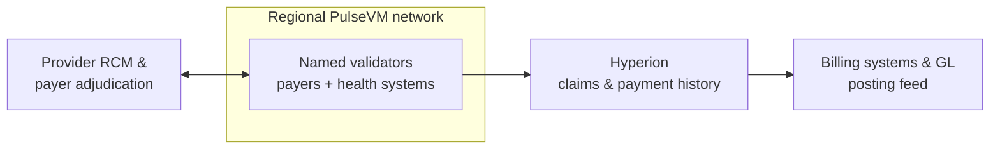

# Healthcare

Payer-provider claims settlement needs three things at once that are hard to get together: a shared authoritative record, confidentiality between parties, and read-access for oversight. The private-subnet model provides all three.

## Why the primitives fit

- **[Private networks](/guide/privacy)**: claims data lives only among the participating payers and providers — never on a public chain — with application-layer encryption where parties must be shielded from each other.
- **Named accounts & [delegated authority](/guide/accounts-permissions)** mirror provider organizations, billing agents, and payers.
- **[Instant finality](/guide/finality)** for adjudicated-claim settlement; **free reads** give regulators and auditors complete visibility into the network they oversee without exposing it publicly.
- **Multisig** for high-value or exception approvals.

## What this looks like in practice

Picture a regional network of three payers and forty provider organizations — hospital systems, physician groups, their billing agents — settling adjudicated claims on a shared PulseVM ledger. A claim could post from the provider's revenue-cycle system as a ledger entry, the payer's adjudication engine could write its decision to the same record, and the payment would execute in that moment: an [instant, irreversible transfer](/guide/finality) from `bluepine.claims → stmarys.rcm` with the remittance detail attached to the transaction itself — no two-week gap between decision and deposit, no remittance file to match against the bank statement. The clinical record never touches the chain: the ledger carries claim identifiers, statuses, and amounts between **named organizational accounts**, while protected health information stays in the payer and provider systems where it lives today. A provider's finance team reads its receivables position live — every claim's state, from submission to final payment, one free query against [Hyperion](/institutions/technical-evaluators) — instead of reconciling three payers' portals against billing-system aging reports. High-value or exception payments hold at a [multisig](/guide/multisig) threshold for a named officer's co-signature, and a state oversight body granted read access sees the complete settlement history without touching any operational system. This is the designed capability — the shape a pilot is built to prove.

The ledger is the shared settlement record; clinical systems and PHI stay entirely off-chain; Hyperion feeds posting, aging, and oversight from the same free reads.

## Why not something else?

**Why not a public EVM chain?** Because healthcare settlement data — even stripped of clinical content — is confidential business information that has no place on the open internet, and pseudonymous hex addresses are the opposite of the accountable organizational identity the workflow requires. Fees float with public congestion, settlement is probabilistic until enough blocks pass, and every control — organizational permissions, approval thresholds, sponsored participants — is bespoke infrastructure to build and audit. See [PulseVM vs Ethereum](/compare/ethereum).

**Why not a generic permissioned or enterprise DLT?** Permissioned EVM stacks give the consortium consensus control but keep hex identities and framework-assembled institutional features that the participants' engineers own forever. Consortium DLT toolkits without production public lineage hand a payer-provider group a governance problem and a multi-year integration project rather than a working system — no native account and permission model, no battle-tested system contracts, no tooling hardened by real usage. See [PulseVM vs Permissioned EVM](/compare/permissioned-evm) and the [full comparison](/compare/).

**Why not keep the clearinghouse-and-check status quo?** It works — as a lag and a reconciliation industry: adjudication and payment live in separate systems connected by batch files, providers wait weeks for deposits they then match by hand, and both sides staff teams to make their copies of the same transaction agree. A shared ledger collapses decision, payment, and record into one final event that both sides — and oversight — read directly.

> Confidentiality patterns and the specific compliance posture (e.g. handling of protected data) are part of a deployment design — [talk to us](https://metallicus.com/contact-us?utm_source=pulsevm.dev&utm_medium=docs) about your requirements.

## Frequently asked questions

### Does protected health information go on the blockchain?

No — the deployment pattern keeps clinical data in the existing payer and provider systems and puts settlement on the ledger: claim identifiers, adjudication status, amounts, and payments between named organizational accounts. Where parties on the same network must be shielded from each other, sensitive payloads are [encrypted at the application layer](/guide/privacy). The specific confidentiality architecture and compliance posture are part of a deployment design with Metallicus engineering.

### How fast do providers get paid after adjudication?

The moment the claim is adjudicated. On one shared ledger, the adjudication decision and the payment are the same event — an [instant, irreversible transfer](/guide/finality) between the payer's and provider's named accounts, at any hour, with the remittance detail attached to the transaction itself. The weeks between decision and deposit, and the remittance-matching work that follows, are artifacts of separate systems the shared ledger removes.

### How does this reduce reconciliation between payers and providers?

Because both sides read the same authoritative record instead of maintaining two and comparing them. A provider's revenue-cycle team sees each claim's status and payment as one queryable history — submitted, adjudicated, paid — rather than matching remittance files against bank deposits against their own billing system. Reads are free, so posting and reporting are API queries, not batch projects.

### What do regulators and auditors see?

Whatever the network grants — up to complete, human-readable settlement history by named organizational account, queryable in real time at no per-query cost. An oversight body can be given read access to the payment ledger without touching any clinical or operational system, and controls such as payment holds are policy in contracts the network's operator owns, executed under [multisig](/guide/multisig) on the audit trail.

### Do providers or patients need cryptocurrency?

No. The network operator stakes [resources](/guide/resources) and sponsors participants entirely — a provider's billing office interacts through its existing revenue-cycle tools via API, and patients never touch the ledger at all. There is no token to buy, no gas prompt, no crypto mechanics anywhere in the workflow.

### Is PulseVM running in production today?

PulseVM itself is at the test-network stage, in active development by Metallicus. The execution model it implements — Antelope, formerly EOSIO — has run public production chains such as [XPR Network](https://xprnetwork.org), WAX, and Telos for years, so the account, permission, and settlement semantics are proven; correctness is measured by [differential testing against that production reference](/institutions/technical-evaluators). Pilot deployments are run with Metallicus engineering.

**[Talk to us — Contact Metallicus →](https://metallicus.com/contact-us?utm_source=pulsevm.dev&utm_medium=docs)**

## For your engineering team

- **[For Technical Evaluators](/institutions/technical-evaluators)** — architecture, integration surface, operations, and the failure model, CTO-to-CTO.
- **[Get Started](/build/get-started)** — stand up against the public test network and deploy a first contract.
- **[Finality & Settlement](/guide/finality)** — why "when is it settled?" has a one-word answer.
