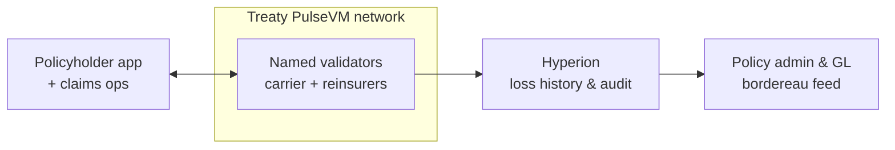

# Insurance

Claims settlement, reinsurance treaties, and parametric products are multi-party processes that today run on reconciliation between separate systems of record. PulseVM gives every party one authoritative ledger with instant, final settlement.

## Why the primitives fit

- **Named accounts** for insurers, reinsurers, brokers, MGAs, and TPAs — identity is legible, not a hex address.
- **[Multisig](/guide/multisig)** for claims approval and treaty execution: an adjuster proposes, supervisors approve, the payout executes only at threshold — every step on an immutable audit trail.
- **[Instant finality](/guide/finality)** turns "when does the claim pay?" into a one-word answer; parametric triggers (with an [oracle](/build/api)) can settle automatically the moment conditions are met.
- **[Private networks](/guide/privacy)** keep treaty terms and claims data among the participating carriers, never on a public chain.

## What this looks like in practice

Picture a specialty carrier writing parametric weather cover for 30,000 agricultural policyholders, ceding half the risk to two reinsurers under a quota-share treaty — all four parties (carrier, two reinsurers, broker) on one PulseVM network. When a verified rainfall index crosses the trigger, the policy contract could pay the affected policyholders the same hour — instant, irreversible transfers from the carrier's claims account, with no adjuster visit, no cheque run, no "processing" limbo, just the payout arriving in the carrier's app. Claims operations would watch **named accounts** performing human-readable actions — `stormco.claims → farm.arnold, 12,000 MUSD, event #2107` — with large or exception payouts held at a [multisig](/guide/multisig) threshold until a supervisor co-signs. The reinsurance side settles on the same ledger: each payout posts its cession automatically, so the reinsurers read their share of the loss in real time rather than reconciling a bordereau six weeks later, and the quarterly treaty settlement becomes a single final transfer against a loss position all four parties already agree on — because there was only ever one. The broker sees the flows it intermediates; the regulator, granted read access through [Hyperion](/institutions/technical-evaluators), sees the whole claims history for free without touching any operational system. This is the designed capability — the shape a pilot is built to prove.

The chain is the shared loss ledger; each party's policy-admin and GL systems stay in place; Hyperion replaces the bordereau exchange with a free read everyone trusts.

## Why not something else?

**Why not a public EVM chain?** Because claims and treaty data would live on the open internet at hex addresses, payouts would compete for blockspace with whatever is congesting the network, and settlement would stay probabilistic until enough blocks pass — language no claims-handling policy wants to inherit. Approval thresholds, key rotation, and sponsored policyholders are all wallet infrastructure a carrier would build and audit itself. See [PulseVM vs Ethereum](/compare/ethereum).

**Why not a generic permissioned or enterprise DLT?** Permissioned EVM stacks give the consortium consensus control but leave identity as hex addresses and every institutional feature — dual approval, delegation, sponsored users — as a framework the carriers' engineers assemble and own forever. Consortium DLT toolkits without production public lineage offer a governance problem and an integration project rather than a working system; several insurance-industry ledger efforts have already found that ceiling. See [PulseVM vs Permissioned EVM](/compare/permissioned-evm) and the [full comparison](/compare/).

**Why not keep the status quo?** Bordereaux, quarterly statements, and cash-call reconciliation work — as a standing cost and a standing lag: every party keeps its own loss ledger and pays people to make the copies agree, while recoveries wait on the cycle. A shared ledger removes the plurality that makes that work exist — the claim, the cession, and the recovery are the same final event, read by everyone at once.

## Frequently asked questions

### How does a parametric insurance payout settle on a blockchain?

When the trigger condition is met — an [oracle](/build/api)-attested index value, a verified event — the policy contract executes the payout as a transfer between named accounts, and settlement is [instant and irreversible](/guide/finality). "When does the claim pay?" becomes a one-word answer: immediately. The trigger logic, the data source, and any human sign-off threshold are all policy the carrier defines in contract code it owns.

### Can a carrier and its reinsurers share a ledger without exposing the whole book?

Yes. The network is scoped to the treaty relationship — the participants are the cedent, the reinsurers, and the broker, and data never leaves that [boundary](/guide/privacy). Cessions and recoveries post to the shared ledger the moment the underlying claim settles, so every party reads the same loss position in real time instead of reconciling bordereaux weeks later. Business outside the treaty stays outside the network, isolated per relationship or encrypted at the application layer.

### How are claims approvals controlled?

Through native [weighted multisig](/guide/multisig) on named accounts. An adjuster proposes, a supervisor approves, and the payout executes only at threshold — with escalation tiers for claim size expressed as permission weights, not workflow-tool configuration. Every proposal, approval, and disbursement is permanently on the audit trail with the named officer who signed it.

### What does the regulator see?

Whatever the network grants — up to complete, human-readable history of every action by named account, queryable in real time at no per-query cost. A market-conduct examiner can be given read access to the claims ledger without touching operational systems, and asset-level controls such as freeze under legal order are policy in contracts the consortium owns, executed under multisig on the audit trail.

### Do policyholders need cryptocurrency or a wallet?

No. The carrier stakes network [resources](/guide/resources) and sponsors participants entirely — a policyholder sees the carrier's app and a payout arriving, never a gas prompt or a token. The blockchain is invisible plumbing behind the claims experience.

### Is PulseVM running in production today?

PulseVM itself is at the test-network stage, in active development by Metallicus. The execution model it implements — Antelope, formerly EOSIO — has run public production chains such as [XPR Network](https://xprnetwork.org), WAX, and Telos for years, so the account, permission, and settlement semantics are proven; correctness is measured by [differential testing against that production reference](/institutions/technical-evaluators). Pilot deployments are run with Metallicus engineering.

**[Talk to us — Contact Metallicus →](https://metallicus.com/contact-us?utm_source=pulsevm.dev&utm_medium=docs)**

## For your engineering team

- **[For Technical Evaluators](/institutions/technical-evaluators)** — architecture, integration surface, operations, and the failure model, CTO-to-CTO.
- **[Get Started](/build/get-started)** — stand up against the public test network and deploy a first contract.
- **[Finality & Settlement](/guide/finality)** — why "when is it settled?" has a one-word answer.
