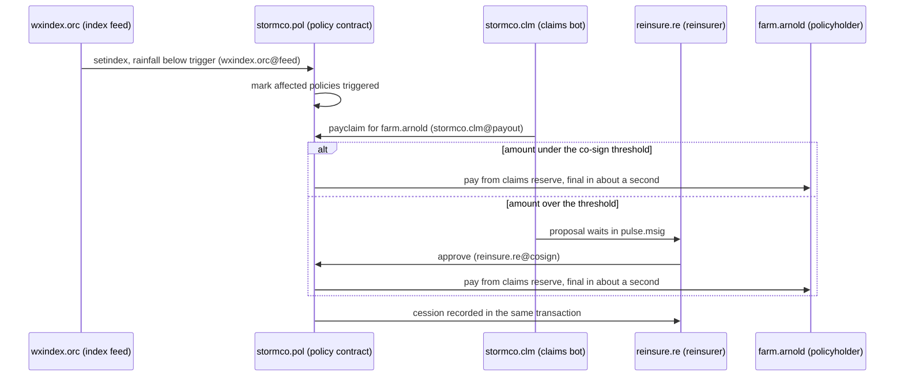

# Insurance: pay the claim the moment the trigger fires

Parametric cover promises speed, then waits on a claims run, a payment file and a bordereau that takes a quarter to agree. On PulseVM the trigger, the payout and the reinsurance cession are one transaction, final in about a second, and every key involved can do exactly one job.

## How it works on PulseVM

A parametric program maps onto a handful of named accounts. Nothing here is a wallet library or middleware: permissions, `linkauth` and weighted multisig are part of the protocol ([accounts and permissions](/guide/accounts-permissions)).

| Account | Role | Permission that matters |
| --- | --- | --- |
| `stormco` | The carrier | `owner` and `active` held by treasury officers, 2 of 3 |
| `stormco.pol` | Policy contract: triggers, limits, claims reserve | Its `pulse.code` grant lets it pay out of the reserve as itself |
| `wxindex.orc` | Index provider | `feed`, linked to `stormco.pol::setindex` only |
| `stormco.clm` | Claims operations | `payout` (the claims bot's key), linked to `stormco.pol::payclaim` only |
| `reinsure.re` | Quota-share reinsurer | `cosign`, linked to `stormco.pol::payclaim`, required above the threshold |
| `farm.arnold` | A policyholder | Created and resourced by the carrier; holds no fee token |

The carrier [stakes the resources](/guide/resources) for every account in the program, so the index provider, the reinsurer and every policyholder never buy a token to take part.

## Trigger to payout, in one sequence

What the chain enforces at each step:

- **The index key can only post the index.** If `wxindex.orc@feed` is used on any action other than `setindex`, the chain refuses it with `action declares irrelevant authority`, before contract code runs.
- **The claims bot can only pay claims.** `payclaim` pays a policy the contract has marked triggered, to the account on the policy record, up to the policy limit, once. The bot cannot redirect a payout or touch the reserve any other way.
- **Large claims need the reinsurer.** Above the threshold, `payclaim` also requires `reinsure.re@cosign`. The proposal sits in `pulse.msig` until the reinsurer approves it; nobody at the carrier can pay it alone.
- **The cession is not a separate process.** The reinsurer's share is written in the same transaction as the payout, so the loss position everyone reads is one record, not three copies.

The threshold, the trigger data source and the sign-off rules are policy the carrier writes into a contract it owns, and can change under its own multisig.

## Delegated authority: the claims bot

The claims bot is the same pattern that runs live on XPR Network today for trading bots: a key on a permission linked to one action, inside limits the contract enforces, removable by the owner with one signature. In a testnet exercise with a real bot key built this way, 31 of 31 attempts to move money out or take over the account were refused by the chain. Read the [delegated authority case study](/guide/delegated-authority).

Comparing with a permissioned EVM consortium? See [PulseVM vs permissioned EVM](/compare/permissioned-evm).

## Frequently asked questions

### What stops the index feed or the claims bot from paying the wrong party?

Each key sits on a permission linked with [`linkauth`](/guide/accounts-permissions#give-a-key-one-job) to exactly one contract action. The index provider's key can call `setindex` and nothing else; the claims bot's key can call `payclaim` and nothing else. The chain refuses any other action before contract code runs. Inside `payclaim`, the policy contract pays only a triggered policy, only to the policyholder account on record, only up to the limit, and only once.

### How does the reinsurer see its share of a loss?

The cession is written in the same transaction as the payout, so the reinsurer reads its share of the loss the second the claim pays, from a ledger its own validator helps run. The quarterly bordereau becomes a report over records every party already holds.

### Do policyholders need a crypto wallet or a fee token?

No. The carrier creates each policyholder's named account and stakes the network resources for it. The policyholder uses the carrier's app, can sign with a passkey, and never sees a fee.

### Can a carrier run this today?

PulseVM is at the test-network stage. Carriers can build and exercise the full flow on a test network now, and pilots are run with Metallicus engineering. The account and permission model it uses already runs in production on XPR Network.

## Next step

Bring one parametric product and one reinsurance treaty. A pilot proves the trigger, the payout keys and the co-sign threshold end to end. **[Talk to Metallicus →](https://metallicus.com/contact-us?utm_source=pulsevm.dev&utm_medium=docs)**
