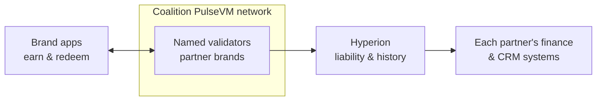

# Loyalty & Rewards

The lowest-regulatory on-ramp to the whole stack — and a real business in its own right. Loyalty points and gift-card balances are issuer-controlled value with meaningful float; tokenizing them keeps the float and the program data with the issuer.

## Why the primitives fit

- **Issuer-defined assets**: points/credits with the rules you set (expiry, transferability, redemption) in contract code you own.
- **No gas for customers**: the program sponsors resources; members earn and redeem with no crypto mechanics — just an app.
- **[Instant finality](/guide/finality)** for earn/redeem; **named accounts** and free reads for clean reconciliation and partner settlement.
- **Multi-brand coalitions** as a [consortium network](/institutions/enterprises): partners share a points ledger with rules they agree on.

A great way to prove the stack in production before extending the same infrastructure to deposits or settlement.

## What this looks like in practice

Picture a coalition of an airline, a hotel group, and a fuel retailer running a shared points program for two million members on their own PulseVM network. A member could earn points at the pump and redeem them against a hotel night an hour later — both actions instant and final inside each brand's own app, with no crypto mechanics anywhere. Underneath, the redemption that used to trigger a month-end invoice between partners settles itself: the moment the hotel accepts the points, the inter-partner obligation moves as a final transfer between **named accounts** — `fuelco.loyal → grandstay.stl, 41,200 PTS, member #` — so the coalition's billing-file exchange, disputed redemption counts, and net-settlement cycle collapse into state everyone already agrees on. Each brand's finance team reads its points liability live from [Hyperion](/institutions/technical-evaluators) — issuance, redemptions, expiry, breakage, by partner, for free — instead of estimating it at quarter-end from three systems. The program rules — expiry schedules, earn rates, which partner can redeem what — are contract policy the coalition governs together, changed under [multisig](/guide/multisig) with every change on the audit trail, not a platform vendor's roadmap. And because points are the same asset machinery as tokenized deposits with a fraction of the regulatory surface, the coalition is quietly proving the exact stack a member bank or the retailer's finance arm could later extend to real money. This is the designed capability — the shape a program pilot is built to prove.

One shared points ledger; each brand keeps its own app, CRM, and finance systems, fed by free reads instead of partner billing files.

## Why not something else?

**Why not a public EVM chain?** Because members would need gas in a volatile token to move points, balances would sit at hex addresses, and the program's economics — earn rates, redemption patterns, liability — would be legible to anyone watching the chain, competitors included. Sponsored users, expiry logic, and partner permissions are all bespoke contract infrastructure to build and audit, and fees float with unrelated congestion. See [PulseVM vs Ethereum](/compare/ethereum).

**Why not a generic permissioned or enterprise DLT?** Permissioned EVM stacks put the coalition in control of consensus but keep hex identities and framework-built program mechanics the partners' engineers assemble and own forever. Consortium DLT toolkits without production public lineage offer a governance problem and an integration project rather than a working system with native accounts, issuer-defined assets, and free reads hardened by real usage. See [PulseVM vs Permissioned EVM](/compare/permissioned-evm) and the [full comparison](/compare/).

**Why not a conventional loyalty platform?** Rented platforms work — with the program data, the integration surface, and often the economics accruing to the platform, coalition settlement running on invoices, and every rule change waiting on a vendor roadmap. Owning the ledger keeps the float, the breakage, and the member relationship with the brands — and the infrastructure competency it builds is the same one that later runs deposits and settlement.

## Frequently asked questions

### Do loyalty members need cryptocurrency or a wallet?

No. The program sponsors network [resources](/guide/resources) entirely — members earn and redeem in the brand's existing app with no token to buy, no gas prompt, and no seed phrase. The ledger is invisible plumbing under a normal loyalty experience.

### How does settlement work in a coalition loyalty program?

As instant transfers on one shared ledger instead of periodic invoicing between partners. When a member earns at one brand and redeems at another, the inter-partner obligation settles as a [final transfer](/guide/finality) between the partners' named accounts the moment the redemption happens — so the monthly cycle of billing files, disputed counts, and net settlement between coalition members collapses into state every partner already agrees on.

### Who keeps the float and breakage in a tokenized loyalty program?

The issuer — that is the point. Points and gift-card balances are issuer-defined liabilities on a ledger the issuer operates, so the float, the breakage economics, and the program data stay with the brand rather than accruing to an outside platform. The rules that drive those economics — expiry, transferability, redemption — are contract code the issuer owns and can change under its own governance.

### Can we control expiry, transferability, and redemption rules?

Yes — they are contract policy, enforced by the ledger on every transaction: expiry schedules, earn caps, whether points transfer between members, which partners can redeem what. In a coalition, the rules are what the partners agree on, in contracts the consortium governs together, and every rule change is an auditable action rather than a platform vendor's release note.

### Why put a loyalty program on a blockchain at all?

Because a points balance is issuer-controlled value moving between many parties — the same shape as tokenized deposits, with a fraction of the regulatory surface. One authoritative ledger gives members instant earn and redeem, gives partners settlement without reconciliation, and gives finance a real-time liability position instead of a quarter-end estimate. It is also the lowest-risk way to prove the stack an institution can later extend to [deposits or settlement](/institutions/banks).

### Is PulseVM running in production today?

PulseVM itself is at the test-network stage, in active development by Metallicus. The execution model it implements — Antelope, formerly EOSIO — has run public production chains such as [XPR Network](https://xprnetwork.org), WAX, and Telos for years, so the account, permission, and asset semantics are proven; correctness is measured by [differential testing against that production reference](/institutions/technical-evaluators). Pilot deployments are run with Metallicus engineering.

**[Talk to us — Contact Metallicus →](https://metallicus.com/contact-us?utm_source=pulsevm.dev&utm_medium=docs)**

## For your engineering team

- **[For Technical Evaluators](/institutions/technical-evaluators)** — architecture, integration surface, operations, and the failure model, CTO-to-CTO.
- **[Get Started](/build/get-started)** — stand up against the public test network and deploy a first contract.
- **[Finality & Settlement](/guide/finality)** — why "when is it settled?" has a one-word answer.
