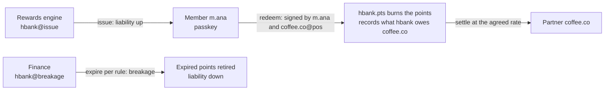

# Loyalty: points you can account for, and a network you can start with

Points are a liability on the balance sheet, yet most programs can only estimate it, partner settlement arrives as a month-end file, and breakage is a guess. On PulseVM every point is issued, redeemed and expired as an action on a ledger the issuer owns, so the liability is a number you read, not one you model.

## How it works on PulseVM

| Account | Role | Permission that matters |
| --- | --- | --- |
| `hbank` | Program owner (a bank, retailer or coalition) | `owner` and `active`: 2 of 3 officers; rule changes under multisig |
| `hbank.pts` | Points contract | Issue, redeem and expiry rules the owner writes |
| `hbank` `issue` permission | Rewards engine | Linked to `hbank.pts::issue` only, with a daily issuance budget in the contract |
| `hbank` `breakage` permission | Finance | Linked to `hbank.pts::expire` only; retires points per the program's expiry rule |
| `coffee.co` | Partner merchant | `pos` permission, linked to `hbank.pts::redeem` only |
| `m.ana` | Member | Signs with a passkey from the bank's app; never holds a fee token |

The program owner [stakes the resources](/guide/resources) for every member and partner, so nobody outside the bank touches a token to earn or redeem.

## Points as a liability, end to end

- **Issuance** raises outstanding supply, and outstanding supply is the liability. Finance reads it live from the contract.
- **Redemption** needs two signatures in one transaction: the member's passkey and the partner's `pos` key. The points burn and the obligation to the partner is recorded in the same step, final in about a second. The partner can be paid through the bank's existing rails against that record, so no cash has to move on chain.
- **Breakage** is an action, not an estimate. `hbank@breakage` can only call `expire`, and the contract only retires points that meet the rule members were shown.
- **Coalitions** share one points ledger, with each partner on its own scoped key and rule changes under [multisig](/guide/multisig).

## The lowest-regulatory on-ramp

A bank that wants its own network does not have to start with deposits. A points program exercises everything that matters: validators the bank runs and admits, named customer accounts, passkey signing, partner keys linked to one action, governance under multisig. It does all of this without moving a deposit or issuing a payment token. Whether and how a given program is regulated depends on its design and jurisdiction, so counsel decides, but it is typically a lighter lift than tokenized deposits.

When the bank is ready, the same accounts, keys and validators carry the next asset. See [PulseVM for banks](/institutions/banks).

## Delegated authority: the partner's redemption key

Every partner terminal holds a key that can do one thing: co-sign a redemption the member has already signed. It cannot issue points, move a balance or change a rule; the chain refuses it on any other action before contract code runs. Lose a terminal, and the partner rotates that one key without touching anyone's points. The same pattern runs live on XPR Network; see the [delegated authority case study](/guide/delegated-authority).

## Frequently asked questions

### How does finance see the points liability?

Outstanding supply is the liability. The points contract keeps issued, redeemed and expired totals in its state, so finance reads the live figure at any moment, by partner if the contract records it, instead of estimating it from several systems at quarter end.

### What can a partner's point-of-sale key do?

Accept redemptions and nothing else. The key sits on a permission linked to the `redeem` action only, and a redemption also needs the member's own signature. The partner key cannot issue points, move a member's balance or change a rule.

### Why is loyalty a good first project for a bank?

Because it exercises the whole stack, your own validators, named customer accounts, passkey signing, scoped partner keys and multisig governance, without moving deposits or issuing a payment token. Whether and how a particular program is regulated depends on its design and jurisdiction, so your counsel decides, but it is typically a lighter lift than tokenized deposits.

### Is a points program running on PulseVM today?

No. PulseVM is at the test-network stage, and program pilots are run with Metallicus. The account model it uses runs in production on XPR Network.

## Next step

Pick one earn rule, one partner and one expiry rule, and run them on a test network with your own validators. **[Talk to Metallicus →](https://metallicus.com/contact-us?utm_source=pulsevm.dev&utm_medium=docs)**
