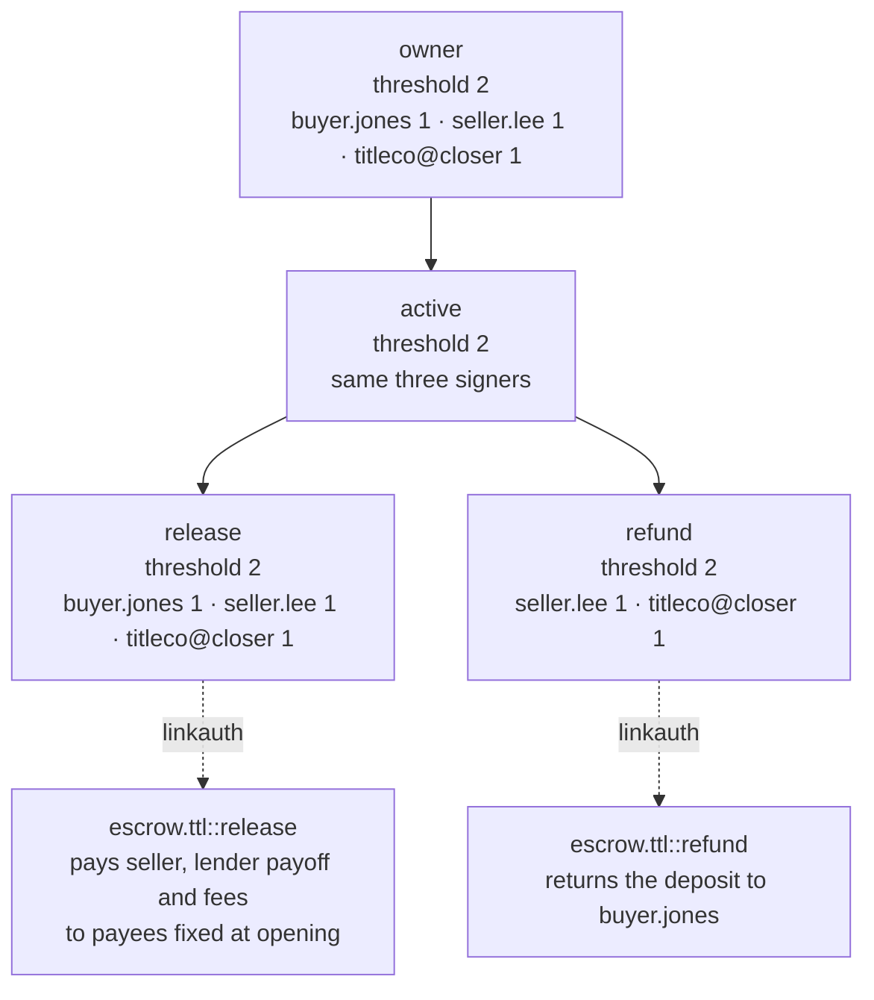

# Title and escrow: no single party can move the money

Closing funds are a target: a spoofed email with new wiring instructions, a disbursement sent to the wrong account, a release nobody can later prove was authorized. On PulseVM each closing gets its own escrow account whose rules are enforced by the chain: release needs two of the three parties, payees are fixed when the escrow opens, and disbursement is final in about a second.

## How it works on PulseVM

| Account | Role | Permission that matters |
| --- | --- | --- |
| `esc.maple12` | Escrow account for one closing | `owner`, `active`, `release` and `refund`, shown below |
| `escrow.ttl` | Escrow contract | Holds the deposit and the deal record (price, payees, payoff and fee lines); acts only when `esc.maple12` authorizes it, then pays with its `pulse.code` grant |
| `buyer.jones` | Buyer | Signs with a passkey from the agent's app |
| `seller.lee` | Seller | Signs with a passkey |
| `titleco` | Title agent | `closer` permission held by the closing officer; `titleco@active` creates and resources each escrow account |

The title agent [stakes the resources](/guide/resources) for every account, so buyers and sellers sign with a passkey ([WebAuthn keys are verified by the chain](/guide/accounts-permissions)) and never hold a token.

## The escrow account's permission tree

How that reads at the closing table:

- **Any two of three release.** Buyer and seller, or either with the title agent. The chain counts weights and refuses a release with one signature.
- **Refund is its own permission, linked to its own action.** Signatures on `release` do not authorize `refund`, and `refund` cannot pay the seller: each permission is refused on the other's action before contract code runs. Only the parent permissions sit above both, and they need 2 of 3 as well.
- **Nobody rewrites the rules mid-deal.** `owner` and `active` need the same 2 of 3, so the agent cannot swap a key or edit payees alone.
- **Payees are named accounts, fixed at opening.** An email asking for "updated wiring instructions" has nothing to change.
- **Every signature is on the record.** Who approved, when, and what was paid to whom is permanent and readable by the underwriter or auditor at any time.

## Delegated authority: the closing officer

The agent's closing officer, or a closing system, signs as `titleco@closer`. That permission counts as one vote on this closing's `release` and `refund`, and does nothing on its own. It is the same idea as the operator key in the [delegated authority case study](/guide/delegated-authority): power scoped to one job, enforced by the chain.

## Frequently asked questions

### Can a spoofed email redirect closing funds?

Not by changing an account number in an email. Payees are named accounts written into the deal record when the escrow opens, and changing them needs the same 2-of-3 approval as the release itself. A message asking to send funds elsewhere has nothing to act on.

### Can the title agent release funds alone?

No. The release permission needs two of three signatures from buyer, seller and title agent, and the escrow account's `owner` and `active` permissions need the same, so no single party, including the agent, can release funds or rewrite the rules mid-deal.

### What happens if the deal falls through?

The refund is a separate permission linked to a separate action. It returns the deposit to the buyer's named account and needs its own signers, set when the escrow opens; a contract deadline can also let the buyer reclaim an unreleased deposit after a date both sides agreed.

### Is this used for closings today?

Not on PulseVM yet; it is at the test-network stage and pilots are run with Metallicus. [Weighted multisig](/guide/multisig) and `linkauth`, the two pieces this design rests on, run in production on XPR Network.

## Next step

Take one closing type and model its escrow permissions on a test network. **[Talk to Metallicus →](https://metallicus.com/contact-us?utm_source=pulsevm.dev&utm_medium=docs)**
