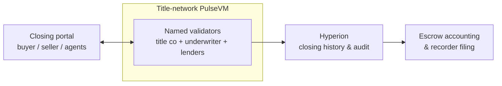

# Title & Escrow

Real-estate settlement is multi-party, dual-control, audit-everything, and painfully slow — exactly the workload deterministic settlement was made for.

## Why the primitives fit

- **[Multisig & dual control](/guide/multisig)** are native: escrow release requiring buyer, seller, and agent approvals is a permission threshold, not a custom contract platform.
- **Named accounts** map to the parties — title company, lender, buyer, seller, agent — with delegated authority where a firm acts for a client.
- **[Instant, irreversible finality](/guide/finality)**: funds and title records move together and settle permanently, with no reorg or confirmation-window ambiguity.
- **Complete audit trail** with named identities — every proposal, approval, and disbursement, permanently recorded for compliance.

## What this looks like in practice

Picture a title company handling 400 closings a month on a network operated with its underwriter and partner lenders. For each closing, escrow could be a **named account** — `esc.4417elm` — whose release rules are the deal itself: no disbursement executes without the escrow officer and the lender's named sign-off, because the threshold is enforced by the ledger, not by office procedure. The buyer's funds arrive as tokenized settlement balances and sit visibly in escrow, so "did the wire land?" is a free read instead of a phone call. On closing day, the settlement statement becomes a proposed batch of transfers — seller proceeds, loan payoff, commissions, recording fees — each to an account verified days earlier; the officer proposes, the lender approves, and every disbursement executes [instantly and irreversibly](/guide/finality) in the same minute, at 6pm on a Friday if that's when the deal signs. The classic wire-fraud vector — a spoofed email with "updated" instructions — has nothing to attack, because payees are ledger state under [multisig](/guide/multisig) control, and changing one is itself an auditable action. Afterward, the closing file assembles itself: every document fingerprint, approval, and payment in one ordered history on [Hyperion](/institutions/technical-evaluators), read for free by the auditor, the underwriter, and the regulator examining the escrow account. Legal title still records with the county; the network is the settlement and evidence layer underneath it. This is the designed capability — the shape a pilot is built to prove.

Escrow, approvals, and disbursement finality live on the ledger; the county recorder and the firm's escrow accounting consume its history rather than reconstructing it.

## Why not something else?

**Why not a public EVM chain?** Because a closing needs accountable named parties, dual control, and settlement certainty — and a public chain offers hex addresses, contract-wallet multisig you deploy and audit yourself, fees that spike with unrelated congestion, and probabilistic settlement language no escrow instruction should inherit. Client funds on infrastructure nobody in the transaction governs is a hard conversation with a regulator. See [PulseVM vs Ethereum](/compare/ethereum).

**Why not a generic permissioned or enterprise DLT?** Permissioned EVM stacks give the operator consensus control but keep the primitives that fight this workload — identity, approval thresholds, and delegation all become framework code the title company's integrators build and own forever. Consortium DLT toolkits without production public lineage deliver a governance problem and a project, not a working escrow system with native accounts, weighted permissions, and audit-grade history. See [PulseVM vs Permissioned EVM](/compare/permissioned-evm) and the [full comparison](/compare/).

**Why not keep wires and escrow accounts as they are?** They work — through cutoff times, same-day-wire anxiety, fraud exposure in emailed instructions, and a closing file assembled after the fact from receipts and PDFs. Escrow's control model is already dual-control and audit-everything; today it is enforced by procedure and reconstructed by paperwork. A ledger enforces it by construction and records it as a side effect.

## Frequently asked questions

### How does escrow work as a multisig policy?

The escrow account is a named account whose release permission is a [weighted threshold](/guide/multisig) across the parties — for example, escrow officer plus lender sign-off before any disbursement executes. Funds physically cannot move without the required approvals, because the requirement is enforced by the ledger itself rather than by a firm's internal procedure. Every proposal, approval, and release is permanently recorded with the named signer.

### How does this address wire fraud in closings?

By making the payee a verified named account instead of wire instructions in an email. Disbursements go to accounts established and verified before closing — a last-minute "updated wire instructions" message has nothing to attack, because payment routing is ledger state under the escrow policy, not free-text a fraudster can substitute. Any change to a payout account is itself an auditable, multisig-controlled action.

### Does this replace the county recorder or legal title?

No — legal title remains with the recording jurisdiction. The network is the settlement and evidence layer: it holds the escrow, executes the disbursements, and keeps a tamper-evident, ordered record of every document fingerprint, approval, and payment in the closing. That record makes the recorder filing and the title-insurance file a read from one authoritative history rather than a reconstruction from emails and wire receipts.

### When is a disbursement final?

The moment it executes — settlement is [instant and irreversible](/guide/finality), with no confirmation window, no reversal risk, and no waiting on wire cutoffs. A closing can complete at 6pm on a Friday with seller proceeds, payoffs, commissions, and fees all final in the same minute, each as a separate transfer to a named account on the permanent record.

### Do buyers, sellers, and agents need cryptocurrency?

No. The title company or network operator stakes [resources](/guide/resources) and sponsors all participants — parties interact through the closing portal they already use, funds move as tokenized settlement balances, and nobody buys a token, sees a gas prompt, or manages keys beyond their approval credential.

### Is PulseVM running in production today?

PulseVM itself is at the test-network stage, in active development by Metallicus. The execution model it implements — Antelope, formerly EOSIO — has run public production chains such as [XPR Network](https://xprnetwork.org), WAX, and Telos for years, so the account, permission, and settlement semantics are proven; correctness is measured by [differential testing against that production reference](/institutions/technical-evaluators). Pilot deployments are run with Metallicus engineering.

**[Talk to us — Contact Metallicus →](https://metallicus.com/contact-us?utm_source=pulsevm.dev&utm_medium=docs)**

## For your engineering team

- **[For Technical Evaluators](/institutions/technical-evaluators)** — architecture, integration surface, operations, and the failure model, CTO-to-CTO.
- **[Get Started](/build/get-started)** — stand up against the public test network and deploy a first contract.
- **[Finality & Settlement](/guide/finality)** — why "when is it settled?" has a one-word answer.
