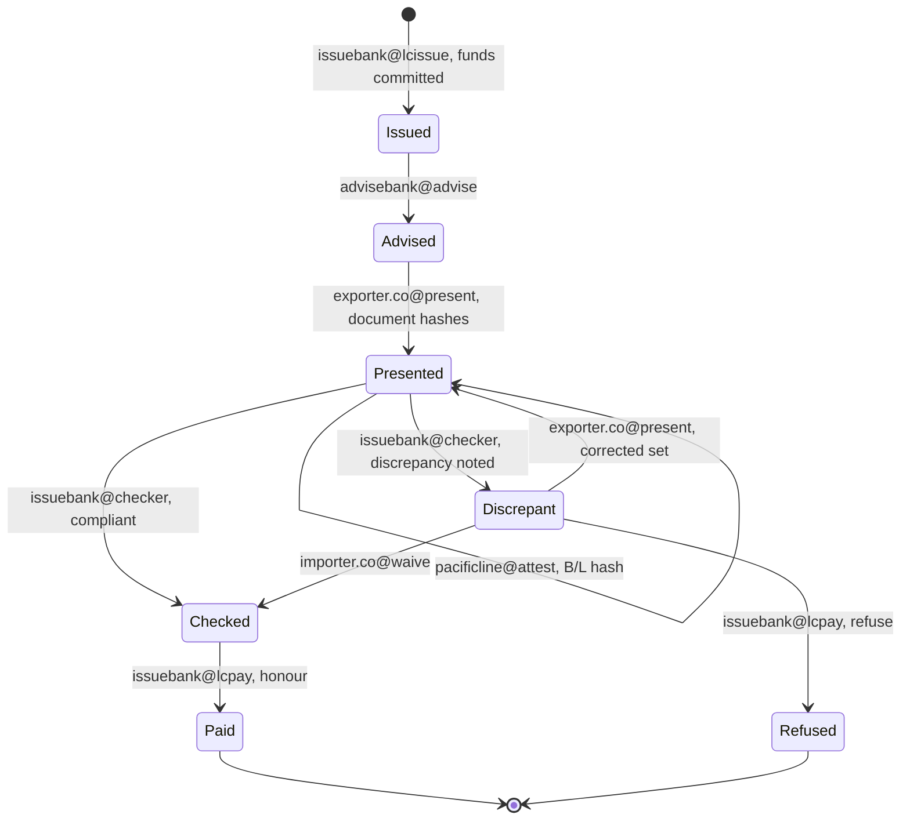

# Trade finance: a letter of credit that pays when the documents comply

Documents travel slower than the goods, discrepancy cycles run for days, and every bank in the chain keeps its own copy of the credit. On a PulseVM consortium network the letter of credit is one contract that every party reads, each step is signed by the party responsible for it, and honour pays the exporter in about a second.

## How it works on PulseVM

| Account | Role | Permission that matters |
| --- | --- | --- |
| `lc.desk` | Letter-of-credit contract | Holds the committed funds per credit; pays out with its `pulse.code` grant |
| `issuebank` | Issuing bank | `lcissue` and `lcpay`: 2 of 3 trade officers each, linked to `lc.desk::issue` and `lc.desk::honour` / `lc.desk::refuse`; `checker` linked to `lc.desk::examine` |
| `advisebank` | Advising bank | `advise`, linked to `lc.desk::advise` |
| `exporter.co` | Beneficiary | `present`, linked to `lc.desk::present` |
| `importer.co` | Applicant | `waive`, linked to `lc.desk::waive` (accepts discrepancies) |
| `pacificline` | Carrier | `attest`, linked to `lc.desk::attestbl` (bill of lading fingerprint) |

The consortium [stakes the resources](/guide/resources) for exporters, importers and carriers, so a shipper takes part with a named account and no token. The validators are the member banks: named, admitted by the members, removable by them.

## The credit, state by state

Every arrow is an action on `lc.desk`, and the label is the only permission the chain accepts for it.

- **Funds are committed at issue.** The exporter can see from the contract that the credit exists and is funded, instead of waiting on a message confirmed through correspondents.
- **Documents are proved, not copied.** The exporter presents hashes; the carrier attests the bill of lading hash from its own account. Everyone checks the same fingerprints.
- **Nobody can skip a step.** The exporter's key cannot mark its own documents compliant; the checker cannot pay; payment needs two of three trade officers. A wrong key on any transition is refused by the chain with `action declares irrelevant authority`.
- **Honour is final.** The payment is an inline transfer from the committed funds, final in about a second ([finality](/guide/finality)).

## Delegated authority: a document-checking agent

First-pass examination is repetitive, which makes it a candidate for automation. Put the checking service's key on the `checker` permission, linked to `lc.desk::examine` only: it can mark a presentation compliant or discrepant, and nothing else. It cannot honour, refuse or move funds; payment still needs two officers. See the [delegated authority case study](/guide/delegated-authority) for the same pattern running live on XPR Network.

Weighing a permissioned EVM consortium? See [PulseVM vs permissioned EVM](/compare/permissioned-evm).

## Frequently asked questions

### Do the shipping documents go on the ledger?

Their fingerprints do. The exporter presents a set of document hashes and the carrier attests the bill of lading hash from its own named account. The documents themselves travel through the parties' existing channels; the ledger proves which version was presented, by whom and when, and ties it to the payment.

### Who can move a letter of credit from one state to the next?

Only the party whose job it is. Each transition is a contract action, and each party's permission is linked with [`linkauth`](/guide/accounts-permissions#give-a-key-one-job) to its own action: the issuing bank's officers issue and honour, the exporter presents, the carrier attests, the examiner checks, the importer can waive a discrepancy. The chain refuses a key on any action it is not linked to, before contract code runs.

### How do competing banks share one network without exposing their books?

Scope the network to a corridor or relationship, admit only its members as validators and readers, and encrypt commercially sensitive fields at the application layer ([privacy](/guide/privacy)). The validators are named institutions the members admit and can remove.

### Is a corridor live on PulseVM?

No. PulseVM is at the test-network stage; corridor pilots are run with Metallicus. The permission model underneath already runs in production on XPR Network.

## Next step

Choose one corridor, two or three banks and a handful of shippers. A pilot runs real credit terms through every state above on a test network. **[Talk to Metallicus →](https://metallicus.com/contact-us?utm_source=pulsevm.dev&utm_medium=docs)**
