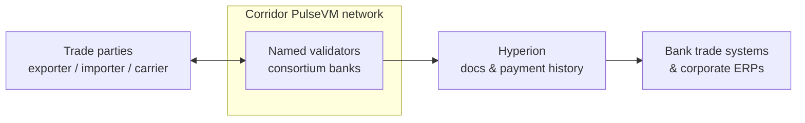

# Trade Finance & Supply Chain

Letters of credit, invoice factoring, and provenance tracking are classic consortium problems — many parties, shared state, and a hard requirement that competitors on the same network not see each other's books.

## Why the primitives fit

- **[Private, per-relationship networks](/guide/privacy)** solve the confidentiality problem that sank earlier enterprise-blockchain efforts: isolate by trade relationship, or encrypt sensitive payloads at the application layer.
- **Named accounts** for banks, exporters, importers, carriers, and customs — accountable identities, not anonymous addresses.
- **[Multisig](/guide/multisig)** for document approval and conditional release; **[instant finality](/guide/finality)** for settlement the moment terms are met.
- **Provenance** as an append-only, freely auditable record across the chain of custody.

## What this looks like in practice

Picture a trade corridor network run by four banks, carrying letter-of-credit flows for a few hundred exporters and importers. An importer's bank could issue an LC as a contract on the ledger — funds committed under it, terms encoded in it — and the exporter sees, from a **named account** it can verify, that the credit is real and funded the moment it opens, not after a SWIFT message is confirmed through correspondents. As the shipment moves, the named parties attest their pieces on the same ledger: the carrier signs the bill-of-lading fingerprint, the inspector signs the certificate, customs signs the clearance — an append-only chain of custody where each attestation is an action by an accountable identity, readable as `pacificline.ops → attest, B/L #4471`. When the document set satisfies the LC terms, payment to the exporter executes as an [instant, irreversible transfer](/guide/finality) — no presentation-period limbo, no discrepancy fax cycle, no wondering which of five copies of the file is current. The banks' trade-ops teams stop reconciling document status against payment status because they were never separate records. Approvals above threshold run under [multisig](/guide/multisig) by named officers, and an auditor granted read access through [Hyperion](/institutions/technical-evaluators) can replay the entire transaction — documents, approvals, payment — for free. This is the designed capability — the shape a corridor pilot is built to prove.

The ledger holds document state and payment finality together; each bank's trade platform and each corporate's ERP stay in place, fed by the same free reads.

## Why not something else?

**Why not a public EVM chain?** Because trade flows are commercially sensitive by definition — on a public chain, volumes, counterparties, and timing leak to anyone watching, and pseudonymous hex addresses are the opposite of what a documentary-credit process needs. Fees float with the open network's congestion, settlement is probabilistic until enough blocks pass, and every control — named identity, dual approval, sponsored participants — is bespoke infrastructure to build and audit. See [PulseVM vs Ethereum](/compare/ethereum).

**Why not a generic permissioned or enterprise DLT?** This category has been tried in trade finance specifically, and the pattern repeated: consortium toolkits without production public lineage delivered a governance problem and an integration project, and several high-profile networks wound down before reaching sustainable volume. Permissioned EVM variants add consensus control but keep hex identities and framework-assembled institutional features the banks own forever. PulseVM starts from native named accounts, permissions, and system contracts hardened by public production use. See [PulseVM vs Permissioned EVM](/compare/permissioned-evm) and the [full comparison](/compare/).

**Why not keep the paper process?** It works — at the cost of documents traveling slower than the goods, discrepancy cycles measured in days, financing priced against that friction, and every party staffing its own copy of the transaction record. The paper process is itself an approximation of a shared authoritative state; a consortium ledger is that state, with payment finality attached.

## Frequently asked questions

### How does a letter of credit work on a blockchain?

As a contract among named accounts that holds the payment condition and the document state in one place. The issuing bank commits funds under the LC contract; presentation of the required documents — attested on-chain by the named parties responsible for them — satisfies the condition; payment to the beneficiary executes as an [instant, irreversible transfer](/guide/finality) the moment terms are met. The document trail and the money movement stop being two systems that must be reconciled, because they are one ledger.

### Can competing banks or competing traders be on the same network?

Yes — with isolation as the default. Networks are deployed per trade relationship or per corridor, so participants are exactly the parties to the agreement; where broader networks are useful, sensitive payloads are [encrypted at the application layer](/guide/privacy) and each party sees only the flows it is party to. The confidentiality failure that sank earlier trade-finance blockchain efforts — competitors able to infer each other's business — is solved by scoping the network, not by trusting a platform.

### What about the physical documents — bills of lading, certificates, inspections?

The ledger carries attestations and document fingerprints, signed by the named party responsible: the carrier attests the shipment, the inspector attests the certificate, and each document's hash is anchored so any copy can be verified against the record. Whether a jurisdiction recognizes an electronic document as the legal original is a legal-framework question that varies by corridor; the network gives every party a tamper-evident, ordered record of who presented what, when — which is the substrate the paper process is trying to approximate.

### Do all parties need to run blockchain infrastructure?

No. Validators are typically the anchor institutions — the banks, or the consortium operator — while exporters, importers, carriers, and inspectors participate as named accounts through APIs or apps, with [resources](/guide/resources) sponsored so no participant buys a token or manages gas. A small trading company's footprint is an account and a key, not a node.

### What does this replace, concretely?

The courier-and-reconciliation layer: paper documents moving slower than the goods, each party keeping its own file of the transaction, and discrepancies discovered at presentation time triggering days of back-and-forth. On one ledger the transaction has a single authoritative state every party reads in real time — the exporter sees the LC is funded, the banks see the documents are in, and payment finality is a property of the transfer, not a settlement window.

### Is PulseVM running in production today?

PulseVM itself is at the test-network stage, in active development by Metallicus. The execution model it implements — Antelope, formerly EOSIO — has run public production chains such as [XPR Network](https://xprnetwork.org), WAX, and Telos for years, so the account, permission, and contract semantics are proven; correctness is measured by [differential testing against that production reference](/institutions/technical-evaluators). Pilot deployments are run with Metallicus engineering.

**[Talk to us — Contact Metallicus →](https://metallicus.com/contact-us?utm_source=pulsevm.dev&utm_medium=docs)**

## For your engineering team

- **[For Technical Evaluators](/institutions/technical-evaluators)** — architecture, integration surface, operations, and the failure model, CTO-to-CTO.
- **[Get Started](/build/get-started)** — stand up against the public test network and deploy a first contract.
- **[Finality & Settlement](/guide/finality)** — why "when is it settled?" has a one-word answer.
