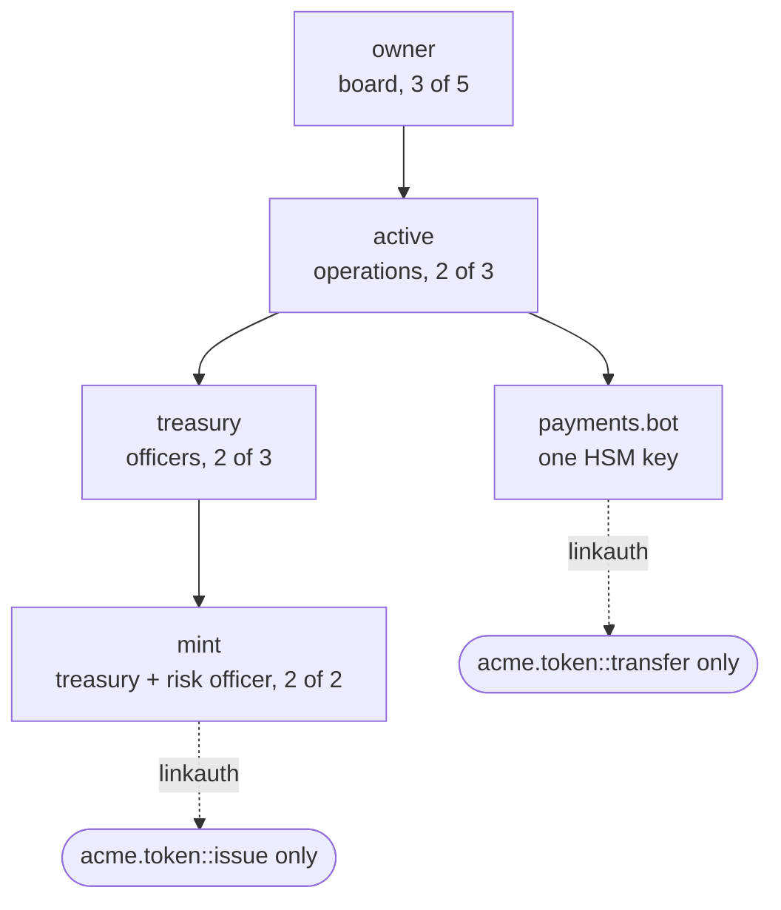
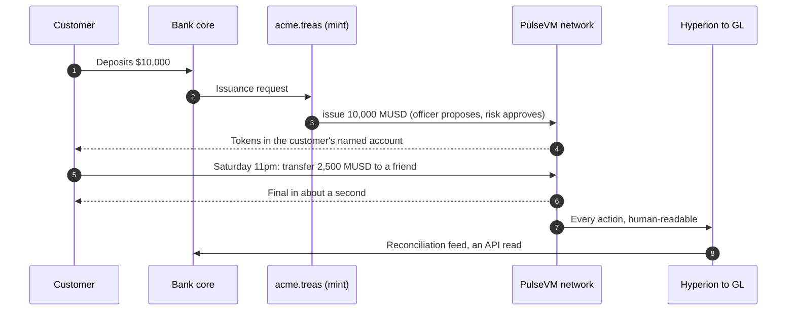

# For banks and fintechs

<BanksLead />

## Your authorization matrix is the account model

Every institution already runs on an authorization matrix: who can approve what, up to which amount, with whose countersignature. On PulseVM that matrix is the account itself. An account such as `acme.treas` carries a tree of permissions, each with its own keys and threshold, and any permission can be bound to exactly one contract action with `linkauth`. A key made for one job is refused by the protocol on anything else, before contract code runs.

- **The payments bot can pay and do nothing else.** If its key leaks, the attacker can call `transfer` within the limits your contract sets. It cannot mint, change keys or touch the treasury.
- **Issuance is dual control by construction.** No single officer holds a key that can call `issue`.
- **Rotation never moves assets.** Replace a departed officer's key with one `updateauth`; the account, balances and history stay put.
- **The board is the recovery path.** `owner` sits above everything and can reset any permission below it.

See [Accounts and permissions](/guide/accounts-permissions) for the full model.

## The economic argument: keep deposits, and the technology, at home

Every dollar a customer moves into a third-party stablecoin or fintech app is a deposit that **leaves your balance sheet**. The float, the net interest margin and, increasingly, the customer relationship go to the issuer or the app, while the institution that did the KYC becomes a funding source for someone else's business model.

PulseVM plus the **Metal Dollar** network turns that around:

- **Your institution issues the tokenized dollars.** Customers get instant, programmable, 24/7 money, and the deposits behind it **stay on your balance sheet**, earning your margin.
- **You own the customer relationship and the data.** The wallet is your app, the account is your named account, the permissions are your policy.
- **You own the rails.** The institution (or consortium) operates the network, so technology competency builds up inside the institution instead of being rented.
- **Interoperate on your terms.** Metal Dollar provides a common settlement asset across the ecosystem for institution-to-institution transfer, while each network's rules remain its own.

The same product that stops deposit flight makes you the technology provider instead of the disintermediated party.

## The primitives already match how you work

| Banking concept | PulseVM primitive |
|---|---|
| Named, KYC'd entities | Named accounts (`acme.treas`) |
| Authorization matrix | A tree of permissions on every account |
| Dual control / maker-checker | [Weighted multisig](/guide/multisig) on any permission |
| Key rotation and recovery | `updateauth`; assets never move |
| HSM / enclave custody | R1 (secure enclave, HSM) and WebAuthn (passkey) keys verified by the chain |
| A key that can do one thing | `linkauth` binds a permission to a single contract action. A payments key that may only call `transfer` is refused on anything else, before the contract runs |
| Customer pays no gas | Institution stakes resources; users see an app |
| "When is it settled?" | Final in about a second, with [no reorganizations](/guide/finality) |
| Audit trail | Full indexed history, human-readable actions |

On EVM chains each of these is extra infrastructure: a contract wallet, a module, a paymaster, each with its own audit. Here they are how accounts work.

::: tip In production today
A trading service on XPR Network mainnet gives each customer an account of their own and gives its bot a key linked to one action, `trade`, with limits the contract enforces. The operator cannot withdraw. In a testnet exercise with the real bot key, 31 of 31 attempts to move money out or take the account over were refused by the chain. For a bank this is the same shape as a payments processor or a treasury desk acting under a mandate. [Read the case study](/guide/delegated-authority).
:::

## A tokenized deposit, end to end

1. **The dollars stay home.** The deposit sits where it always did, on the bank's balance sheet, because the bank is the issuer.
2. **Issuance runs under dual control.** A treasury officer proposes, a risk officer approves, and the mint executes only at threshold, each step on the audit trail.
3. **Transfers settle at any hour.** No cutoff times, no "pending until Monday", no gas prompt, just the bank's own app.
4. **Operations reads a ledger of named accounts.** An anomalous transfer reads as `acme.treas → acme.ops, 250,000 MUSD`, not `0x4f3a…`.
5. **The chain is the subledger.** Its full history queries for free, so month-end reconciliation into the core is an API read rather than a batch-file break investigation.

The core remains your system of record. Integration is a read feed and an issuance path, not a core replacement. This is the designed capability, and the shape a [90-day pilot](/institutions/pilot) is built to prove.

## Permissioned is the design point, not a compromise

Your validators are named institutions under legal agreements. The members admit them and can remove them. The network's rules (account policy, fee models, asset-level controls such as freeze or clawback under court order, written as policy) live in **system contracts your organization owns and can modify**, on an execution model with a decade of customization precedent (WAX, Telos, FIO, [XPR Network](https://xprnetwork.org)).

## Why not something else?

| Alternative | What you inherit |
|---|---|
| Public EVM chain | Customers pay gas in a volatile token, live at hex addresses and share blockspace with whatever is congested that day. Multisig, key rotation and sponsored users are wallet platforms you deploy and audit. See [PulseVM vs Ethereum](/compare/ethereum). |
| Permissioned EVM or enterprise DLT | You control consensus but keep hex identities, contract-wallet multisig and paymasters, so your team builds and owns the institutional layer forever. See [PulseVM vs permissioned EVM](/compare/permissioned-evm). |
| Existing rails | Batch windows, cutoff times and a permanent reconciliation department, with no programmability on top. The instant-payments ground is being claimed by fintechs and stablecoin issuers regardless. |

The question is not whether 24/7 programmable settlement arrives, but whether your institution owns it or rents access to someone else's. More in [Objections, answered](/institutions/objections).

## Not bare infrastructure

The same account model already runs products in production on XPR Network: the **WebAuth wallet** (passkey custody with named accounts), **Metal X** (an order-book exchange), a **loan protocol**, and the indexers, explorers and SDKs around them. Contracts built for that model run on PulseVM, which is how these products come to a PulseVM network.

## Frequently asked questions

### Do our customers need cryptocurrency or gas fees to use this?

No. The institution stakes network [resources](/guide/resources) once and sponsors its customers entirely — there is no per-transaction gas market, no token for customers to buy, and no wallet pop-ups asking them to approve fees. Customers see your app and your brand; the blockchain is invisible plumbing.

### How do tokenized deposits stay on our balance sheet?

Because your institution is the issuer. A tokenized deposit is a liability you issue against dollars you hold — the same accounting shape as any deposit product — so the funding never leaves your balance sheet and the net interest margin stays yours. This is the structural difference from third-party stablecoins, where the float accrues to an outside issuer.

### Can this integrate with our core banking system?

Yes — PulseVM is designed to run alongside your core as a settlement and record layer, not replace it. Hyperion provides full, queryable, human-readable history over standard APIs, which becomes the reconciliation and reporting feed into your GL. Reads are free, so audit and analytics impose no cost or rate pressure. See [For Technical Evaluators](/institutions/technical-evaluators).

### What happens under a court order or regulatory action?

Asset-level controls such as freeze, clawback and account restriction are policy you write into the token and system contracts your institution owns, executed under [multisig](/guide/multisig) by named officers with every step on the audit trail. The account model makes this possible; the reference contracts do not ship these controls today. You are not asking a neutral public protocol for an exception; compliance actions are first-class operations on a network whose rules you set.

### Is this a public blockchain? Who can see our transactions?

No — a PulseVM deployment is a private, permissioned network whose validators are named institutions under legal agreements. Transaction data lives inside that [privacy boundary](/guide/privacy), visible to participants and to whomever you grant read access, such as auditors or regulators — not to the public internet.

### Is PulseVM running in production today?

PulseVM itself is at the test-network stage, in active development by Metallicus. The execution model it implements — Antelope, formerly EOSIO — has run public production chains such as [XPR Network](https://xprnetwork.org), WAX, and Telos for years, so the account, permission, and contract semantics are proven; correctness is measured by [differential testing against that production reference](/institutions/technical-evaluators). Pilot deployments are run with Metallicus engineering.

## Talk to us

Start with a [90-day pilot](/institutions/pilot): a small validator network, a tokenized test deposit, real settlement flows, and exit criteria agreed up front. Take the [buyer's checklist](/institutions/checklist) into your first meeting.

**[Contact Metallicus →](https://metallicus.com/contact-us?utm_source=pulsevm.dev&utm_medium=docs)**

## For your engineering team

- **[For technical evaluators](/institutions/technical-evaluators)**: architecture, integration surface, operations and what is shipped today.
- **[Delegated authority with hard limits](/guide/delegated-authority)**: the production case study for linked, limited keys.
- **[Get started](/build/get-started)**: stand up against the public test network and deploy a first contract.
- **[Finality and settlement](/guide/finality)**: why "when is it settled?" has a one-word answer.
