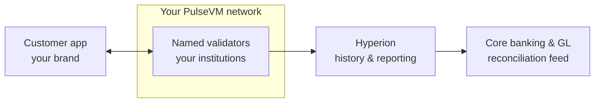

# For Banks & Fintechs

## The economic argument first: keep deposits — and the technology — at home

Every dollar a customer moves into a third-party stablecoin or fintech app is a deposit that **leaves your balance sheet**. The float, the net interest margin, and increasingly the customer relationship accrue to the issuer or the app — while the institution that did the KYC and bears the regulatory burden becomes a funding source for someone else's business model.

PulseVM plus the **Metal Dollar** network inverts that flow:

- **Your institution issues the tokenized dollars.** Customers get instant, programmable, 24/7 money — and the deposits backing it **stay on your balance sheet**, earning your margin.
- **You own the customer relationship and the data.** The wallet is your app; the account is your named account; the permissions are your policy.
- **You own the rails.** The institution (or consortium) operates the network — technology competency compounds inside the institution instead of being rented.
- **Interoperate on your terms.** Metal Dollar provides a common settlement asset across the ecosystem — instant institution-to-institution transfer — while each network's rules remain its own.

**One line: the same product that stops deposit flight makes you the technology provider instead of the disintermediated party.**

## The primitives already match how you work

| Banking concept | PulseVM primitive |
|---|---|
| Named, KYC'd entities | Named accounts (`acmecu.treas`) |
| Authorization matrix | Hierarchical permissions — native |
| Dual control / maker-checker | [Weighted multisig](/guide/multisig) on any permission |
| Key rotation & recovery | Native `updateauth`; assets never move |
| HSM / enclave custody | secp256r1 (R1) keys in the account model (implementation support landing) |
| Customer pays no gas | Institution stakes resources; users see an app |
| "When is it settled?" | Instant, irreversible — [no reorgs by construction](/guide/finality) |
| Audit trail | Full indexed history, human-readable actions |

Each of these is solvable on EVM — by *additional* infrastructure, frameworks, and audit surface. Here they are the floor.

## Permissioned is the design point, not a compromise

Your validators are named institutions under legal agreements. Block producers are elected and replaceable. The network's rules — account policy, fee models, asset-level controls, freeze/clawback under court order — live in **system contracts your organization owns and can modify**, on an execution model with a decade of customization precedent (WAX, Telos, FIO, [XPR Network](https://xprnetwork.org)).

## What this looks like in practice

Picture a regional bank with 300,000 customers running a tokenized-deposit product on its own PulseVM network. A customer could send money to another customer at 11pm on a Saturday and see it settle instantly and irreversibly — no cutoff times, no "pending until Monday", no gas prompt, just the bank's own app. Operations would watch a ledger of **named accounts** performing human-readable actions, not hex addresses emitting event logs — an anomalous transfer reads as `acme.treasury → acme.ops, 250,000 MUSD`, not `0x4f3a…`. The month-end GL reconciliation looks like reading [Hyperion](/institutions/technical-evaluators): the chain is the authoritative subledger, its full history queries for free, and the reconciliation feed into the core is an API read rather than a batch-file break investigation. The dollars backing every token would sit where they always did — in deposit accounts on the bank's balance sheet, because the bank is the issuer. Issuance and redemption run under [dual control](/guide/multisig): a treasury officer proposes, a second officer approves, and the mint executes only at threshold, with each step on the immutable audit trail. If a court order arrives, compliance freezes the named account through the same multisig path — a policy action in contracts the bank owns, not a support ticket to someone else's chain. This is the designed capability — the shape a pilot deployment is built to prove.

The chain settles; the core remains your system of record; Hyperion is the bridge between them. Integration is a read feed and an issuance path — not a core replacement.

## Why not something else?

**Why not a public EVM chain?** Because your customers would pay gas in a volatile token, live at hex addresses, and share blockspace with whatever is congesting the network that day — your payment fees spike because of someone else's speculation. Settlement is probabilistic until enough blocks pass, so your risk policies inherit reorg-handling language. Every institutional feature — multisig, key rotation, sponsored users — is a wallet platform you deploy and audit rather than a protocol primitive. See [PulseVM vs Ethereum](/compare/ethereum).

**Why not a generic permissioned or enterprise DLT?** Permissioned EVM stacks give you control of consensus but inherit primitives that fight you — hex identities, contract-wallet multisig, paymaster infrastructure — so your team builds and owns the institutional layer forever. Consortium DLT frameworks without a production public lineage hand you a toolkit and a governance problem, not a working system: no native account/permission model, no battle-tested system contracts, no ecosystem of wallets and indexers hardened by real usage. PulseVM's floor is that category's ceiling for the institutional feature set. See [PulseVM vs Permissioned EVM](/compare/permissioned-evm) and the [full comparison](/compare/).

**Why not stay on existing rails?** Existing rails work — at the cost of batch settlement windows, cutoff times, and a permanent reconciliation department, with no programmability on top. Every new money-movement product is a project against decades-old interfaces, and the instant-payments ground is being claimed by fintechs and stablecoin issuers building on new rails regardless. The question is not whether 24/7 programmable settlement arrives, but whether your institution owns it or rents access to someone else's.

## Not bare infrastructure

A deployment starts with working products, not a toolkit: the **WebAuth wallet** (passkey-grade custody with named accounts), **Metal X** (a running order-book exchange), a **loan protocol**, and the indexers, explorers, and SDKs that come from operating these networks in production.

## Frequently asked questions

### Do our customers need cryptocurrency or gas fees to use this?

No. The institution stakes network [resources](/guide/resources) once and sponsors its customers entirely — there is no per-transaction gas market, no token for customers to buy, and no wallet pop-ups asking them to approve fees. Customers see your app and your brand; the blockchain is invisible plumbing.

### How do tokenized deposits stay on our balance sheet?

Because your institution is the issuer. A tokenized deposit is a liability you issue against dollars you hold — the same accounting shape as any deposit product — so the funding never leaves your balance sheet and the net interest margin stays yours. This is the structural difference from third-party stablecoins, where the float accrues to an outside issuer.

### Can this integrate with our core banking system?

Yes — PulseVM is designed to run alongside your core as a settlement and record layer, not replace it. Hyperion provides full, queryable, human-readable history over standard APIs, which becomes the reconciliation and reporting feed into your GL. Reads are free, so audit and analytics impose no cost or rate pressure. See [For Technical Evaluators](/institutions/technical-evaluators).

### What happens under a court order or regulatory action?

Asset-level controls — freeze, clawback, account restriction — are policy in system contracts your institution owns, executed under [multisig](/guide/multisig) by named officers with every step on the audit trail. You are not asking a neutral public protocol for an exception; compliance actions are first-class operations on a network whose rules you set.

### Is this a public blockchain? Who can see our transactions?

No — a PulseVM deployment is a private, permissioned network whose validators are named institutions under legal agreements. Transaction data lives inside that [privacy boundary](/guide/privacy), visible to participants and to whomever you grant read access, such as auditors or regulators — not to the public internet.

### Is PulseVM running in production today?

PulseVM itself is at the test-network stage, in active development by Metallicus. The execution model it implements — Antelope, formerly EOSIO — has run public production chains such as [XPR Network](https://xprnetwork.org), WAX, and Telos for years, so the account, permission, and contract semantics are proven; correctness is measured by [differential testing against that production reference](/institutions/technical-evaluators). Pilot deployments are run with Metallicus engineering.

## Talk to us

The pilot shape we recommend: a consortium runs a small validator network, issues a tokenized test-deposit asset, and moves intra-member settlement on it for 90 days — small, sovereign, measurable.

**[Contact Metallicus →](https://metallicus.com/contact-us?utm_source=pulsevm.dev&utm_medium=docs)**

## For your engineering team

- **[For Technical Evaluators](/institutions/technical-evaluators)** — architecture, integration surface, operations, and the failure model, CTO-to-CTO.
- **[Get Started](/build/get-started)** — stand up against the public test network and deploy a first contract.
- **[Finality & Settlement](/guide/finality)** — why "when is it settled?" has a one-word answer.
