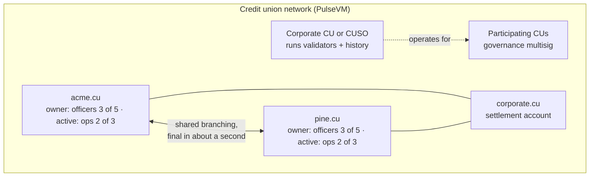

# For credit unions and leagues

**The movement already works as a network. Give it a ledger it owns.**

Corporates, CUSOs, leagues and member credit unions already trust each other and settle with each other every day. That is the governance a permissioned network needs, so the movement does not have to invent a new one. It maps its existing structure onto the network and keeps the deposits, and the technology, inside the movement.

## Your structure, mapped onto the network

| Movement role | Network role | What it does |
|---|---|---|
| Corporate credit union or CUSO | Validators and operator | Runs the nodes, history and monitoring, and holds the network's rules in system contracts under multisig |
| Participating credit unions | Governance | Admit and remove validators and approve rule changes under a written network agreement |
| League | Convener (optional) | Brings members together, sets policy expectations, can sit on the governance multisig |
| Corporate credit union | Settlement and liquidity account | Holds the settlement positions members fund and draw on, under its own multisig |
| Member credit union | A named account with its own permission tree | Issues its own tokenized deposits, runs its own approvals, keeps its own balance sheet |
| Member | An account the CU sponsors | Uses the CU's app; never holds a fee token or a seed phrase |

No single credit union carries the infrastructure alone, and no member gives up control of its own accounts to do it.

## What changes for a member credit union

- **Shared branching settles as it happens.** A member of `pine.cu` served at an `acme.cu` branch is a single transfer between named accounts, final in about a second. No end-of-day net position, no break file the next morning.
- **Member-to-member payments work at any hour.** A member sends money to their daughter at a credit union two states away on a Sunday morning, inside the CU's own app, with no gas fee and nothing to explain.
- **Smaller institutions get enterprise-grade custody.** [Weighted multisig](/guide/multisig), key rotation without moving funds, and R1 (HSM, secure enclave) and WebAuthn (passkey) keys verified by the chain are how every account works, not a platform to buy.
- **A key can be limited to one job.** A bill-pay service key can be bound with `linkauth` to one contract action, so it cannot do anything else. See [Delegated authority with hard limits](/guide/delegated-authority).
- **Deposits stay home.** Each CU issues its own tokenized deposits on Metal Dollar rails, so the liability and the margin stay on that CU's balance sheet. The economics are the same as the [banks case](/institutions/banks).
- **Examiners get a read grant, not a data request.** Full, human-readable history through Hyperion, at no per-query cost.

Each credit union keeps its core as the system of record. The network settles between them, and Hyperion feeds every member's reconciliation. One shared rail, many sovereign balance sheets.

## Why the movement should own the rail

Shared branching and inter-CU settlement work today, through batch windows, cutoff times, per-transaction network fees and a standing reconciliation workload. Meanwhile the instant-money experience members expect is being delivered by fintechs and stablecoin apps that pull deposits out of the movement. Owning the rail together is the version of modernization where the deposits and the technology competency stay home. For the comparison with public chains and generic DLTs, see [Objections, answered](/institutions/objections).

## Doesn't FedNow already do this?

FedNow and RTP move money between institutions instantly, and PulseVM works alongside them. They do not let a credit union issue a programmable deposit, give a vendor's system a key that can perform one action, or give an examiner a live, read-only view of the ledger. A practical shape: members transact on the network the movement runs, and net positions between credit unions settle over FedNow or RTP.

## Frequently asked questions

### Can a credit union run its own blockchain?

Yes — and the natural shape is a corporate credit union or CUSO operating the validator network on behalf of participating credit unions, so no single CU carries the infrastructure alone. Each member credit union is a named account with its own [permission tree](/guide/accounts-permissions); validators run on standard Linux hosts under legal agreements between institutions that already trust each other. The movement's existing consortium structure is exactly the governance shape a permissioned network needs.

### Do members need cryptocurrency, tokens, or gas fees?

No. The credit union or league stakes network [resources](/guide/resources) and sponsors members entirely — members never buy a token, see a gas prompt, or manage seed phrases. They use the credit union's own app; the network underneath is invisible.

### Do tokenized deposits leave our balance sheet?

No — the credit union is the issuer, so a tokenized deposit is a liability you issue against shares you hold, and the funding stays on your balance sheet earning your margin. That is the structural opposite of members moving money into third-party stablecoins or fintech apps, where the float leaves the movement entirely.

### How does member-to-member or shared-branching settlement work on a blockchain?

As a single intra-chain transfer between named accounts — [instant, irreversible](/guide/finality), and auditable, at any hour. Settlement between credit unions stops being batch files and end-of-day net positions and becomes a final transfer the moment it happens, with no reconciliation break to chase afterward.

### What do examiners and auditors see?

Complete, human-readable history — every action, by named account, queryable in real time through an indexer at no per-query cost. Read access is a grant your network controls, so an examiner or external auditor can be given full visibility without touching operational systems. Asset-level controls such as freeze under court order are policy in contracts the consortium owns, executed under [multisig](/guide/multisig) with every step on the audit trail.

### Is this available in production today?

PulseVM is at the test-network stage, in active development by Metallicus. The execution model it implements — Antelope, formerly EOSIO — has run public production chains such as [XPR Network](https://xprnetwork.org), WAX, and Telos for years, so the account, permission, and settlement semantics are proven. The recommended entry point is a small pilot, with a corporate or CUSO running the nodes, alongside Metallicus engineering.

## Next step

The right first project is a small pilot: a handful of member CUs, a corporate or CUSO running the nodes, a tokenized test deposit and real shared-branching flows for 90 days. See [Run a 90-day pilot](/institutions/pilot) and bring the [buyer's checklist](/institutions/checklist).

**[Talk to us: contact Metallicus →](https://metallicus.com/contact-us?utm_source=pulsevm.dev&utm_medium=docs)**

## For your engineering team

- **[For technical evaluators](/institutions/technical-evaluators)**: architecture, integration surface, operations and what is shipped today.
- **[Accounts and permissions](/guide/accounts-permissions)**: the permission tree each member CU gets.
- **[Get started](/build/get-started)**: stand up against the public test network and deploy a first contract.
