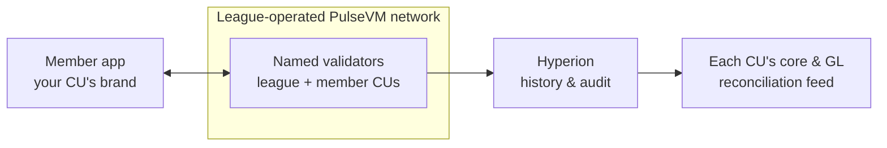

# For Credit Unions & Leagues

A credit union movement is already a consortium: leagues, corporates, CUSOs, and member institutions that trust each other, govern together, and settle with each other constantly. That is precisely the shape a permissioned blockchain needs — which is why the model fits the movement natively:

- **A league operates the validator set**; member credit unions are named accounts with their own permission trees.
- **Shared branching and member-to-member settlement** become intra-chain transfers — instant, auditable, fee-free at the member level.
- **Smaller institutions inherit enterprise-grade custody** — multisig, key rotation, HSM-backed keys — without building any of it.
- **Deposits stay home**: league- or CU-issued tokenized dollars on Metal Dollar rails give members modern money movement while the funding stays on member balance sheets.

The economics and primitives are the same as the [banks case](/institutions/banks) — the governance shape (league as operator, members as participants) is what makes it especially natural here.

## What this looks like in practice

Picture a mid-sized credit union with 40,000 members, participating in a league-operated PulseVM network alongside thirty other member CUs. A member could send money to their daughter at a credit union two states away on a Sunday morning and see it arrive instantly and finally — inside the CU's own branded app, with no gas fee, no crypto, nothing to explain. The ops team would see the transfer as a human-readable action between **named accounts** — `alice.acmecu → beth.pinecu` — on a shared ledger every participating CU can verify, instead of an ACH batch that settles Tuesday. Inter-CU settlement that used to be end-of-day net positions and corporate wires becomes the transfer itself: final at the moment it happens, so there is no break file to work the next morning. The GL reconciliation looks like reading [Hyperion](/institutions/technical-evaluators) — the chain is the authoritative subledger, and the feed into each CU's core is a free API read, not a reconciliation project. The dollars stay where they belong: each CU issues its own tokenized deposits, so the liability — and the margin — remain on that CU's balance sheet. Compliance controls look like the movement already works: issuance under [2-of-3 multisig](/guide/multisig) by named officers, court-order freezes as auditable policy actions, and an examiner handed free read access to complete history. This is the designed capability — the shape a league pilot is built to prove.

Each credit union keeps its core as the system of record; the network settles between them; Hyperion feeds every member's reconciliation and reporting. One shared rail, thirty sovereign balance sheets.

## Why not something else?

**Why not a public EVM chain?** Your members would need gas in a volatile token, hold assets at hex addresses, and share blockspace with the open internet — fees spike when someone else's speculation is busy, and settlement stays probabilistic until enough blocks pass. Every institutional control — dual approval, key recovery, sponsored members — is extra smart-contract infrastructure the movement would have to build, audit, and maintain. See [PulseVM vs Ethereum](/compare/ethereum).

**Why not a generic permissioned or enterprise DLT?** Permissioned EVM stacks put you in control of consensus but leave identity as hex addresses and every institutional feature as a framework your (or your CUSO's) engineers assemble and own forever. Consortium DLT toolkits without production public lineage offer a governance problem and an integration project, not a working system — no native account and permission model, no battle-tested system contracts, no wallet and indexer ecosystem hardened by real usage. See [PulseVM vs Permissioned EVM](/compare/permissioned-evm) and the [full comparison](/compare/).

**Why not stay on existing rails?** Shared branching and inter-CU settlement work today — through batch windows, cutoff times, per-transaction network fees, and a standing reconciliation workload, with no programmability to build member products on. Meanwhile the instant-money experience members increasingly expect is being delivered by fintechs and stablecoin apps that pull deposits out of the movement. Owning the rail — as a league, collectively — is the version of modernization where the deposits and the technology competency stay home.

## Frequently asked questions

### Can a credit union run its own blockchain?

Yes — and the natural shape is a league or CUSO operating the validator network on behalf of its member credit unions, so no single CU carries the infrastructure alone. Each member credit union is a named account with its own [permission tree](/guide/accounts-permissions); validators run on standard Linux hosts under legal agreements between institutions that already trust each other. The movement's existing consortium structure is exactly the governance shape a permissioned network needs.

### Do members need cryptocurrency, tokens, or gas fees?

No. The credit union or league stakes network [resources](/guide/resources) and sponsors members entirely — members never buy a token, see a gas prompt, or manage seed phrases. They use the credit union's own app; the network underneath is invisible.

### Do tokenized deposits leave our balance sheet?

No — the credit union is the issuer, so a tokenized deposit is a liability you issue against shares you hold, and the funding stays on your balance sheet earning your margin. That is the structural opposite of members moving money into third-party stablecoins or fintech apps, where the float leaves the movement entirely.

### How does member-to-member or shared-branching settlement work on a blockchain?

As a single intra-chain transfer between named accounts — [instant, irreversible](/guide/finality), and auditable, at any hour. Settlement between credit unions stops being batch files and end-of-day net positions and becomes a final transfer the moment it happens, with no reconciliation break to chase afterward.

### What do examiners and auditors see?

Complete, human-readable history — every action, by named account, queryable in real time through an indexer at no per-query cost. Read access is a grant your network controls, so an examiner or external auditor can be given full visibility without touching operational systems. Asset-level controls such as freeze under court order are policy in contracts the consortium owns, executed under [multisig](/guide/multisig) with every step on the audit trail.

### Is this available in production today?

PulseVM is at the test-network stage, in active development by Metallicus. The execution model it implements — Antelope, formerly EOSIO — has run public production chains such as [XPR Network](https://xprnetwork.org), WAX, and Telos for years, so the account, permission, and settlement semantics are proven. The recommended entry point is a small league-operated pilot with Metallicus engineering.

**[Talk to us — Contact Metallicus →](https://metallicus.com/contact-us?utm_source=pulsevm.dev&utm_medium=docs)**

## For your engineering team

- **[For Technical Evaluators](/institutions/technical-evaluators)** — architecture, integration surface, operations, and the failure model, CTO-to-CTO.
- **[Get Started](/build/get-started)** — stand up against the public test network and deploy a first contract.
- **[Finality & Settlement](/guide/finality)** — why "when is it settled?" has a one-word answer.
