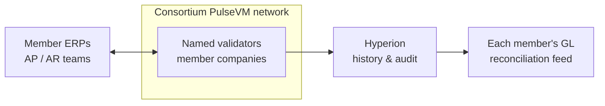

# For Enterprises & Consortia

Supply-chain provenance, loyalty and rewards, inter-company settlement, B2B invoicing — wherever multiple organizations need a shared, authoritative record with rules they agree on, the per-consortium model fits.

- **A network per business relationship.** A consortium operates its own chain with its own validator set; member companies are named accounts with their own permission trees. Data is shared among the members, not the world.
- **Rules that match the agreement.** Settlement terms, access policy, asset definitions, and fee models live in system contracts the consortium owns — not hard-coded by a platform vendor.
- **Authorization that mirrors your org chart.** Role keys, [weighted multisig](/guide/multisig) for approvals, delegation between subsidiaries and parents — your existing authority structure expressed directly.
- **Settlement you can reconcile against.** [Instant, irreversible finality](/guide/finality) and free reads mean every counterparty (and every auditor) sees the same authoritative state with no confirmation-window ambiguity.
- **Interoperate by choice.** Networks in the Metal ecosystem share consensus infrastructure and can exchange verified messages as the business relationship requires — connection is a decision, never a default exposure. See [Cross-Chain Messaging](/guide/cross-chain).

The same primitives that make this work for banks — named accounts, native permissions, deterministic settlement, owner-defined rules — apply directly to any multi-party enterprise process.

## What this looks like in practice

Picture a consortium of six manufacturers and their two shared logistics providers settling inter-company invoices on their own PulseVM network. Today that relationship is a mesh of bilateral reconciliations: each pair exchanges invoice files, matches statements, and trues up net positions at month-end, with a dispute queue for everything that doesn't match. On the shared ledger, an approved invoice could settle as a single transfer between **named accounts** — `northsteel.ap → apexparts.ar, 1,240,000 MUSD, PO-88231` — instant, irreversible, and visible to exactly the two parties and the auditors, at any hour. Each member's AP clerk works in their existing ERP; the chain sits underneath as the settlement layer between companies, so what used to be eight sets of books agreeing eventually becomes one authoritative state everyone reads for free. High-value payments run under [dual control](/guide/multisig) — a controller proposes, a treasurer approves, the transfer executes at threshold — with every step on the permanent audit trail. Competing suppliers on the same network see their own flows and nothing else: sensitive lanes are isolated per relationship, and the consortium's rules — membership, fees, dispute handling — live in contracts the members govern together. Month-end close looks like reading [Hyperion](/institutions/technical-evaluators): the inter-company subledger is already agreed, because it was never plural. This is the designed capability — the shape a consortium pilot is built to prove.

Each member keeps its ERP as the internal system of record; the network settles between companies; Hyperion feeds every member's reconciliation from the same free reads. One shared rail, sovereign books on every side.

## Why not something else?

**Why not a public EVM chain?** Because your inter-company settlement would share blockspace with the open internet — fees spike with someone else's speculation, counterparties live at hex addresses, and settlement stays probabilistic until enough blocks pass. Commercial confidentiality is gone by default, and every institutional control — approval thresholds, key rotation, sponsored participants — is smart-contract infrastructure your consortium builds and audits itself. See [PulseVM vs Ethereum](/compare/ethereum).

**Why not a generic permissioned or enterprise DLT?** Permissioned EVM stacks give the consortium consensus control but inherit primitives that fight enterprise process — hex identities, contract-wallet multisig, paymaster frameworks — so the members' engineers assemble and own the institutional layer forever. Consortium DLT toolkits without production public lineage are where a generation of enterprise-blockchain projects stalled: a framework and a governance problem, not a working system with native accounts, battle-tested system contracts, and tooling hardened by real usage. See [PulseVM vs Permissioned EVM](/compare/permissioned-evm) and the [full comparison](/compare/).

**Why not keep the status quo?** Bilateral reconciliation works — as a permanent cost center: N counterparties means N reconciliation relationships, each with its own file formats, matching runs, and dispute queue, and net positions that carry counterparty exposure until the periodic true-up. A shared ledger doesn't speed that process up; it removes the reason it exists. The record and the settlement become the same event, and the mesh collapses to one state.

## Frequently asked questions

### How do competitors share a ledger without seeing each other's business?

By scoping the network to the relationship. A PulseVM network is deployed per consortium — the participants are exactly the companies in the agreement, and data never leaves that [boundary](/guide/privacy). Where members of the same network must be shielded from each other, isolation is done by network (one chain per bilateral or per trade lane) or by application-layer encryption of sensitive payloads. Connection between networks is a decision, never a default exposure.

### Who governs a consortium network and what happens when a member joins or leaves?

The consortium does, through system contracts it owns and a validator set it appoints. Members are named accounts admitted under the agreement; joining is an account-creation and [permission grant](/guide/accounts-permissions), leaving is a revocation — both auditable policy actions, not platform-vendor tickets. Validators are named, elected, and replaceable, which maps directly onto how consortium governance already works.

### Can this integrate with our ERP?

Yes — the chain runs alongside your ERP as the shared settlement and record layer between companies, while each member's ERP remains its internal system of record. Hyperion provides complete, human-readable history over standard APIs, and reads are free, so each member's reconciliation and reporting feed is an API read rather than a file exchange. See [For Technical Evaluators](/institutions/technical-evaluators).

### Do our counterparties need cryptocurrency or gas fees?

No. The consortium (or each member for its own users) stakes network [resources](/guide/resources) once — there is no per-transaction gas market and no token anyone must buy. Participants act through named accounts from their existing systems; the blockchain is invisible plumbing under the business process.

### What does this replace, concretely?

The bilateral reconciliation mesh. Today every pair of counterparties keeps its own books and periodically compares them — invoice files, statement matching, dispute queues, end-of-period true-ups. On a shared ledger the transfer and the record are the same [irreversible event](/guide/finality), so there is one authoritative state every member reads for free instead of N copies to reconcile.

### Is PulseVM running in production today?

PulseVM itself is at the test-network stage, in active development by Metallicus. The execution model it implements — Antelope, formerly EOSIO — has run public production chains such as [XPR Network](https://xprnetwork.org), WAX, and Telos for years, so the account, permission, and contract semantics are proven; correctness is measured by [differential testing against that production reference](/institutions/technical-evaluators). Pilot deployments are run with Metallicus engineering.

**[Talk to us — Contact Metallicus →](https://metallicus.com/contact-us?utm_source=pulsevm.dev&utm_medium=docs)**

## For your engineering team

- **[For Technical Evaluators](/institutions/technical-evaluators)** — architecture, integration surface, operations, and the failure model, CTO-to-CTO.
- **[Get Started](/build/get-started)** — stand up against the public test network and deploy a first contract.
- **[Finality & Settlement](/guide/finality)** — why "when is it settled?" has a one-word answer.
