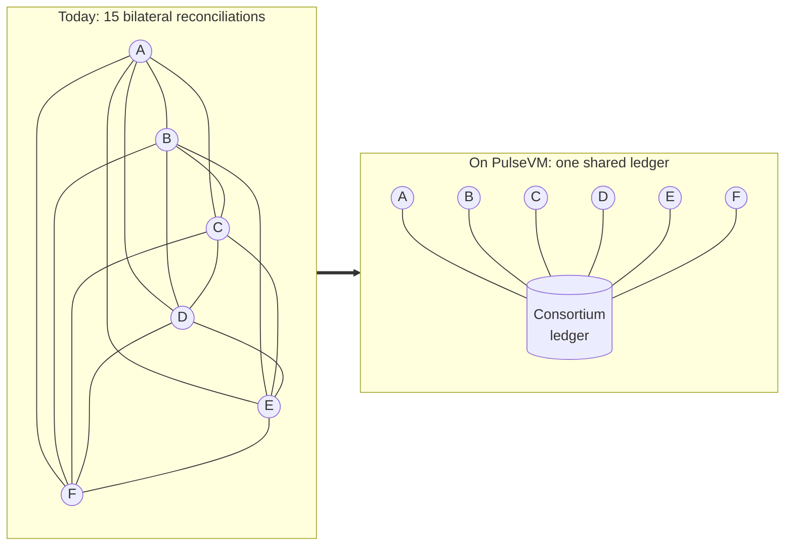

# For enterprises and consortia

**Six companies that trade with each other keep fifteen reconciliations. On a shared ledger they keep one.**

Every pair of counterparties today keeps its own books and periodically proves they agree: invoice files, statement matching, dispute queues, month-end true-ups. With N parties that is N×(N−1)/2 relationships to reconcile, and the count grows with the square of the membership. A PulseVM network collapses the mesh into one authoritative state that every member reads for free, because the transfer and the record are the same final event.

| Members | Bilateral reconciliations | Shared-ledger connections |
|---|---|---|
| 4 | 6 | 4 |
| 6 | 15 | 6 |
| 10 | 45 | 10 |
| 20 | 190 | 20 |

A shared ledger does not speed reconciliation up. It removes the reason it exists.

## How it works for the consortium

- **A network per business relationship.** The consortium operates its own chain with its own validators. Member companies are named accounts with their own permission trees, and data is shared among the members, not the world.
- **Rules that match the agreement.** Settlement terms, access policy, asset definitions and fee models live in system contracts the consortium owns, not in a platform vendor's code.
- **Authorization that mirrors your org chart.** Role keys, [weighted multisig](/guide/multisig) for approvals and delegation between subsidiaries and parents. A controller proposes, a treasurer approves, and a payment executes only at threshold.
- **Keys scoped to one job.** An ERP integration key can be bound with `linkauth` to a single contract action, such as `settle`, and is refused by the protocol on anything else. See [Delegated authority with hard limits](/guide/delegated-authority).
- **Settlement you can reconcile against.** [Final in about a second](/guide/finality), with no reorganizations, so every counterparty and every auditor sees the same state with no confirmation window.
- **Readable records.** An approved invoice settles as `nsteel.ap → apexparts.ar, 1,240,000 CUSD, PO-88231`, not a hex address emitting an event log.

Each member keeps its ERP as the internal system of record. The network settles between companies, and [Hyperion](/institutions/technical-evaluators) gives each member its reconciliation feed from the same free reads.

## Membership is governance, not a vendor ticket

| Event | What happens on the network |
|---|---|
| A company joins | The consortium creates its named account and grants permissions under the agreement |
| A company leaves | Its permissions are revoked; its history stays on the audit trail |
| A validator is added | The members admit it through the system contracts they own |
| A validator misbehaves or exits | The members remove it; the network continues on the rest |
| The rules change | The members approve a contract update under multisig, recorded like any other action |

Validators are named, admitted by the members and removable, which is how consortium governance already works.

## Connecting to other networks

Isolation is the default. Networks in the Metal ecosystem share consensus infrastructure, and validator-signed messaging between networks (Avalanche Warp/ICM) is the direction for connecting them where a business relationship requires it: Metallicus has demonstrated asset transfer between an EVM chain and PulseVM as work in progress. Plan a pilot around one network. See [Cross-chain messaging](/guide/cross-chain).

## Why not something else?

Public chains put inter-company settlement on shared blockspace, with volatile fees, hex addresses and no commercial confidentiality. Generic permissioned DLTs hand the consortium a toolkit and leave its engineers to build accounts, multisig and fee sponsorship themselves. The longer answers are in [Objections, answered](/institutions/objections) and the [comparisons](/compare/).

## Frequently asked questions

### How do competitors share a ledger without seeing each other's business?

By scoping the network to the relationship. A PulseVM network is deployed per consortium — the participants are exactly the companies in the agreement, and data never leaves that [boundary](/guide/privacy). Where members of the same network must be shielded from each other, isolation is done by network (one chain per bilateral or per trade lane) or by application-layer encryption of sensitive payloads. Connection between networks is a decision, never a default exposure.

### Who governs a consortium network and what happens when a member joins or leaves?

The consortium does, through system contracts it owns and a validator set it appoints. Members are named accounts admitted under the agreement; joining is an account-creation and [permission grant](/guide/accounts-permissions), leaving is a revocation — both auditable policy actions, not platform-vendor tickets. Validators are named, admitted by the members, and removable, which maps directly onto how consortium governance already works.

### Can this integrate with our ERP?

Yes — the chain runs alongside your ERP as the shared settlement and record layer between companies, while each member's ERP remains its internal system of record. Hyperion provides complete, human-readable history over standard APIs, and reads are free, so each member's reconciliation and reporting feed is an API read rather than a file exchange. See [For Technical Evaluators](/institutions/technical-evaluators).

### Do our counterparties need cryptocurrency or gas fees?

No. The consortium (or each member for its own users) stakes network [resources](/guide/resources) once — there is no per-transaction gas market and no token anyone must buy. Participants act through named accounts from their existing systems; the blockchain is invisible plumbing under the business process.

### What does this replace, concretely?

The bilateral reconciliation mesh. Today every pair of counterparties keeps its own books and periodically compares them — invoice files, statement matching, dispute queues, end-of-period true-ups. On a shared ledger the transfer and the record are the same [irreversible event](/guide/finality), so there is one authoritative state every member reads for free instead of N copies to reconcile.

### Is PulseVM running in production today?

PulseVM itself is at the test-network stage, in active development by Metallicus. The execution model it implements — Antelope, formerly EOSIO — has run public production chains such as [XPR Network](https://xprnetwork.org), WAX, and Telos for years, so the account, permission, and contract semantics are proven; correctness is measured by [differential testing against that production reference](/institutions/technical-evaluators). Pilot deployments are run with Metallicus engineering.

## Next step

A consortium pilot is small: a few members, a validator each, a test settlement asset and real inter-company flows for 90 days, with the reconciliation count measured before and after. See [Run a 90-day pilot](/institutions/pilot) and the [buyer's checklist](/institutions/checklist).

**[Talk to us: contact Metallicus →](https://metallicus.com/contact-us?utm_source=pulsevm.dev&utm_medium=docs)**

## For your engineering team

- **[For technical evaluators](/institutions/technical-evaluators)**: architecture, integration surface, operations and what is shipped today.
- **[Accounts and permissions](/guide/accounts-permissions)**: the permission tree each member company gets.
- **[Get started](/build/get-started)**: stand up against the public test network and deploy a first contract.
