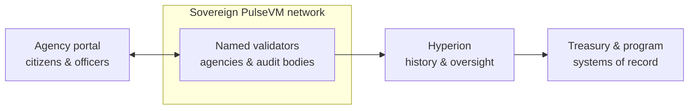

# For Government & Governance Networks

Registries, disbursements, inter-agency settlement, and procurement audit trails want exactly what this environment provides:

- **Named entities and delegated authority** — agencies, departments, and officers as accounts and permissions
- **Irreversible records** with complete, freely readable audit trails
- **Rules set by the deploying authority** — system contracts the operator owns
- **Accountable validators** — DPoS's "named, elected, replaceable operators" is how public institutions already work
- **Sovereignty** — the network, its data residency, and its rule-set are domestically operated; no dependency on a foreign public chain's governance

## What this looks like in practice

Picture a state agency running a disbursement program for 1.2 million beneficiaries on its own PulseVM network. A beneficiary could receive a payment the moment eligibility is confirmed — instant, irreversible, at any hour — through the agency's existing portal, with no token to buy and no crypto mechanics to explain. Program operations would watch a ledger of **named accounts** performing human-readable actions: a disbursement reads as `agency.social → maria.g, 840 UNITS, case #`, not a hex address emitting an event log, so an anomalous payment is legible the moment it appears. Every disbursement carries its authorization chain — the officer who proposed it, the supervisor who approved it under [multisig](/guide/multisig), the policy contract that executed it — permanently recorded, which turns a freedom-of-information request or an auditor-general review into a query against [Hyperion](/institutions/technical-evaluators) instead of a records project. If a court orders funds frozen, compliance executes a policy action in contracts the agency owns, by named officers, on the audit trail — not a support ticket to someone else's chain. The validators are the agency and its peer institutions — a treasury node, a comptroller node, a state-audit node — so the infrastructure, the data residency, and the rule-set stay inside the jurisdiction. This is the designed capability — the shape a pilot deployment is built to prove.

The chain is the authoritative disbursement and registry ledger; existing treasury and case-management systems remain in place; Hyperion feeds oversight, reporting, and public transparency from the same free reads.

## Why not something else?

**Why not a public EVM chain?** Because a public program would then depend on a foreign network's governance, fee market, and validator set — payment costs spike with someone else's speculation, records live at hex addresses, and settlement is probabilistic until enough blocks pass. A government cannot ask a neutral global protocol to honor a court order, and every institutional control becomes bespoke smart-contract infrastructure to build and audit. See [PulseVM vs Ethereum](/compare/ethereum).

**Why not a generic permissioned or enterprise DLT?** Permissioned EVM stacks give you consensus control but inherit primitives that fight public administration — hex identities, contract-wallet multisig, paymaster frameworks — so your integrators build and own the institutional layer forever. Consortium DLT toolkits without production public lineage hand an agency a governance problem and a multi-year integration project, not a working system: no native account and permission model, no battle-tested system contracts, no ecosystem hardened by real usage. See [PulseVM vs Permissioned EVM](/compare/permissioned-evm) and the [full comparison](/compare/).

**Why not stay with existing systems?** Existing registries and disbursement rails work — through batch cycles, inter-agency file exchange, and reconciliation departments, with audit assembled after the fact from separate systems that can disagree. A shared, irreversible ledger makes the record and the settlement the same event: audit is a property of the infrastructure rather than a periodic exercise, and inter-agency reconciliation ceases to exist as a category of work.

## Frequently asked questions

### Can a government agency run its own blockchain?

Yes — that is the design point. A PulseVM deployment is a permissioned network whose validators are named entities the deploying authority chooses: agencies, ministries, state institutions, or an inter-agency consortium. Validators run on standard Linux hosts inside your jurisdiction, the rule-set lives in system contracts the operator owns, and there is no dependency on a foreign public chain's governance, token, or fee market.

### Where does the data live? Is this sovereign infrastructure?

The network runs entirely on infrastructure the deploying authority operates or contracts domestically — data residency is wherever your validators are. No transaction leaves that [privacy boundary](/guide/privacy), no foreign protocol change can alter your rules, and no external token holder has a vote. Sovereignty here is structural, not a compliance overlay.

### What happens under a court order or legislative change?

Controls such as freeze, clawback, and account restriction are policy in system contracts the deploying authority owns, executed under [multisig](/guide/multisig) by named officers with every step permanently recorded. A court order becomes an auditable on-chain action with a documented authorization chain — not a request to a neutral protocol that cannot comply. When law changes, the operator updates the contracts; the execution model has a decade of precedent for exactly this kind of customization.

### Do citizens or beneficiaries need cryptocurrency to use this?

No. The operating authority stakes network [resources](/guide/resources) and sponsors participants entirely — beneficiaries see an agency portal or app, never a gas prompt, a token purchase, or a seed phrase. The blockchain is invisible plumbing behind the public-facing service.

### What do auditors and oversight bodies see?

Complete, human-readable history — every action, by named account, queryable in real time at no per-query cost. Read access is a grant the network controls: an auditor-general, inspector, or legislative oversight body can be given full visibility without touching operational systems, and public transparency portals can be fed from the same free reads where policy calls for them.

### Is PulseVM running in production today?

PulseVM itself is at the test-network stage, in active development by Metallicus. The execution model it implements — Antelope, formerly EOSIO — has run public production chains such as [XPR Network](https://xprnetwork.org), WAX, and Telos for years, so the account, permission, and contract semantics are proven; correctness is measured by [differential testing against that production reference](/institutions/technical-evaluators). Pilot deployments are run with Metallicus engineering.

**[Talk to us — Contact Metallicus →](https://metallicus.com/contact-us?utm_source=pulsevm.dev&utm_medium=docs)**

## For your engineering team

- **[For Technical Evaluators](/institutions/technical-evaluators)** — architecture, integration surface, operations, and the failure model, CTO-to-CTO.
- **[Get Started](/build/get-started)** — stand up against the public test network and deploy a first contract.
- **[Finality & Settlement](/guide/finality)** — why "when is it settled?" has a one-word answer.
