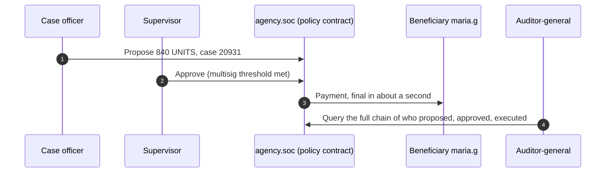

# For government and governance networks

**Public infrastructure the authority owns: its nodes, its jurisdiction, its rules.**

Registries, disbursements, inter-agency settlement and procurement audit trails need a shared record that no single agency can quietly change and no foreign network can govern. A PulseVM network gives the authority exactly that:

- **Sovereignty.** The network, its data residency and its rule-set are operated inside the jurisdiction, with no dependency on a foreign public chain's governance or fee market for its own transactions. The network still registers its validators on the Metal Blockchain P-Chain, which carries a small validator fee.
- **Accountable validators.** Named operators the authority admits and can remove, which is how public institutions already work.
- **Named entities and delegated authority.** Agencies, departments and officers are accounts and permissions. A disbursement key can be bound with `linkauth` to one contract action and refused on anything else. See [Delegated authority with hard limits](/guide/delegated-authority).
- **Irreversible records.** Final in about a second, with no reorganizations, and every action carries its authorization chain.
- **Rules set by the deploying authority.** System contracts the operator owns and updates when the law changes.

## Who runs what, and who can read it

A sovereign network is a list of named operators, each in a known place. An example for a state disbursement program:

| Node | Operated by | Hosted | Role | Can read |
|---|---|---|---|---|
| Validator 1 | Treasury | Government data centre, in-state | Validates, holds disbursement accounts | Everything on the network |
| Validator 2 | Program agency | Government data centre, in-state | Validates, proposes disbursements | Everything on the network |
| Validator 3 | Comptroller | Separate in-state site | Validates, co-approves above a threshold | Everything on the network |
| Validator 4 | State audit office | Separate in-state site | Validates, independent copy of the record | Everything on the network |
| History node (Hyperion) | Treasury or its contractor | Domestic cloud region under contract | Serves history and reporting APIs | What each read grant allows |
| Transparency feed | Program agency | Public web | Publishes the aggregates policy calls for | The public, aggregates only |

Data residency is wherever the validators are. No transaction leaves that [privacy boundary](/guide/privacy) unless the authority publishes it. Oversight bodies get a read grant, not a records project.

## A disbursement, with its authorization chain

A beneficiary is paid the moment eligibility is confirmed, at any hour, through the agency's existing portal, with no token to buy. The disbursement reads as `agency.soc → maria.g, 840 UNITS, case 20931`, so an anomalous payment is legible the moment it appears. A freedom-of-information request or an auditor-general review becomes a query against Hyperion. If a court orders funds frozen, named officers execute a policy action in contracts the agency owns, on the audit trail. This is the designed capability, and the shape a pilot is built to prove.

## Why not something else?

A public chain makes a public program depend on a foreign network's governance, fee market and validators, and a neutral global protocol cannot honour a court order. Generic permissioned DLTs leave integrators to build accounts, multisig and fee sponsorship and own them forever. Existing systems work, through batch cycles and inter-agency file exchange, with audit assembled after the fact from systems that can disagree. On a shared ledger the record and the settlement are the same event, so audit becomes a property of the infrastructure. More in [Objections, answered](/institutions/objections).

## Frequently asked questions

### Can a government agency run its own blockchain?

Yes — that is the design point. A PulseVM deployment is a permissioned network whose validators are named entities the deploying authority chooses: agencies, ministries, state institutions, or an inter-agency consortium. Validators run on standard Linux hosts inside your jurisdiction, the rule-set lives in system contracts the operator owns, and there is no dependency on a foreign public chain's governance, token, or fee market.

### Where does the data live? Is this sovereign infrastructure?

The network runs entirely on infrastructure the deploying authority operates or contracts domestically — data residency is wherever your validators are. No transaction leaves that [privacy boundary](/guide/privacy), no foreign protocol change can alter your rules, and no external token holder has a vote. Sovereignty here is structural, not a compliance overlay.

### What happens under a court order or legislative change?

Controls such as freeze, clawback, and account restriction are policy in system contracts the deploying authority owns, executed under [multisig](/guide/multisig) by named officers with every step permanently recorded. A court order becomes an auditable on-chain action with a documented authorization chain — not a request to a neutral protocol that cannot comply. When law changes, the operator updates the contracts; the execution model has a decade of precedent for exactly this kind of customization.

### Do citizens or beneficiaries need cryptocurrency to use this?

No. The operating authority stakes network [resources](/guide/resources) and sponsors participants entirely — beneficiaries see an agency portal or app, never a gas prompt, a token purchase, or a seed phrase. The blockchain is invisible plumbing behind the public-facing service.

### What do auditors and oversight bodies see?

Complete, human-readable history — every action, by named account, queryable in real time at no per-query cost. Read access is a grant the network controls: an auditor-general, inspector, or legislative oversight body can be given full visibility without touching operational systems, and public transparency portals can be fed from the same free reads where policy calls for them.

### Is PulseVM running in production today?

PulseVM itself is at the test-network stage, in active development by Metallicus. The execution model it implements — Antelope, formerly EOSIO — has run public production chains such as [XPR Network](https://xprnetwork.org), WAX, and Telos for years, so the account, permission, and contract semantics are proven; correctness is measured by [differential testing against that production reference](/institutions/technical-evaluators). Pilot deployments are run with Metallicus engineering.

## Next step

Start with a pilot between two or three agencies: named validators in-jurisdiction, a test program with synthetic beneficiaries, and an oversight body holding a read grant from day one. See [Run a 90-day pilot](/institutions/pilot) and the [buyer's checklist](/institutions/checklist).

**[Talk to us: contact Metallicus →](https://metallicus.com/contact-us?utm_source=pulsevm.dev&utm_medium=docs)**

## For your engineering team

- **[For technical evaluators](/institutions/technical-evaluators)**: architecture, integration surface, operations and what is shipped today.
- **[Privacy and confidentiality](/guide/privacy)**: the network boundary and what sits inside it.
- **[Get started](/build/get-started)**: stand up against the public test network and deploy a first contract.
