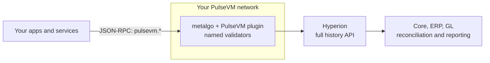

# For technical evaluators

**The institutional layer you would otherwise build is already the protocol.**

On most chains, named identities, role-based keys, dual control, key rotation, fee sponsorship and scoped service keys are a stack of contracts and services your team designs, audits and maintains. On PulseVM they are how accounts work. This page answers the question a CTO actually asks: can we operate this, integrate it and stand behind it?

## What the account model removes from your backlog

| You would build | PulseVM gives you |
|---|---|
| An identity registry mapping addresses to entities | Named accounts, up to 12 characters (`acme.treas`) |
| Role-based access control | A tree of permissions per account, each with its own keys and threshold |
| A multisig wallet contract | [Weighted multisig](/guide/multisig) on any permission, plus proposal-based approvals |
| Scoped service credentials | `linkauth`: bind a permission to one contract action; the protocol refuses it on anything else before contract code runs |
| Key rotation and recovery flows | `updateauth` on the account; assets never move; the parent permission recovers the child |
| HSM and passkey signing support | R1 (secure enclave, HSM) and WebAuthn (passkey) signatures verified by the chain, alongside K1 |
| A paymaster | Resource staking: the institution stakes, users never hold a fee token |

`linkauth` is the one to look at first. A bot key bound to a single action cannot transfer, re-key or call any other contract, whatever its holder tries. A service on XPR Network mainnet runs customer trading this way, on the same account model, and in a testnet exercise 31 of 31 attempts by the real bot key to move money out or take an account over were refused. Read [Delegated authority with hard limits](/guide/delegated-authority) and [Accounts and permissions](/guide/accounts-permissions).

## Where it sits in your architecture

PulseVM is a settlement and record layer alongside your systems of record, not a replacement for them.

- **Write and read path.** A native JSON-RPC API (`pulsevm.*` methods). `issueTx` returns a transaction id on admission; confirm execution from history. A small gateway serves the nodeos-style `/v1/chain` API for eosjs and `@proton/js` clients, as on the [1:1 demo network](/network/one-to-one-demo). See the [API reference](/build/api).
- **History.** [Hyperion](https://github.com/MetalBlockchain/hyperion-rs) indexes every action into queryable, human-readable history. It is the natural feed for reconciliation and reporting. Reads are free, so analytics and audit add no cost or rate pressure.
- **Business logic.** Contracts in [Rust](/build/quickstart-rust), C++ or [TypeScript](/build/quickstart-typescript), compiled to WebAssembly, that you write, version, review and deploy on your schedule.

## Status: what is shipped and what is not

PulseVM is at test-network stage. Here is where each piece stands.

| Area | In PulseVM today | At test-network stage | In development |
|---|---|---|---|
| Execution | Antelope execution model in a Rust VM; about 180 Antelope host functions; WebAssembly contracts from C++, Rust and TypeScript | Whole-system operation on public test networks | `CRYPTO_PRIMITIVES` host functions (alt_bn128, mod_exp, blake2_f, sha3, k1_recover); BLS functions and `set_finalizers` |
| Accounts and keys | Named accounts, permission trees, `linkauth`, weighted multisig, K1, R1 and WebAuthn keys | | |
| Consensus | Snowman on metalgo; final when accepted, no reorganizations | | Support for metalgo 1.14.2 (RPC protocol v45) |
| API | Native JSON-RPC (`pulsevm.*`) | `/v1/chain` through a gateway, as on the demo network | `/v1/chain` served inside the node |
| History | Hyperion indexing | Hyperion on the public demo network | |
| Migration | Antelope snapshot import path | Public 1:1 demo network with imported XPR testnet state | A tagged release carrying the latest merges (latest tag: v0.7.1) |

Maturity in one line: the full XPR Network mainnet history has been replayed on PulseVM. See [Migrating an Antelope chain](/guide/migrate-antelope-chain).

## Operating a network

A network is a set of validator nodes (metalgo plus the PulseVM plugin) and the system contracts that define its rules. See [Launch your own network](/network/launch).

- **Nodes** run on standard Linux hosts under a service manager. A consortium starts with a small, named validator set that the members admit and can remove.
- **Observability.** Each node reports head and last irreversible block plus standard node metrics.
- **Upgrades.** Consensus-affecting upgrades roll out across the validator set in coordinated windows, a governance event the consortium controls.
- **Backup and recovery.** Staking keys are backed up out of band. Chain state is deterministic, so a node rebuilds by replaying the chain: recovery is resumption, not reconstruction.

## Failure model

Finality is a safety guarantee: the network never produces two conflicting final states. If validators cannot reach quorum, the protocol waits and resumes rather than forking. For a settlement system that is the correct trade. There is no reconciliation mess to clean up afterwards, no reorg handling and no probabilistic-finality window to design around. See [Finality and settlement](/guide/finality).

## Security and correctness

- **Source available, including the chain's own rules.** The VM's source ([pulsevm](https://github.com/MetalBlockchain/pulsevm)) is public under the PulseVM Business License: free for evaluation and non-commercial use, with commercial use licensed by Metallicus. The CDTs and system contracts (token, system, multisig, bios in [pulse-cdt-rust](https://github.com/MetalBlockchain/pulse-cdt-rust/tree/master/contracts)) are open source (MIT).
- **Measured against a production reference.** Because the Antelope model runs in production on XPR Network, correctness is checked by replaying the same inputs through the reference implementation and PulseVM and comparing state. Every divergence is a bug with ground truth attached.
- **Responsible disclosure.** Raise security concerns privately with [Metallicus](https://metallicus.com/contact-us?utm_source=pulsevm.dev&utm_medium=docs).

## Continuity and support

PulseVM is built and maintained by Metallicus, with commercial support and deployment engineering available. Because the VM's source is available, the contracts and CDTs are open source and the execution model has independent implementations, the semantics survive independently of any one vendor. Continuity terms belong in the commercial agreement.

## An evaluation path

1. **Read** [What is PulseVM](/guide/what-is-pulsevm) and [Accounts and permissions](/guide/accounts-permissions).
2. **Prototype** against the [public test network](/network/endpoints): deploy a contract, build a permission tree, bind a key with `linkauth`, read history through Hyperion.
3. **Check** your requirements against the [buyer's checklist](/institutions/checklist).
4. **Pilot** a small network for 90 days. See [Run a 90-day pilot](/institutions/pilot).

**[Talk to us: contact Metallicus →](https://metallicus.com/contact-us?utm_source=pulsevm.dev&utm_medium=docs)**
