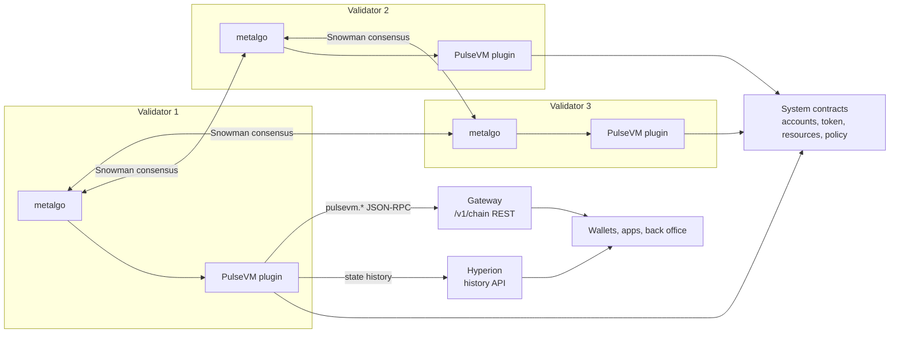

# Launch your own network

A PulseVM network is a chain you own. You decide who validates it, you write its rules as system contracts, and you decide who can read it. A consortium can start with a small named validator set, such as three to five member institutions, and admit or remove members later.

What you get on day one:

- **Your validators.** Validators are named machines run by the members. They are admitted by the members and can be removed. Nobody outside the set produces your blocks.
- **Your rules.** Account creation, fees, resource economics and asset policy live in system contracts deployed to your chain's privileged account. Change the rules by upgrading those contracts under your own governance.
- **Your privacy boundary.** The network can be private to its members. Its RPC, history and explorer are only reachable where you choose to expose them.
- **The account model.** Readable named accounts, permission trees, `linkauth` to bind a key to one contract action, weighted multisig, key rotation without moving assets, and R1 (HSM, secure enclave) and WebAuthn (passkey) keys verified by the chain. See [Accounts and permissions](/guide/accounts-permissions).
- **Finality in about a second.** Blocks are final when accepted. There are no reorganizations to wait out.

::: warning Test-network software
PulseVM is at the test-network stage. Networks built on it today are pilots and test networks. Institutions run pilots together with Metallicus. See [Run a pilot](/institutions/pilot).
:::

<NetworkScene :nodes="5" />

## The pieces

Every validator runs the same two binaries: **metalgo** (the Metal Blockchain node, which runs Snowman consensus) and the **PulseVM plugin** (the Antelope-model execution layer). The rest is software you deploy on the chain or next to it.



| Component | Role |
|---|---|
| **metalgo** | The node. Runs consensus, talks to the P-Chain (validator registry) and hosts the VM. |
| **PulseVM plugin** | The VM binary, installed in metalgo's plugin directory under the PulseVM **VM ID**. |
| **Subnet or L1** | The set of validators that runs your chain. |
| **Genesis** | The chain's first state: the system account's key and the chain parameters. |
| **System contracts** | Your chain's rules: accounts, token, resources, multisig and any policy you add. See [System contracts](/build/system-contracts). |
| **Hyperion** | Action and transaction history, served from the node's state-history stream. |
| **Gateway** | Serves Antelope-style `/v1/chain` REST on top of the node's native `pulsevm.*` JSON-RPC, so existing Antelope tooling works. |

## Step 1: choose a subnet or a sovereign L1

| | Subnet | ACP-77 sovereign L1 |
|---|---|---|
| **What it is** | Your validators also validate the Metal primary network. The subnet owner key adds and removes your validators on the P-Chain. | Your validators validate only your chain. Membership is managed by a validator-manager contract you control, and validators pay a small continuous P-Chain fee instead of a primary-network stake. |
| **Choose it when** | You want the simplest start for a test network. | You want the validator set governed by your own rules and no dependency on primary-network staking. |

ACP-77 validator management depends on P-Chain epoched views (ACP-181), which arrive with the Granite network upgrade in metalgo 1.14.x. On Tahoe, Granite is active and nodes must run metalgo 1.14.2. See [Upgrade to metalgo 1.14.2](/network/upgrade-metalgo-1-14).

## Step 2: install metalgo on every validator

Use one Linux host (x86-64 or ARM64) per validator. Pin the metalgo version, verify the download, and keep the same version on every validator.

```bash
# Tahoe test network (Granite): metalgo v1.14.2-tahoe
VER=v1.14.2-tahoe
curl -fsSLO https://github.com/MetalBlockchain/metalgo/releases/download/$VER/metalgo-linux-amd64-$VER.tar.gz
tar -xzf metalgo-linux-amd64-$VER.tar.gz
sudo install -m 0755 metalgo-$VER/metalgo /opt/metalgo/metalgo
```

Use the `arm64` asset on ARM hosts. See the [metalgo releases](https://github.com/MetalBlockchain/metalgo/releases) for the current version and checksums.

## Step 3: install the PulseVM plugin

metalgo finds a VM by its ID: the plugin binary must be named exactly after the VM ID and sit in the plugin directory.

```bash
VMID=rXcAFxZvio99epp6TzEwYfexCfPAbJuBTMsjUUoiT7PkVykNs
curl -fsSLO https://github.com/MetalBlockchain/pulsevm/releases/download/v0.7.1/pulsevm-linux-amd64.tar.gz
tar -xzf pulsevm-linux-amd64.tar.gz
sudo mkdir -p /opt/pulsevm/plugins
sudo install -m 0755 pulsevm /opt/pulsevm/plugins/$VMID
```

The node and the plugin must agree on the rpcchainvm protocol version. The v0.7.1 release speaks protocol 43, which matches metalgo 1.13.5. metalgo 1.14.2 needs protocol 45, which is merged into PulseVM main and ships in the next release. Watch [Updates](/network/updates) for it. To build from source instead, follow the [PulseVM README](https://github.com/MetalBlockchain/pulsevm#build-from-source) (Rust, LLVM 22, protoc).

Point metalgo at the plugin directory in its node config:

```json
{
  "network-id": "tahoe",
  "plugin-dir": "/opt/pulsevm/plugins",
  "chain-config-dir": "/etc/metalgo/chains",
  "data-dir": "/var/lib/metalgo",
  "http-host": "127.0.0.1",
  "http-port": 9650,
  "staking-port": 9651
}
```

## Step 4: create the chain with a genesis

The PulseVM genesis sets the key that controls the system account and the chain's resource limits. Start from the `genesis.json` in the PulseVM repository and replace `initial_key` with a public key you control. Keep the matching private key offline. Abridged:

```json
{
  "initial_timestamp": "2026-10-01T00:00:00",
  "initial_key": "PUB_K1_...",
  "initial_configuration": {
    "max_block_net_usage": 1048576,
    "max_transaction_lifetime": 3600,
    "max_inline_action_depth": 6,
    "max_authority_depth": 6
  }
}
```

Copy every `initial_configuration` field from the repository's file and change only what you mean to change. Then, on the P-Chain:

1. Create the subnet (a `CreateSubnetTx`). The owner key you set here controls validator membership.
2. Create the blockchain on it (a `CreateChainTx`) with the PulseVM VM ID and your genesis bytes.
3. For a sovereign L1, convert the subnet (a `ConvertSubnetToL1Tx`) and deploy the validator-manager contract.

These are standard Metal P-Chain transactions. Build them with Metal's CLI or JavaScript SDK. See the [Metal Blockchain docs](https://docs.metalblockchain.org) for the current tooling.

## Step 5: boot the validators

Each validator tracks the subnet (`"track-subnets": "<subnet-id>"` in the node config) and gets a PulseVM chain config at `/etc/metalgo/chains/<blockchain-id>/config.json`:

```json
{
  "producer_name": "pulse",
  "producer_key": "PVT_K1_..."
}
```

`producer_name` must match the producer the chain's schedule expects. Keep this file readable only by the metalgo user. Run metalgo under systemd, add each node's NodeID as a validator (Step 1 decides how), and check that every node reports the same head. See [Run a validator](/network/validator) for the operator details.

Chain upgrades later use PulseVM's protocol-feature framework. Each rule change has a protocol version and an activation height, loaded from an `upgrade.json` next to the chain config, so every validator switches rules at the same block.

## Step 6: deploy the system contracts

On a Pulse-native chain the privileged account is `pulse`. Use the genesis key to:

1. Create the system accounts (token, multisig, resource and fee accounts).
2. Deploy the system and token contracts with `set-code` and `set-abi`, then initialise them and create the core token.
3. Give contracts that send inline actions a `pulse.code` grant on their own permission.

The contracts are built from [pulse-cdt-rust](https://github.com/MetalBlockchain/pulse-cdt-rust). The PulseVM repository also contains a boot helper that performs a minimal account, token and system-contract boot, which is useful as a reference sequence. The contract list and actions are on [System contracts](/build/system-contracts).

This is also where your rules go in: KYC-gated account creation, fee models, resource economics, and asset policy such as freeze or clawback. Those are policies you write into the contracts you own. They are not in the reference contracts.

## Step 7: create the institution's accounts and permission trees

With [pulse-ts](/build/cli) pointed at your node, create the institution's accounts and give each one a permission tree:

```bash
pulse-ts endpoint:set https://rpc.your-network.example   # confirm `pulse-ts chain:get` shows your chain ID before signing
# stakes CPU/NET in your core token (SYS here)
pulse-ts create-account treasury PUB_K1_OWNER... PUB_K1_ACTIVE... -c pulse \
  --cpu "1.0000 SYS" --net "1.0000 SYS"

# a permission for the payments bot, under active
pulse-ts update-auth treasury payments active PUB_K1_BOT... --sign-permission active

# bind it to exactly one action: it can call token::transfer and nothing else
pulse-ts push-action pulse linkauth \
  '{"account":"treasury","code":"pulse.token","type":"transfer","requirement":"payments"}' \
  -a treasury@active
```

Put `owner` behind a weighted multisig of officers, keep `active` for operations, and add narrow permissions for each automated job. The chain refuses anything outside those bounds before contract code runs. The [delegated authority case study](/guide/delegated-authority) shows this pattern running on XPR Network mainnet.

## Step 8: run the services around it

- **Hyperion** for history. It indexes the node's state-history stream and serves a `/v2` API.
- **A gateway** if your applications or exchanges expect Antelope `/v1/chain` REST. A nodeos-style `/v1/chain` API inside the node is merged and ships in the next release, which makes the gateway optional.
- **An explorer** pointed at the RPC and Hyperion.

The [1:1 demo network](/network/one-to-one-demo) runs exactly this stack, so you can see it working before you build your own.

## Moving an existing Antelope chain

If you already run an Antelope chain, you don't need to start from an empty genesis. PulseVM can start from the chain's state, keeping its accounts, keys and contracts. See [Migrating an Antelope chain](/guide/migrate-antelope-chain).

## Next step

Launching a network for your institution or consortium? Pilots run with Metallicus, including validator provisioning, system-contract policy, and the monitoring and upgrade runbooks from operating live networks. [Contact Metallicus](https://metallicus.com/contact-us?utm_source=pulsevm.dev&utm_medium=docs) or read [Run a pilot](/institutions/pilot).
